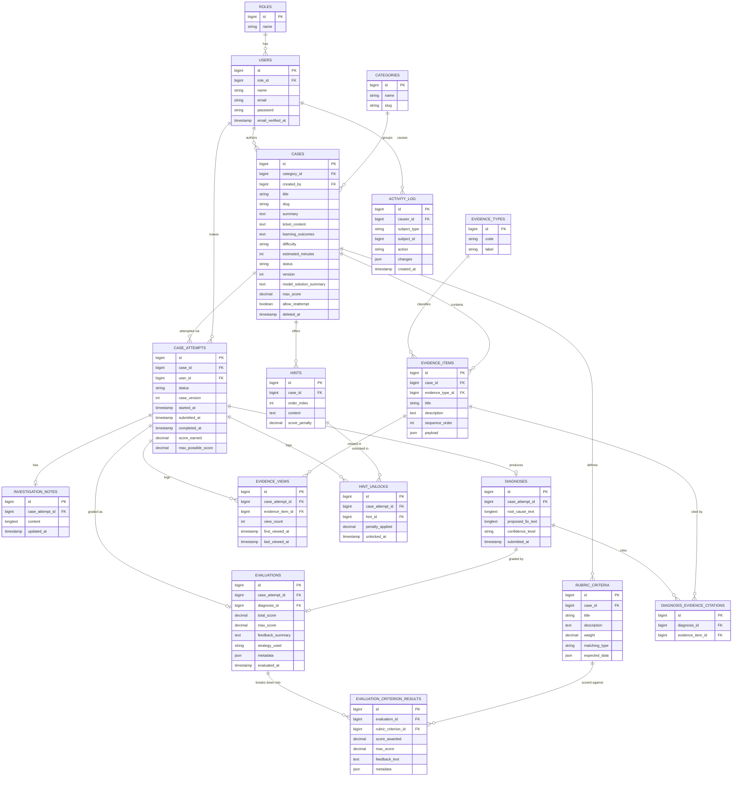

# AI CaseLab — Database Design

No migrations yet — this is the logical/physical design we will implement from later. Design decisions worth calling out up front, because they drive scalability (NFR1) and the Repository/Strategy patterns used later:

**Decision 1 — Evidence is one polymorphic-ish table, not one table per evidence type.**
A naive design would create `evidence_logs`, `evidence_code_snippets`, `evidence_db_snapshots`, `evidence_api_responses`, `evidence_screenshots` as separate tables (class-table inheritance). That's more strictly typed, but every new evidence type = a new migration + new model + new join everywhere evidence is listed. Since "add new case/evidence types without schema rewrites" is an explicit NFR, we instead use a single `evidence_items` table with an `evidence_type` reference and a `payload` JSON column holding type-specific data. A `EvidenceRenderer` (Strategy pattern, see Architecture doc) interprets `payload` per type on the frontend/backend. We accept slightly weaker column-level typing in exchange for zero-migration extensibility — the right trade for a content library that will keep growing.

**Decision 2 — Rubric-based evaluation, not free text grading.**
`rubric_criteria` belongs to a case; `evaluations` + `evaluation_criterion_results` store the graded outcome per attempt per criterion. This keeps grading deterministic/explainable (a constraint from the SRS) while leaving room for an AI-assisted `EvaluationStrategy` later that still writes into the same result tables.

**Decision 3 — Enum-like columns are `string` + PHP backed enums, not native SQL `ENUM`.**
`cases.difficulty`, `cases.status`, `case_attempts.status`, `diagnoses.confidence_level`, and `rubric_criteria.matching_type` are all `string` columns validated/cast via PHP backed enums (`CaseDifficulty`, `CaseStatus`, `AttemptStatus`, `ConfidenceLevel`, `MatchingType` — already planned in the Architecture doc's `app/Enums/` folder), not native MySQL `ENUM` types. A native `ENUM` needs an `ALTER TABLE` to add a new value (e.g. an `ai_assisted` matching type, or an `expert` difficulty); a `string` column lets that be a one-line PHP change. This is the same pattern Phase 2 already established for `UserRole`.

**Decision 4 — Case versioning is a lightweight counter, not a full snapshot.**
`cases.version` increments every time a published case is edited again; `case_attempts.case_version` records which version a student attempted. This flags drift ("this attempt was scored against an earlier version of the case") without the cost of snapshotting the entire case graph (ticket, evidence, hints, rubric) on every edit. Revisit this if a "compare versions" admin UI is ever requested — nothing here forecloses upgrading `case_version` into a foreign key against a future `case_versions` snapshot table later.

**Decision 5 — Diagnosis evidence citations are a pivot table, not a JSON array.**
Originally modeled as a `cited_evidence_ids` JSON array on `diagnoses`. Normalized into a `diagnosis_evidence_citations` pivot table instead, because Analytics (Phase 11) needs an indexed `GROUP BY evidence_item_id` to compute "most-cited vs. never-cited evidence" — a query a JSON array scattered across every `diagnoses` row can't serve efficiently.

**Decision 6 — Admin/system actions get a generic `activity_log` table.**
Distinct from student-activity logging (`evidence_views`, `hint_unlocks`, already covering NFR7's "evidence viewed, hints used, submission time"), this tracks *who changed what*: case created/edited/published/archived, a user's role changed, evidence/hints/rubric edited. One polymorphic table (`causer_id`, `subject_type`, `subject_id`, `action`, `changes` JSON) rather than a bespoke table per auditable model.

## 1. ER Diagram

## 2. Tables (detail)

### roles
| Column | Type | Notes |
|---|---|---|
| id | bigint PK | |
| name | string, unique | `student`, `instructor`, `admin` |

### users
| Column | Type | Notes |
|---|---|---|
| id | bigint PK | |
| role_id | bigint FK → roles.id | restrict on delete |
| name | string | |
| email | string, unique | |
| password | string (hashed) | |
| email_verified_at | timestamp, nullable | |
| remember_token | string, nullable | Laravel standard |
| timestamps | | |

### categories
| Column | Type | Notes |
|---|---|---|
| id | bigint PK | |
| name | string | e.g. "Backend", "Database", "Frontend", "DevOps" |
| slug | string, unique | |
| description | text, nullable | |

### cases
| Column | Type | Notes |
|---|---|---|
| id | bigint PK | |
| category_id | bigint FK → categories.id | restrict on delete |
| created_by | bigint FK → users.id | admin author; restrict on delete |
| title | string | |
| slug | string, unique | |
| summary | text, nullable | short admin-authored teaser — catalog card one-liner (per the UI/UX doc) and the Case Editor's Basic Information section |
| ticket_content | text | the initial support ticket shown to the student |
| learning_outcomes | text, nullable | admin-facing for now; what a student should learn from this case — not yet surfaced in any student-facing UI |
| difficulty | string | app-level enum `App\Enums\CaseDifficulty` (`easy`,`medium`,`hard`) |
| estimated_minutes | int | |
| status | string | app-level enum `App\Enums\CaseStatus` (`draft`,`published`,`archived`), default `draft` |
| version | int | default `1`; incremented each time a published case is edited again (Decision 4) |
| model_solution_summary | text, nullable | the "Expected Diagnosis" shown in the Case Editor; revealed to students after completion if `allow_reattempt` policy permits |
| max_score | decimal(5,2) | sum of rubric weights, denormalized for quick display |
| allow_reattempt | boolean | default true |
| deleted_at | timestamp, nullable | **soft delete** — cases are archived, never hard-deleted, to preserve historical attempts |
| timestamps | | |

### evidence_types
| Column | Type | Notes |
|---|---|---|
| id | bigint PK | |
| code | string, unique | `support_ticket` (rare, usually inline), `log`, `code_snippet`, `db_snapshot`, `api_response`, `screenshot`, `configuration`, `deployment_history` |
| label | string | display name |

*Seeded once; adding a new evidence type in the future = one new row + one new frontend renderer, no migration.*

### evidence_items
| Column | Type | Notes |
|---|---|---|
| id | bigint PK | |
| case_id | bigint FK → cases.id | cascade on delete |
| evidence_type_id | bigint FK → evidence_types.id | restrict on delete |
| title | string | e.g. "Nginx error log — prod-3" |
| description | text, nullable | short caption |
| sequence_order | int | display order in the evidence explorer |
| payload | json | type-specific data (log text, code+language, table schema + sample rows, HTTP request/response, image path) |
| timestamps | | |

### hints
| Column | Type | Notes |
|---|---|---|
| id | bigint PK | |
| case_id | bigint FK → cases.id | cascade on delete |
| order_index | int | hints unlock in order |
| content | text | |
| score_penalty | decimal(5,2) | deducted from max achievable score when unlocked |

### rubric_criteria
| Column | Type | Notes |
|---|---|---|
| id | bigint PK | |
| case_id | bigint FK → cases.id | cascade on delete |
| title | string | e.g. "Correctly identifies N+1 query as root cause" |
| description | text, nullable | |
| weight | decimal(5,2) | points this criterion contributes |
| matching_type | string | app-level enum `App\Enums\MatchingType` (`keyword`,`evidence_citation`,`manual`) — which `EvaluationStrategy` handles it |
| expected_data | json | e.g. `{"keywords": ["n+1","eager load"]}` or `{"required_evidence_ids":[4,7]}` |

### case_attempts
| Column | Type | Notes |
|---|---|---|
| id | bigint PK | |
| case_id | bigint FK → cases.id | restrict on delete |
| user_id | bigint FK → users.id | restrict on delete |
| status | string | app-level enum `App\Enums\AttemptStatus` (`in_progress`,`submitted`,`completed`,`abandoned`) |
| case_version | int | snapshot of `cases.version` at the moment the attempt started (Decision 4) |
| started_at | timestamp | |
| submitted_at | timestamp, nullable | |
| completed_at | timestamp, nullable | |
| score_earned | decimal(5,2), nullable | |
| max_possible_score | decimal(5,2) | case's max_score minus any hint penalties incurred |
| timestamps | | |

### investigation_notes
| Column | Type | Notes |
|---|---|---|
| id | bigint PK | |
| case_attempt_id | bigint FK → case_attempts.id, **unique** | 1:1 with attempt (v1); could evolve to 1:N timestamped entries later |
| content | longtext | autosaved free text |
| timestamps | | `updated_at` doubles as "last autosave" |

### diagnoses
| Column | Type | Notes |
|---|---|---|
| id | bigint PK | |
| case_attempt_id | bigint FK → case_attempts.id, **unique** | 1:1 |
| root_cause_text | longtext | |
| proposed_fix_text | longtext | |
| confidence_level | string | app-level enum `App\Enums\ConfidenceLevel` (`low`,`medium`,`high`) |
| submitted_at | timestamp | |

Cited evidence lives in `diagnosis_evidence_citations` (Decision 5), not a JSON column here.

### diagnosis_evidence_citations
| Column | Type | Notes |
|---|---|---|
| id | bigint PK | |
| diagnosis_id | bigint FK → diagnoses.id | cascade on delete |
| evidence_item_id | bigint FK → evidence_items.id | cascade on delete |

Unique constraint on `(diagnosis_id, evidence_item_id)`. Indexed on `evidence_item_id` for the "most-cited vs. never-cited evidence" analytics query.

### evidence_views
| Column | Type | Notes |
|---|---|---|
| id | bigint PK | |
| case_attempt_id | bigint FK → case_attempts.id | cascade on delete |
| evidence_item_id | bigint FK → evidence_items.id | cascade on delete |
| view_count | int | increments on each open |
| first_viewed_at | timestamp | |
| last_viewed_at | timestamp | |

Unique constraint on `(case_attempt_id, evidence_item_id)` — one row per evidence item per attempt, counters increment. (Kept aggregated rather than an append-only event log — sufficient for the documented "4/7 viewed" progress indicator and Work History list; revisit only if a true event-by-event timeline UI is requested.)

### hint_unlocks
| Column | Type | Notes |
|---|---|---|
| id | bigint PK | |
| case_attempt_id | bigint FK → case_attempts.id | cascade on delete |
| hint_id | bigint FK → hints.id | cascade on delete |
| penalty_applied | decimal(5,2) | snapshot of `hints.score_penalty` at the moment of unlock — protects historical scoring if a hint's penalty is edited later |
| unlocked_at | timestamp | |

Unique constraint on `(case_attempt_id, hint_id)`.

### evaluations
| Column | Type | Notes |
|---|---|---|
| id | bigint PK | |
| case_attempt_id | bigint FK → case_attempts.id, **unique** | 1:1 |
| diagnosis_id | bigint FK → diagnoses.id | |
| total_score | decimal(5,2) | |
| max_score | decimal(5,2) | |
| feedback_summary | text | |
| strategy_used | string | e.g. `RubricKeywordEvaluationStrategy` — recorded for auditability |
| metadata | json, nullable | strategy-specific extra data (e.g. a future AI strategy's raw model response/confidence) — extensibility seam, not populated by v1's deterministic strategies |
| evaluated_at | timestamp | |

### evaluation_criterion_results
| Column | Type | Notes |
|---|---|---|
| id | bigint PK | |
| evaluation_id | bigint FK → evaluations.id | cascade on delete |
| rubric_criterion_id | bigint FK → rubric_criteria.id | restrict on delete |
| score_awarded | decimal(5,2) | |
| max_score | decimal(5,2) | |
| feedback_text | text | per-criterion explanation shown to student |
| metadata | json, nullable | strategy-specific extra data (e.g. matched keywords, citation match details) |

### activity_log
| Column | Type | Notes |
|---|---|---|
| id | bigint PK | |
| causer_id | bigint FK → users.id, nullable | who performed the action; nullable for system-initiated actions |
| subject_type | string | e.g. `App\Models\CaseModel`, `App\Models\User` |
| subject_id | bigint | polymorphic target id (no FK constraint — target table varies) |
| action | string | e.g. `created`, `updated`, `published`, `archived`, `role_changed` |
| changes | json, nullable | before/after diff where relevant |
| created_at | timestamp | append-only — no `updated_at` |

Indexed on `(subject_type, subject_id)` for "show history for this case" lookups, and on `causer_id` for "show everything this admin did."

## 3. Relationships Summary

- `roles` 1—N `users`
- `categories` 1—N `cases`
- `users` (as author) 1—N `cases`
- `cases` 1—N `evidence_items`, `hints`, `rubric_criteria`, `case_attempts`
- `evidence_types` 1—N `evidence_items`
- `users` 1—N `case_attempts`
- `case_attempts` 1—1 `investigation_notes`
- `case_attempts` 1—1 `diagnoses`
- `case_attempts` 1—1 `evaluations`
- `case_attempts` N—M `evidence_items` through `evidence_views`
- `case_attempts` N—M `hints` through `hint_unlocks`
- `diagnoses` N—M `evidence_items` through `diagnosis_evidence_citations`
- `diagnoses` 1—1 `evaluations`
- `evaluations` 1—N `evaluation_criterion_results`
- `rubric_criteria` 1—N `evaluation_criterion_results`
- `users` (as causer) 1—N `activity_log`

## 4. Indexing Notes (for later migrations)

- `cases`: index on `(status, category_id, difficulty)` for catalog filtering.
- `case_attempts`: index on `(user_id, status)` for dashboard queries; index on `case_id` for instructor analytics.
- `evidence_items`: index on `case_id`.
- `evidence_views` / `hint_unlocks`: composite unique indexes as noted above double as lookup indexes.
- `diagnosis_evidence_citations`: composite unique index `(diagnosis_id, evidence_item_id)`; index on `evidence_item_id` for citation-count analytics.
- `activity_log`: composite index `(subject_type, subject_id)`; index on `causer_id`.
