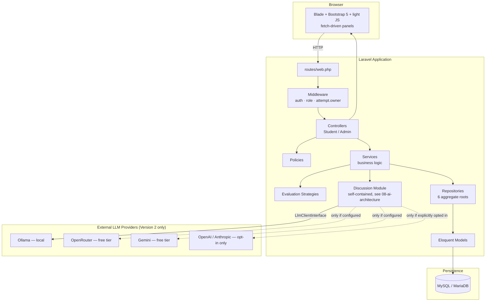

# 04 — System Architecture

> **Related:** [05-backend-architecture](05-backend-architecture.md) · [06-frontend-architecture](06-frontend-architecture.md) · [07-database-design](07-database-design.md) · [08-ai-architecture](08-ai-architecture.md) · [33-folder-structure](33-folder-structure.md) · [34-class-reference](34-class-reference.md)
> **Primary source:** `docs/04-architecture.md` (original pre-implementation design), reconciled here against the actual, as-built codebase. Where the two differ, this document describes what was actually built and notes the divergence — plans evolved during implementation, which is normal and is itself discussed in [20-design-decisions.md](20-design-decisions.md) and [30-lessons-learned.md](30-lessons-learned.md).

## High-Level Architecture

AI CaseLab is a monolithic Laravel 11 application (server-rendered Blade views, no separate SPA/API frontend) with one clearly-bounded module — the AI Discussion Engine — kept structurally independent of the rest of the domain.



## Layered Architecture

Standard Laravel MVC (Route → Controller → Model → View) is insufficient once "evaluate a diagnosis against a pluggable rubric strategy" and "orchestrate a multi-turn AI conversation with a cost-safe fallback chain" enter the picture. Two layers sit between Controller and Model:

```
Route → Middleware → Controller → Service → Repository (interface) → Eloquent Model → MySQL
                          │             │
                     FormRequest   Strategy (evaluation) / LlmClientInterface (discussion)
                     Policy        Event → Listener (side effects)
                          │
                        View (Blade + Bootstrap)
```

| Layer | Responsibility | Rule |
|---|---|---|
| **Controller** | HTTP-only concerns: receive request, ensure validated (Form Request) and authorized (Policy/middleware), call one Service method, return a response. | No business logic, no direct Eloquent queries. |
| **Service** | Orchestrates one use case (e.g., `DiagnosisSubmissionService`). Talks to Repositories/Models, applies business rules, fires Events. | One class, one use case — Single Responsibility. |
| **Repository** (interface + Eloquent implementation) | The only place that queries Eloquent for a given **aggregate root**. Bound to its interface in `RepositoryServiceProvider`. | Applied only where real query complexity/business rules exist — see below. |
| **Strategy** | The Evaluation Engine's pluggable scoring algorithms, resolved per rubric criterion's `matching_type`. | New scoring rule = new class implementing `EvaluationStrategyInterface`, zero changes to `EvaluationService`. |
| **Policy** | All authorization decisions ("can this user view/edit this case? can this student re-attempt?"). | Never scattered into controllers or Blade `@if`s. |
| **Middleware** | Cross-cutting request concerns: auth, role gating, attempt ownership, discussion rate limiting. | Applied at the route-group level wherever possible. |

### Where a Repository is deliberately *not* used

`Category`, `Role`, and `EvidenceType` are near-static lookup tables with trivial queries — wrapping them in Repository interfaces would be ceremony with no payoff. The Repository Pattern is applied only to the **domain aggregates with real query complexity and business rules**: `CaseModel` (`Case` is a reserved word in PHP, hence the class-vs-table name mismatch), `CaseAttempt`, `EvidenceItem`, `Diagnosis`, `Evaluation`, and `Hint` — six aggregates, six interfaces, six Eloquent implementations. This is a deliberate, defensible judgment call: patterns are tools for managing complexity, not a checklist applied uniformly. See `EloquentCaseRepository`, `EloquentCaseAttemptRepository`, `EloquentDiagnosisRepository`, `EloquentEvaluationRepository`, `EloquentEvidenceItemRepository`, `EloquentHintRepository` under `app/Repositories/Eloquent/`.

### Divergence from the original plan

The pre-implementation design (`docs/04-architecture.md`) sketched `CaseAttemptPolicy` and `EvidenceItemPolicy`. In the actual build, `CaseAttempt` ownership is enforced by `EnsureAttemptBelongsToUser` middleware (`$attempt->user_id === $request->user()->id`) rather than a Policy class — discovered and explicitly corrected during Phase 16, Milestone 4, when building `DiscussionSessionPolicy` (see [31-architecture-decision-records.md](31-architecture-decision-records.md), ADR on discussion authorization). The plan also named `DiagnosisService` and `NoteService`; the actual classes are `DiagnosisSubmissionService` and note-autosaving is handled directly by `NotebookController` delegating to `EvidenceInvestigationService`/model updates rather than a dedicated service, since the autosave logic never grew complex enough to justify one. Both are normal, low-risk plan-to-implementation drifts, not defects.

## Backend

Covered in full in [05-backend-architecture.md](05-backend-architecture.md): controllers, services, repositories, policies, Form Requests, routing conventions.

## Frontend

Covered in full in [06-frontend-architecture.md](06-frontend-architecture.md): Blade layout components, the Investigation Workspace's fetch-driven panels, and the Design System token layer.

## AI Subsystem

Covered in full starting at [08-ai-architecture.md](08-ai-architecture.md): the Discussion module (`app/Discussion/`) is architecturally isolated from the rest of the domain — it depends on Version 1 read-only through one adapter (`CaseAttemptDiscussionSubject`) and is never depended upon by Version 1 code. See the [Domain module isolation ADR](31-architecture-decision-records.md).

## Database

Covered in full in [07-database-design.md](07-database-design.md): 15 Version-1 domain tables plus 2 Version-2 tables (`discussion_sessions`, `discussion_turns`), all reachable from a single `CaseAttempt` graph.

## Services (index)

| Service | Owns |
|---|---|
| `CaseCatalogService` | Case browsing, publish-invariant enforcement |
| `CaseAttemptService` | Starting/resuming an attempt, reattempt policy |
| `EvidenceInvestigationService` | Evidence retrieval + view recording |
| `HintService` / `HintUnlockService` | Hint listing / idempotent unlock + penalty |
| `DiagnosisSubmissionService` | Idempotent diagnosis submission, triggers evaluation |
| `EvaluationService` | Rubric-criterion scoring via Strategy resolution, totals |
| `ManualReviewService` | Instructor score/comment override, total recalculation |
| `AnalyticsService` | Cohort-level aggregate metrics (backend only) |
| `ActivityLogService` | Admin audit-trail entries |
| `UserRegistrationService` | Registration, always assigns the `student` role |
| `DiscussionService` | The AI Discussion Engine's own state-machine orchestration (see [09-discussion-engine.md](09-discussion-engine.md)) |

Full class-by-class detail, including constructor dependencies and key methods, is in [34-class-reference.md](34-class-reference.md).

## Configuration

Application configuration follows standard Laravel convention (`config/*.php`, populated from `.env`), plus two Version-2-specific files:

- `config/llm.php` — per-tier provider settings (Ollama, OpenRouter, Gemini, paid fallback), `max_tokens`, `supports_structured_output` flags. The fallback chain's *order* is fixed in code (`LlmClientFactory`), not read from config — the fixed order is the cost-safety guarantee, not a preference. See [26-configuration-reference.md](26-configuration-reference.md).
- `config/discussion_personas.php` — Mentor/Interviewer persona data (tone directives, strictness, hint policy, round defaults, acceptance bar). See [10-persona-system.md](10-persona-system.md).

## Dependency Injection

All Repository interfaces and `LlmClientInterface` are bound in Service Providers, never resolved via `new` inside a Service:

- `RepositoryServiceProvider` — binds the six repository interfaces to their Eloquent implementations.
- `DiscussionServiceProvider` — binds `LlmClientInterface` to `FakeLlmClient` when `app()->environment('testing')`, and to `(new LlmClientFactory())->build()` (a singleton) otherwise. This single binding switch is what makes the entire Discussion module's test suite network-free without a single mock/stub scattered through individual tests.

## Events

| Event | Fired by | Listener(s) |
|---|---|---|
| `EvidenceViewed` | `EvidenceInvestigationService` | `RecordEvidenceView` |
| `CaseAttemptCompleted` | `EvaluationService` (on first successful evaluation) | *(no listener yet — a documented extension point for future analytics/badges)* |
| `DiscussionAccepted` | `DiscussionService` (on AI acceptance) | `PrefillDiagnosisFromAcceptedDiscussion` |

Listeners are auto-discovered by Laravel from their `handle()` method's type-hint — the same convention used for both Version 1 and Version 2 events, verified in tests that do *not* fake events, proving the real wiring works.

## Policies

| Policy | Key methods | Scope |
|---|---|---|
| `CasePolicy` | `view`, `create`, `update`, `delete`, `viewAny` | Case CRUD; drafts visible to author/admin only |
| `CategoryPolicy` | `create`, `update`, `delete` | Admin-only category management |
| `EvaluationPolicy` | `view`, `update` | Admin **or** instructor — the one policy that isn't admin-only, since manual review is an instructor task |
| `DiscussionSessionPolicy` | `view` (owner + admin/instructor), `participate` (owner only) | See [15-security-architecture.md](15-security-architecture.md) for the noted-but-currently-unreachable admin `view` path |

## Middleware

| Middleware | Purpose |
|---|---|
| `auth` (Breeze default) | Require login |
| `EnsureUserHasRole` (aliased `role`) | Route-group gating for `/admin/*` (`role:admin,instructor`) |
| `EnsureAttemptBelongsToUser` (aliased `attempt.owner`) | Prevents a student from opening someone else's `case_attempt` by guessing an ID; protects every `/investigation/{attempt}/*` route including all four Discussion routes |
| `throttle:discussion-messages` | Named rate limiter (10/minute, per user+attempt) on `POST /discussion/messages` only |

## Why This Satisfies SOLID

- **S**ingle Responsibility — controllers do HTTP only; each Service owns one use case; each Strategy owns one scoring algorithm; each LLM provider client owns one wire format.
- **O**pen/Closed — a new evidence type needs a new Blade renderer, not a controller change; a new evaluation method is a new `EvaluationStrategyInterface` implementation; a new LLM provider is a new `LlmClientInterface` implementation, with zero changes to `DiscussionService`.
- **L**iskov Substitution — any `EvaluationStrategyInterface` or `LlmClientInterface` implementation is substitutable wherever its interface is type-hinted (proven directly by `FakeLlmClient` standing in for every real provider client across the entire Discussion test suite).
- **I**nterface Segregation — repository interfaces are narrow and per-aggregate, not one large interface; `LlmClientInterface` exposes exactly one method (`complete()`).
- **D**ependency Inversion — Services depend on Repository/Strategy/`LlmClientInterface` **interfaces**, bound in Service Providers; concrete Eloquent classes and concrete LLM provider clients are implementation details swappable without touching calling code.
