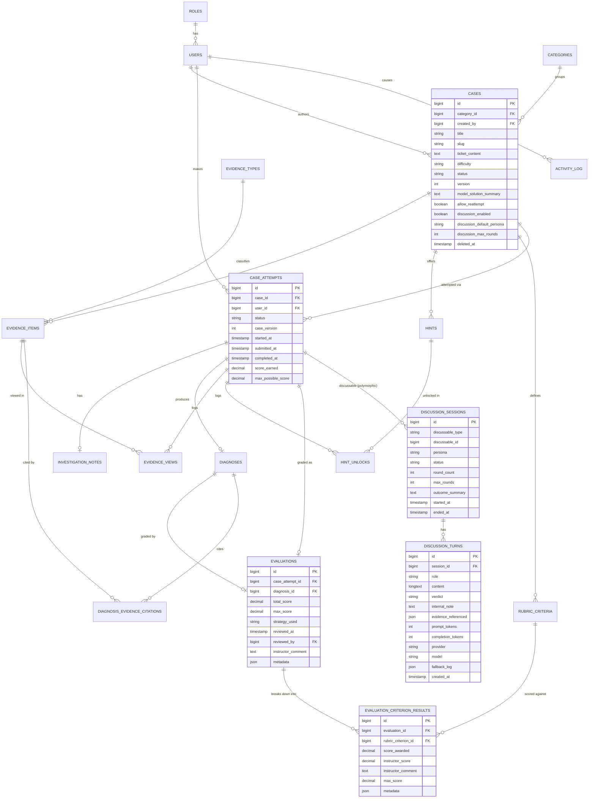

# 07 — Database Design

> **Related:** [04-system-architecture](04-system-architecture.md) · [05-backend-architecture](05-backend-architecture.md) · [09-discussion-engine](09-discussion-engine.md) · [23-performance-optimizations](23-performance-optimizations.md)
> **Primary source:** `docs/03-database-design.md` (Version 1 design, six numbered design decisions preserved below verbatim since they remain accurate), extended here with the two Version 2 tables and the Manual Review additive columns that postdate that document.

## Engine and Environment

MySQL 8 / MariaDB 10.4+ in development and production; **SQLite in-memory** for the automated test suite (`phpunit.xml`), chosen specifically so tests never depend on a locally-running database service. 23 migrations total as of Phase 22 (17 Version 1 + 2 core Version 2 tables + 1 Version 2 `cases` column-addition migration + 2 Manual Review column-addition migrations + 1 evidence/case seed-adjacent migration).

## Design Rationale (Version 1)

These six decisions, made during the pre-implementation Phase 3 architecture review, still govern the schema:

1. **Evidence is one polymorphic-shaped table, not one table per evidence type.** A single `evidence_items` table with an `evidence_type_id` reference and a `payload` JSON column, instead of `evidence_logs`/`evidence_code_snippets`/`evidence_db_snapshots`/etc. as separate tables. Trades column-level typing for zero-migration extensibility — adding a new evidence type is one seed row plus one new Blade renderer, never a schema change. Directly serves NFR1 (Scalability).
2. **Rubric-based evaluation, not free-text grading.** `rubric_criteria` belongs to a case; `evaluations` + `evaluation_criterion_results` store the graded outcome. Deterministic and explainable, while `evaluations.metadata`/`evaluation_criterion_results.metadata` (nullable JSON) leave an explicit extensibility seam for a future AI-assisted strategy that still writes into the same result tables — deliberately unused by every current strategy.
3. **Enum-like columns are `string` + PHP backed enums, not native SQL `ENUM`.** `cases.difficulty`/`status`, `case_attempts.status`, `diagnoses.confidence_level`, `rubric_criteria.matching_type` — and later `discussion_sessions.status`/`discussion_turns.role`/`verdict` — are all plain `string` columns cast via PHP backed enums. Adding a new enum value (e.g. an `expert` difficulty) is a one-line PHP change, not an `ALTER TABLE`.
4. **Case versioning is a lightweight counter, not a full snapshot.** `cases.version` increments on every edit to a published case; `case_attempts.case_version` records which version a student attempted. Flags drift without the cost of snapshotting the entire case graph on every edit.
5. **Diagnosis evidence citations are a pivot table, not a JSON array.** Normalized from an originally-planned `cited_evidence_ids` JSON column into `diagnosis_evidence_citations`, because Analytics needs an indexed `GROUP BY evidence_item_id` to compute "most-cited vs. never-cited evidence" — a query a JSON array scattered across rows can't serve efficiently.
6. **Admin/system actions get a generic `activity_log` table.** One polymorphic table (`causer_id`, `subject_type`, `subject_id`, `action`, `changes` JSON) rather than a bespoke audit table per auditable model.

## Design Rationale (Version 2 addition)

7. **`discussion_sessions` is polymorphic on purpose, even though only one subject type exists today.** `discussable_type`/`discussable_id` (Laravel `morphs()`) resolves to `CaseAttempt` for every session Version 2 ships — but the polymorphism costs nothing extra now and means a future subject (e.g., reviewing a pull request directly) needs zero schema change, only a new `DiscussionSubjectInterface` implementation. `persona` is a validated plain string, not a DB enum — the one deliberate exception to design decision 3 — because the set of personas is expected to grow in a way the core state-machine enums are not (see [10-persona-system.md](10-persona-system.md)).

## Entity-Relationship Diagram (complete, Version 1 + Version 2)

*(Non-discussion tables not redrawn above — `roles`, `users`, `categories`, `evidence_types`, `evidence_items`, `hints`, `rubric_criteria`, `investigation_notes`, `diagnoses`, `diagnosis_evidence_citations`, `evidence_views`, `hint_unlocks`, `activity_log` — are unchanged from Version 1; see the full column-by-column reference in `docs/03-database-design.md` §2, which remains accurate for every table it covers.)*

## New in Version 2

### discussion_sessions

| Column | Type | Notes |
|---|---|---|
| id | bigint PK | |
| discussable_type / discussable_id | string / bigint | polymorphic; resolves to `CaseAttempt` in every session Version 2 creates |
| persona | string | validated against `config('discussion_personas')` at the application layer, not a DB enum |
| status | string | `App\Enums\DiscussionStatus` — `active`, `accepted`, `ended_by_student`, `max_rounds_reached` |
| round_count | int | |
| max_rounds | int | resolved from `cases.discussion_max_rounds` or the persona's own config default |
| outcome_summary | text, nullable | populated on acceptance by `PrefillDiagnosisFromAcceptedDiscussion`; read at diagnosis-form render time |
| started_at / ended_at | timestamp | |

### discussion_turns

| Column | Type | Notes |
|---|---|---|
| id | bigint PK | |
| session_id | bigint FK → discussion_sessions.id | cascade on delete |
| role | string | `App\Enums\DiscussionTurnRole` — `student`, `ai` |
| content | longtext | |
| verdict | string, nullable | `App\Enums\DiscussionVerdict` — `continue`, `accept`, `end_unresolved`; null on student turns |
| internal_note | text, nullable | model's own reasoning note, not shown to the student |
| evidence_referenced | json, nullable | |
| prompt_tokens / completion_tokens | int, nullable | |
| provider / model | string, nullable | which tier actually served this turn |
| fallback_log | json, nullable | populated **only** when the primary tier didn't serve the turn — see [13-provider-abstraction.md](13-provider-abstraction.md) |
| created_at | timestamp | **no `updated_at`** — `$timestamps = false` on the model, matching `ActivityLog`'s existing append-only shape |

### `cases` additive columns (§9.3 of the frozen AI design spec — the one Version 1 table Version 2 touches)

| Column | Type | Notes |
|---|---|---|
| discussion_enabled | boolean | default `false` — every pre-existing case defaults to discussion disabled |
| discussion_default_persona | string, nullable | validated against live persona config, required only when `discussion_enabled` is true |
| discussion_max_rounds | int, nullable | falls back to the persona's own default when null |

### Manual Review additive columns (Phase 6, Milestone 2 — predates Version 2 but postdates the original design doc)

| Table | New columns | Notes |
|---|---|---|
| `evaluations` | `reviewed_at`, `reviewed_by` (FK → users.id), `instructor_comment` | |
| `evaluation_criterion_results` | `instructor_score` (nullable), `instructor_comment` | `score_awarded` is **never overwritten** — it stays the auditable strategy output; `instructor_score` is a separate override, and `EvaluationCriterionResult::effectiveScore()` is the one place that decides which value wins |

## Relationships Summary

Unchanged from Version 1 (`roles`→`users`, `categories`→`cases`, `cases`→{`evidence_items`,`hints`,`rubric_criteria`,`case_attempts`}, `case_attempts`↔`evidence_items` through `evidence_views`, `case_attempts`↔`hints` through `hint_unlocks`, `diagnoses`↔`evidence_items` through `diagnosis_evidence_citations`, `case_attempts`—1:1—`evaluations`), plus:

- `case_attempts` 1—N `discussion_sessions` (polymorphic `discussable`)
- `discussion_sessions` 1—N `discussion_turns`

## Indexing Notes

Carried over from `docs/03-database-design.md` §4 and reconfirmed present in the actual migrations during the Phase 12 performance audit ([23-performance-optimizations.md](23-performance-optimizations.md)):

- `cases`: `(status, category_id, difficulty)` for catalog filtering.
- `case_attempts`: `(user_id, status)` for dashboard queries; `case_id` for instructor analytics.
- `evidence_items`: `case_id`.
- `evidence_views` / `hint_unlocks`: composite unique indexes double as lookup indexes.
- `diagnosis_evidence_citations`: composite unique `(diagnosis_id, evidence_item_id)`; index on `evidence_item_id` for citation-count analytics.
- `activity_log`: `(subject_type, subject_id)`; index on `causer_id`.

## Migrations

Migrations live in `database/migrations/`, one table (or one additive column set) per file, run via `php artisan migrate`. Reference/lookup data (`roles`, `evidence_types`, `categories`) is populated via dedicated seeders (`RoleSeeder`, `EvidenceTypeSeeder`, `CategorySeeder`), separate from `DemoDataSeeder` (three fully-populated, published demo cases, confirmed idempotent). See [27-developer-guide.md](27-developer-guide.md) for the exact local setup commands.
