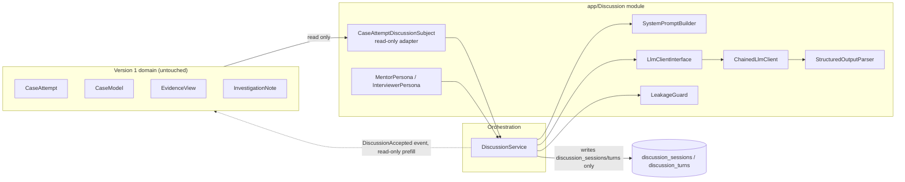

# 08 — AI Architecture (Overview)

> **Related:** [09-discussion-engine](09-discussion-engine.md) · [10-persona-system](10-persona-system.md) · [11-prompt-pipeline](11-prompt-pipeline.md) · [12-structured-output](12-structured-output.md) · [13-provider-abstraction](13-provider-abstraction.md) · [14-state-machine](14-state-machine.md)
> **Primary source:** `docs/13-ai-discussion-engine-design.md` (the frozen Version 2 design spec, ~1,400 lines) and `docs/14-v2-implementation-roadmap.md` (Phases 13–22). This document is the entry point into the AI subsystem's documentation cluster (08–14); it summarizes and cross-references rather than duplicating the full spec.

## What the AI Subsystem Is

AI CaseLab's only AI-driven feature is the **Engineering Discussion**: a Socratic AI reviewer that challenges a student's stated root-cause reasoning *before* they submit a formal diagnosis, modeled on a real code review or postmortem happening before a fix is merged, not as commentary after the fact. It is not a grader — rubric-based scoring (see [17-testing-strategy.md](17-testing-strategy.md) and the Evaluation Engine in [05-backend-architecture.md](05-backend-architecture.md)) remains the sole scoring authority.

## The Seven Architectural Decisions

`docs/13-ai-discussion-engine-design.md`'s executive summary states seven decisions that shape everything else in the subsystem. Restated here because they are the single most important piece of context for anyone extending this module:

1. **Additive, not invasive.** No existing Version 1 table, column, enum, or class changes. The Discussion Engine is new tables, a new `App\Discussion` module, and one new nullable flag family on `cases`. Deleting Version 2 entirely would leave Version 1 unaffected.
2. **Discussion happens before final submission, not after** — the AI participates in reaching the conclusion, not critiquing a done deal.
3. **Personas are data + a thin strategy, not hardcoded chatbots** — resolved through the same Strategy-pattern shape the Evaluation Engine already uses. See [10-persona-system.md](10-persona-system.md).
4. **The subject being discussed is just as pluggable as who's discussing it** — `CaseAttempt` today, via `DiscussionSubjectInterface`, but not hardwired to it.
5. **The LLM provider is resolved through a cost-safe, ordered fallback chain — never a silent path to a paid provider.** See [13-provider-abstraction.md](13-provider-abstraction.md).
6. **The model never sees "reveal the answer" as a live option** — the system prompt forbids it, and a server-side check inspects every reply regardless of what the prompt said. Defense in depth, not "the prompt asked it nicely." See [15-security-architecture.md](15-security-architecture.md).
7. **Synchronous request/response for the MVP** — one bounded LLM call per turn, a few seconds, acceptable inline; no queue, no streaming. Called out explicitly as the first scalability upgrade, not a launch requirement (see [29-future-roadmap.md](29-future-roadmap.md)).

## Module Boundary

`app/Discussion/` depends on Version 1 through exactly one adapter (`CaseAttemptDiscussionSubject`, reading `CaseAttempt`/`CaseModel`/`EvidenceItem`/`RubricCriterion`/`EvidenceView`/`InvestigationNote` — never writing to any of them) and is never depended upon *by* Version 1 code. The one place `DiscussionService` reaches outside this abstraction is reading `$attempt->case->model_solution_summary` directly for `LeakageGuard`, because that check needs specifically the sensitive answer text, not the subject's full `groundTruthContext()` blob (which legitimately includes evidence content the AI is *supposed* to quote) — documented in the service's own docblock as a deliberate, narrow exception.

## Component Responsibilities

| Component | Namespace | Responsibility |
|---|---|---|
| `DiscussionService` | `App\Services` | Orchestrates one full turn: persist student message → build context → call the LLM → guard the reply → persist AI turn → apply state transition |
| `LlmClientInterface` + implementations | `App\Discussion\Contracts`, `Infrastructure\Llm` | The one boundary for talking to a language model — see [13-provider-abstraction.md](13-provider-abstraction.md) |
| `AiPersonaInterface` + `MentorPersona`/`InterviewerPersona` | `App\Discussion\Contracts`, `Personas` | The "who/how" axis — see [10-persona-system.md](10-persona-system.md) |
| `DiscussionSubjectInterface` + `CaseAttemptDiscussionSubject` | `App\Discussion\Contracts`, `Subjects` | The "what" axis — read-only access to ground truth and student progress |
| `SystemPromptBuilder` | `App\Discussion\Support` | Pure string composition of persona + subject into the system prompt — see [11-prompt-pipeline.md](11-prompt-pipeline.md) |
| `StructuredOutputParser` + `TurnClassifier` | `App\Discussion\Infrastructure\Llm\Support`, `Support` | Interprets a model's structured output strictly — see [12-structured-output.md](12-structured-output.md) |
| `LeakageGuard` | `App\Discussion\Support` | Deterministic, non-LLM check that a reply doesn't leak the model solution — see [15-security-architecture.md](15-security-architecture.md) |
| `FakeLlmClient` | `App\Discussion\Testing` | Network-free `LlmClientInterface` implementation bound in the testing environment — makes the entire module's test suite deterministic and offline |

## Cost and Safety Guarantees (summary)

Full detail in [13-provider-abstraction.md](13-provider-abstraction.md) and [24-cost-optimizations.md](24-cost-optimizations.md). In one sentence: the default configuration costs nothing, structurally, because the paid tier does not exist in the fallback chain at all unless an operator explicitly sets `LLM_ALLOW_PAID_FALLBACK=true` — provable by reading `LlmClientFactory`'s source, not just by testing its behavior.

## Read Next

- [09-discussion-engine.md](09-discussion-engine.md) — the conversation flow and UI integration in full
- [10-persona-system.md](10-persona-system.md) — Mentor vs. Interviewer
- [11-prompt-pipeline.md](11-prompt-pipeline.md) — system prompt composition, context management, token budget
- [12-structured-output.md](12-structured-output.md) — the structured-output contract and its failure-mode handling
- [13-provider-abstraction.md](13-provider-abstraction.md) — Ollama, OpenRouter, Gemini, the paid tier, and the fallback chain
- [14-state-machine.md](14-state-machine.md) — the four-state discussion lifecycle
