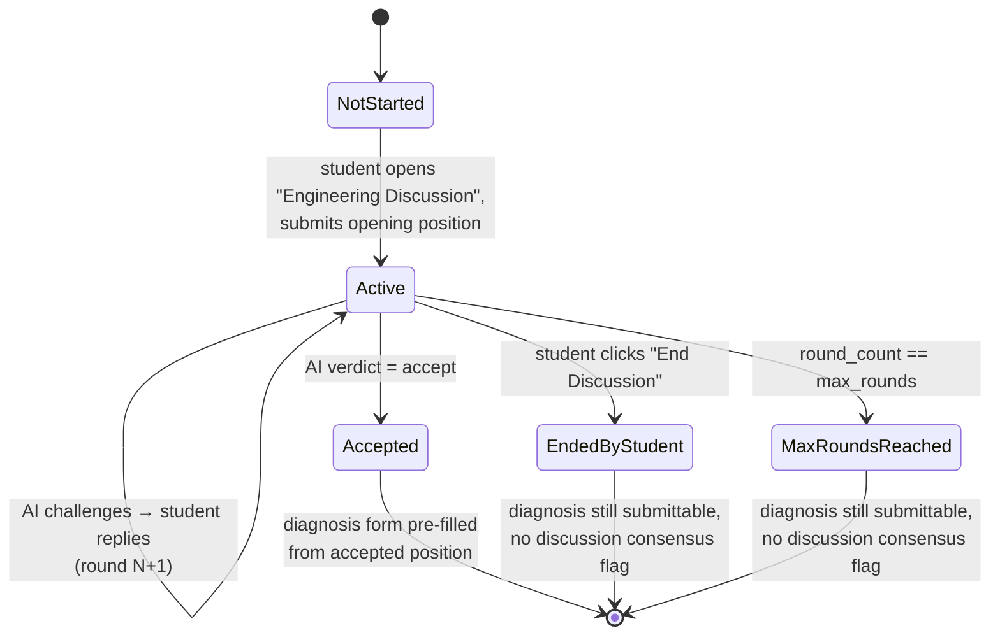

# 09 — Discussion Engine

> **Related:** [08-ai-architecture](08-ai-architecture.md) · [14-state-machine](14-state-machine.md) · [10-persona-system](10-persona-system.md) · [16-design-system](16-design-system.md)
> **Primary source:** `docs/13-ai-discussion-engine-design.md` §2, §11; Phase 16–19 commit history.

## Purpose

The Engineering Discussion is the mechanism by which a student's stated diagnosis is stress-tested before it becomes a graded submission. It is deliberately positioned **before** Submit Diagnosis, not after, matching how a real code review or postmortem happens before a fix is merged — not as a formality once the outcome is already fixed.

## Conversation Flow

A **round** is one student turn plus one AI turn — simple, countable, matches "maximum discussion rounds" literally. Full state-machine implementation detail (guards, exceptions, persistence) is in [14-state-machine.md](14-state-machine.md).

## Why This Shape

- **Ending early or hitting the round cap never blocks submission.** The discussion is a rigor tool, not a gate that can trap a frustrated or time-pressured student. Discussion outcome is recorded as metadata visible to the instructor on Performance Review — the same transparency principle the Manual Review queue already embodies for judgment-based rubric criteria — never a new blocking precondition.
- **Acceptance auto-carries into the diagnosis form, pre-filled but still editable** — not a second, disconnected place the student has to re-type their conclusion. Mechanically, this happens via the `DiscussionAccepted` event and the `PrefillDiagnosisFromAcceptedDiscussion` listener, not logic inside the state machine itself: the state machine only knows "accepted," not "and therefore pre-fill a diagnosis," which is what keeps it reusable for a future subject type that has no diagnosis form at all.
- **`max_rounds` is per-case, not global** — a five-evidence-item case reasonably supports more back-and-forth than a two-evidence-item one — falling back to the resolved persona's own default (Mentor: 8, Interviewer: 5) when a case doesn't override it.
- **What "accept" checks:** the AI is instructed to judge the *shape* of good reasoning against the case's rubric and model solution — root cause identified, tied to specific evidence, no unaddressed contradiction — without ever comparing against exact wording. The same "accept good reasoning even if the wording differs" principle the rubric's own keyword/citation strategies apply, applied consistently to how the AI is instructed to judge.

## The Workspace Panel

Built across Phase 18 (Milestones 1–4):

1. **Entry point** (Milestone 1) — a `<button class="btn btn-outline-primary btn-sm">` in the Investigation Workspace top bar, positioned immediately before Submit Diagnosis, visible only when the case's `discussion_enabled` is true. Sized/spaced to match Submit Diagnosis exactly, distinguished only by outline-vs-filled (a peer action, not *the* primary action of the screen). `WorkspaceLayout`'s `discussionUrl` parameter is nullable — `null` renders the workspace exactly as every pre-Version-2 case always has.
2. **Chat panel** (Milestone 2) — a dark-panel, chat-style modal reusing the workspace's existing dark-panel visual language (the same "Night" token family as the evidence log/code viewers — see [16-design-system.md](16-design-system.md)), not a generic light chat UI. Fetch-driven JS mirroring the Notebook-autosave/Hint-unlock conventions already established elsewhere in the workspace. Shows a round counter and an "AI is thinking…" state while a turn is in flight.
3. **End/accept flow** (Milestone 3) — an "End Discussion" confirmation mirroring the existing exit-confirmation modal pattern, and an explicit banner with a call to action on acceptance (never a silent redirect) marking the accept → diagnosis-prefill transition.
4. **Unavailable state** (Milestone 4) — for the chain-exhausted case: a neutral, specific message ("AI Discussion Unavailable") with a student-triggered "Try Again" action — never a hardcoded provider name, never an automatic retry loop. See [15-security-architecture.md](15-security-architecture.md) for why the message is deliberately generic.

These four pieces were committed together (Milestones 2–4 in one commit) because they were built as one physically interleaved unit — the modal's HTML nests the accepted-banner and unavailable-state markup directly inside the base panel, and the script's IIFE declares all their DOM references in one shared block before any are used, so there was no clean line to split the diff at without fabricating an intermediate state that never existed.

## Performance Review Integration

Added in Phase 19, Milestone 1: an "Engineering Discussion" card on Performance Review, a *sibling* to the existing rubric-breakdown card (not nested inside it, which stays exactly as Version 1 built it). Collapsed by default, since most students checking their score aren't there to re-read a full transcript. `PerformanceReviewController` loads the most recent discussion session for the attempt regardless of outcome (accepted, ended-by-student, or max-rounds-reached — a student can end without accepting and still want to see it here), or renders nothing when no discussion was ever started. The card shows persona, outcome, round count, and the full turn-by-turn transcript.

## Admin Configuration

Added in Phase 19, Milestone 2: a "discussion_enabled" toggle, default-persona select, and max-rounds override in the admin case editor, grouped as their own "Engineering Discussion" card near the existing publish-workflow controls. `discussion_default_persona` is required only when `discussion_enabled` is being turned on — an admin cannot enable discussion without a usable configuration, since `DiscussionService::start()` has no fallback persona. `CaseModel::$fillable` gained all three discussion columns only at this point (Phase 19), deliberately withheld before this validated/authorized admin path existed.

## Rate Limiting and Abuse Resistance

The only endpoint that triggers an LLM call, `POST /discussion/messages`, is protected by a named `RateLimiter` (`discussion-messages`, 10 requests/minute), keyed by **user ID and attempt ID together** — so one student's usage on one attempt never affects their budget on a different attempt. `start`/`end`/`show` are not rate-limited, matching the design spec's literal scope ("on the messages endpoint" — the one that costs money on every request).

## Related Reading

[10-persona-system.md](10-persona-system.md) · [11-prompt-pipeline.md](11-prompt-pipeline.md) · [12-structured-output.md](12-structured-output.md) · [13-provider-abstraction.md](13-provider-abstraction.md) · [14-state-machine.md](14-state-machine.md) · [35-sequence-diagrams.md](35-sequence-diagrams.md#engineering-discussion-a-full-turn)
