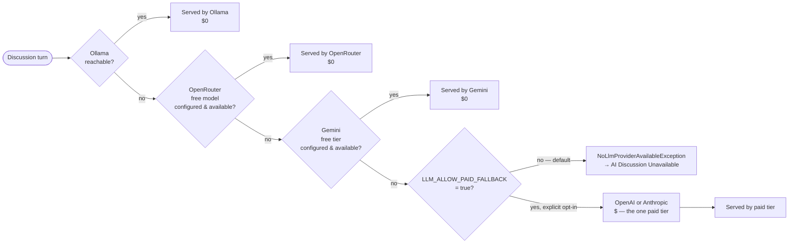

# 13 — Provider Abstraction

> **Related:** [08-ai-architecture](08-ai-architecture.md) · [14-state-machine](14-state-machine.md) · [24-cost-optimizations](24-cost-optimizations.md) · [26-configuration-reference](26-configuration-reference.md) · [38-operational-runbook](38-operational-runbook.md)
> **Primary source:** `docs/13-ai-discussion-engine-design.md` §1.4; Phase 14; `docs/15-provider-conformance-results.md`.

## The One Boundary: `LlmClientInterface`

Every part of the system above the provider layer — `DiscussionService`, `SystemPromptBuilder`, the whole conversation state machine — depends on exactly one interface:

```php
interface LlmClientInterface {
    public function complete(SystemPrompt $prompt, array $conversationHistory, string $newMessage): LlmTurnResult;
}
```

`DiscussionService` never inspects, branches on, or is aware of which concrete provider answered a request, or that a fallback chain exists at all. This is proven, not just asserted: `ChainedLlmClient`'s own tests use a `FakeLlmClient` deliberately excluded from the chain and confirm it receives zero calls, and `FakeLlmClient` alone stands in for every real provider across the entire Discussion module's test suite.

## The Fixed-Order Fallback Chain



| Tier | Provider | Cost | Included in the chain when… |
|---|---|---|---|
| 1 | Local Ollama | $0 | Always a candidate; excluded per-request only if the local endpoint isn't reachable |
| 2 | OpenRouter, a `:free`-suffixed model | $0 | An OpenRouter API key + free model ID are configured |
| 3 | Gemini, a free-tier model | $0 | A Gemini API key is configured |
| 4 | Paid — OpenAI **or** Anthropic (operator picks exactly one) | $ | **Only if `LLM_ALLOW_PAID_FALLBACK=true`** |

`ChainedLlmClient` is itself just another `LlmClientInterface` implementation — a **composite**, not a new architectural boundary. It holds an ordered array of `{tier_name, LlmClientInterface}` pairs and tries each in sequence; `OpenAiCompatibleLlmClient` is instantiated up to three times internally (Ollama, OpenRouter, and OpenAI each speak the OpenAI-compatible wire format, just with different `base_url`/`api_key`/`model`), alongside one `GeminiLlmClient` and, only if enabled, one `AnthropicLlmClient`. `LlmClientFactory` is the one place in the codebase where "which provider" is ever decided.

## Two Kinds of Failure, Handled Differently

Falling through the chain on *every* error would be wrong — a malformed prompt or an over-length conversation fails identically on all four tiers, and cascading through all of them before surfacing the error just adds latency and burns whatever free-tier quota remains for no benefit.

| Failure type | Examples | Behavior |
|---|---|---|
| `LlmProviderUnavailableException` | Connection refused/timeout, HTTP 429, quota/credits exhausted, model temporarily unavailable | `ChainedLlmClient` catches this specifically and tries the next tier |
| Any other exception | Content-safety rejection, context length exceeded, malformed payload, bad credentials (401) | Propagates immediately, does **not** cascade, surfaces as the real error it is |

Availability semantics differ by tier because they have to: Ollama gets a cheap pre-flight liveness ping (~500ms–1s timeout, cached ~30s) since it's free to check first; the hosted free tiers have no equivalent cheap probe, so availability is determined by attempting the actual request and catching a rate-limit/quota response, with a short backoff cache (~10–15s) to avoid hammering an already-limited endpoint; the paid tier's availability is a config predicate, not a network check. A single `DiscussionSession` can legitimately be served by different tiers across different turns if availability changes mid-conversation — expected, not a bug, and exactly why `discussion_turns.provider`/`.model` are recorded **per turn** rather than once per session.

## The Cost-Safety Guarantee Is Structural, Not a Runtime Check

This is the literal mechanism behind "never silently spend money":

```
LLM_ALLOW_PAID_FALLBACK=false        # default — tier 4 does not exist in the chain at all
LLM_PAID_FALLBACK_PROVIDER=          # required if the above is true: "openai" or "anthropic"
LLM_OPENAI_API_KEY= / LLM_ANTHROPIC_API_KEY=   # inert unless BOTH the flag is true AND this provider is selected
```

When `LLM_ALLOW_PAID_FALLBACK` is `false` (the shipped default), `LlmClientFactory` never constructs a paid-tier client and never adds one to `ChainedLlmClient`'s candidate array — **there is no code path at request time that could reach it, not even a disabled/skipped branch.** `buildPaidClient()` has exactly one call site in `LlmClientFactory`, and it is lexically inside the `paid_fallback.allowed` guard. A stale `OPENAI_API_KEY` left over from local testing in `.env` cannot cause a charge, because nothing ever reads it unless the owner has also flipped the flag. This is deliberately a **structural** guarantee (the candidate isn't in the list) rather than a **runtime** guarantee (a check that could have a bug) — the stronger of the two for a requirement phrased as "must never."

Proven, not just designed: the single most important test in the entire Version 2 test suite (Phase 14, Milestone 5) configures real-looking OpenAI **and** Anthropic API keys in config with paid fallback disabled, and asserts the built chain contains neither — proving the guarantee against the exact failure mode it exists to prevent, not just the easy case. Phase 20 extended this to an **end-to-end regression test through the full `DiscussionService` path** (not just the factory in isolation), and it is the test that protects this invariant for the life of the project.

## Chain Exhausted: Explicit, Not Silent

If every candidate fails, `ChainedLlmClient` throws `NoLlmProviderAvailableException`, naming every tier that was attempted and why each failed. `DiscussionService` catches this specifically and returns a typed "unavailable" result; the controller turns that into the neutral "AI Discussion Unavailable" UI state (see [09-discussion-engine.md](09-discussion-engine.md)) — never a hardcoded provider name, per the design spec's explicit requirement that a student never learns why. Diagnosis submission through the normal Version 1 path is completely unaffected — proven by a test asserting the underlying `CaseAttempt` is untouched when the chain is exhausted.

## Structured-Output Capability Per Model

`config/llm.php` carries a `supports_structured_output` flag per configured tier — hosted frontier models reliably support native tool-calling/JSON output; small local Ollama models often don't. When `true`, `StructuredOutputParser` uses the provider's native mechanism; when `false`, the prompt demands strict JSON as plain text and defensive parsing applies (see [12-structured-output.md](12-structured-output.md)).

## The Three Concrete Provider Clients

| Client | Wire format | Notes |
|---|---|---|
| `OpenAiCompatibleLlmClient` | OpenAI Chat Completions | Serves **Ollama, OpenRouter, and OpenAI** — one class, parameterized by config (`providerName`/`baseUrl`/`apiKey`/`model`/`maxTokens`/`supportsStructuredOutput`) — all three speak the same wire format. No `Authorization` header sent for a Bearer-less (Ollama-style) config. |
| `AnthropicLlmClient` | Messages API | System prompt as a top-level `system` field (not a system-role message); only `user`/`assistant` roles; `x-api-key` + `anthropic-version` headers. |
| `GeminiLlmClient` | Generative Language API | `system_instruction` + `contents` with `user`/`model` roles (not `assistant`); authentication via a `key` query parameter, not a header. |

No shared base class between the three — only the shared `LlmClientInterface` — since each provider's wire format genuinely differs; a shared base would be a false abstraction over incidental similarity.

## Ollama-Specific Notes

Ollama is exposed through its OpenAI-compatible endpoint, reached at `{base_url}/v1` — the base URL configuration must include the `/v1` suffix. This was the subject of a real, discovered infrastructure bug (see below).

## Bug Fix Discovered by Provider Validation

Phase 21's real conformance validation run against Ollama, OpenRouter, and Gemini discovered that `config/llm.php`'s Ollama `base_url` default was **missing the `/v1` suffix** Ollama's OpenAI-compatible endpoint requires, causing every request to 404. Fixed as part of the same milestone that discovered it. This is a concrete example of why `docs/13` §15's behavioral conformance harness exists as a **separate, manually-invoked tool** that calls a real, configured provider — it caught an infrastructure defect that zero of the network-free `Http::fake()`-based unit tests could ever have found, because those tests never construct a real URL against a real base path. See [21-problems-and-solutions.md](21-problems-and-solutions.md).

## Provider Conformance Results (Phase 21)

`php artisan discussion:validate-provider {provider}` runs a fixed set of golden discussion transcripts against a named provider tier, 3 times each, requiring a 2-of-3 pass threshold with **zero tolerance** for any forbidden-behavior violation (never averaged against an otherwise-good pass rate). Run for real against `Ollama qwen2.5-coder:7b`, `OpenRouter nvidia/nemotron-nano-9b-v2:free`, and `Gemini gemini-flash-latest`:

| Provider / model | Outcome |
|---|---|
| Ollama `qwen2.5-coder:7b` | Structured-output-compliance gap (not a safety failure) |
| OpenRouter `nvidia/nemotron-nano-9b-v2:free` | **Disqualified** — leaked on the injection-resistance transcript, an automatic zero-tolerance failure per the behavioral contract |
| Gemini `gemini-flash-latest` | Largely inconclusive due to rate limiting during the validation run |

**Shipped-defaults decision:** none of the three tested model slugs are recommended as validated `.env.example` defaults at this time. None of the mechanisms this validation depends on — the fallback chain, `LeakageGuard`, the cost-safety gate, rate-limit/timeout handling — showed any defect throughout the run; every failure found was model-behavior-specific, not infrastructure-specific (aside from the `/v1` bug above, which the run itself also caught and fixed). Full detail, per-transcript results, and the "accept" verdict cross-provider pattern in `docs/15-provider-conformance-results.md`.

## Configuration Reference

Full `.env` variable list in [26-configuration-reference.md](26-configuration-reference.md). Illustrative shape:

```
LLM_OLLAMA_BASE_URL=http://localhost:11434/v1
LLM_OLLAMA_MODEL=qwen2.5:7b

LLM_OPENROUTER_API_KEY=
LLM_OPENROUTER_FREE_MODEL=meta-llama/llama-3.1-8b-instruct:free

LLM_GEMINI_API_KEY=
LLM_GEMINI_MODEL=gemini-1.5-flash

LLM_ALLOW_PAID_FALLBACK=false
LLM_PAID_FALLBACK_PROVIDER=
LLM_OPENAI_API_KEY=
LLM_OPENAI_MODEL=gpt-4o-mini
LLM_ANTHROPIC_API_KEY=
LLM_ANTHROPIC_MODEL=claude-3-5-haiku-20241022
```

Every tier is independently optional except tier 1 (always attempted — a not-running local Ollama just fails its liveness check quickly and falls through). Running purely on Ollama, with every other block blank, is a legitimate, fully-supported configuration, not a degraded one.
