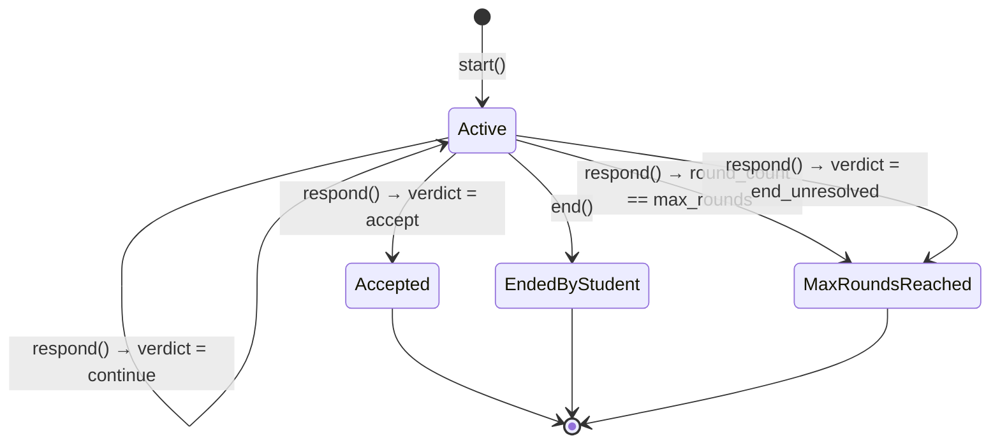
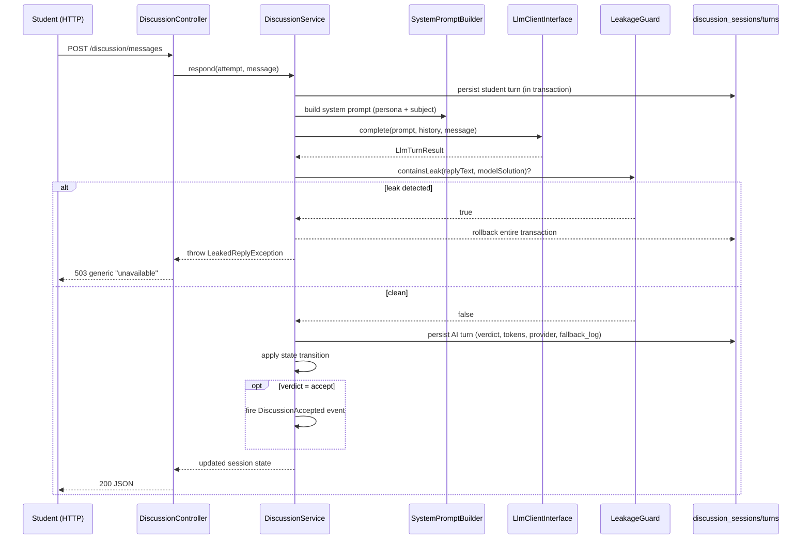

# 14 — State Machine

> **Related:** [09-discussion-engine](09-discussion-engine.md) · [13-provider-abstraction](13-provider-abstraction.md) · [15-security-architecture](15-security-architecture.md)
> **Primary source:** `docs/13-ai-discussion-engine-design.md` §2, §9.2; Phase 16.

## The Four States

`DiscussionStatus` (`App\Enums`): `active`, `accepted`, `ended_by_student`, `max_rounds_reached`.

`verdict = end_unresolved` has no dedicated terminal database status — the schema only has `Active`/`Accepted`/`EndedByStudent`/`MaxRoundsReached` — so it is mapped to `MaxRoundsReached` as the closest existing "terminal, unresolved" state. This mapping is tested explicitly rather than left to guesswork.

## `DiscussionService`

`DiscussionService` (`App\Services`) orchestrates a complete turn per this exact sequence:

No HTTP, no UI, no schema changes live in this class — orchestration only, matching a strict "one class, one use case" scope kept even across a five-milestone phase.

## Transaction Safety

The `LeakageGuard` check runs inside the **same `DB::transaction()`** as the rest of the turn: a detected leak throws `LeakedReplyException` immediately, and because the check is inside that transaction, the student's own message for that exchange rolls back too. Proven directly in tests (zero sessions, zero turns left behind after a blocked reply on the very first turn of a session, **and** — extended in Phase 16 Milestone 5 — zero *additional* rows left behind when a leak occurs on a later round after prior legitimate turns already exist, with round-count and turn-count returning to exactly where they were before the failed attempt, not the whole session being wiped).

## Guards

| Guard | Enforced by | Behavior |
|---|---|---|
| One active session per subject | `DiscussionService::start()` | Throws `DiscussionAlreadyActiveException` on an existing `Active` session for the same attempt — a real guard, not just a comment, per the design spec's §9.1 requirement |
| Terminal session cannot be responded to or ended again | `DiscussionService::respond()`/`end()` | Throws `DiscussionNotActiveException` |
| Cross-case hint/discussion access | Various | See [15-security-architecture.md](15-security-architecture.md) |

## Round and Persona Resolution

- **`max_rounds`** resolves as `$attempt->case->discussion_max_rounds ?? <resolved persona's config default>` — per-persona, not a flat platform constant, since Mentor and Interviewer's own defaults genuinely differ (8 vs. 5), which is more specific and correct than a single flat "proposed: 6" mentioned elsewhere in the early design notes.
- **Persona** defaults to `cases.discussion_default_persona` when not explicitly supplied to `start()`, matching the routes' documented "persona (or case default)" behavior.

## Events

`DiscussionAccepted` (`App\Events`) carries only the `DiscussionSession` itself — matching `CaseAttemptCompleted`'s existing plain-class style, and deliberately subject-agnostic per the design spec. `PrefillDiagnosisFromAcceptedDiscussion` (`App\Listeners`), auto-discovered from its `handle(DiscussionAccepted $event)` type-hint, does **not** create a `Diagnosis` row (a real constraint discovered by reading `DiagnosisSubmissionService` before writing this listener: its idempotency check is purely "does a diagnosis row already exist for this attempt," so writing one early would make the student's real, later submission silently return the stale prefilled row instead of persisting what they actually wrote — a serious would-be Version 1 regression). Instead, the listener populates `discussion_sessions.outcome_summary` — already-existing schema, whose own documented purpose is exactly this — with the accepted round count and the student's final turn. The Diagnosis Submission form reads this at **render time**, the same way it already pre-checks cited-evidence chips from `EvidenceView` at render time rather than writing that state early.

## Testing

`DiscussionServiceTest` (per-behavior unit tests) and `DiscussionServiceEndToEndTest` (five full multi-round scenarios — accepted, ended-by-student, max-rounds-reached, discussion-unavailable, leakage-rejection — each checking state, every persisted turn, emitted events, and `outcome_summary` together) complement each other the same way `EndToEndWorkflowTest` complements Version 1's narrower per-controller tests. Full testing philosophy in [17-testing-strategy.md](17-testing-strategy.md).
