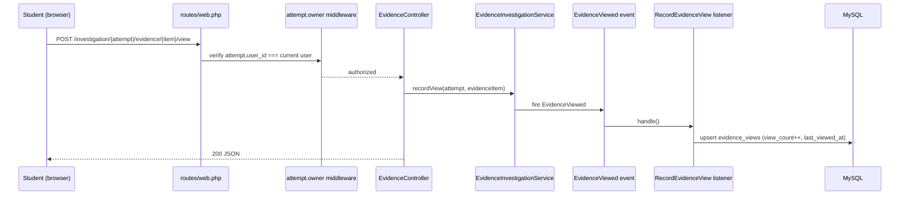
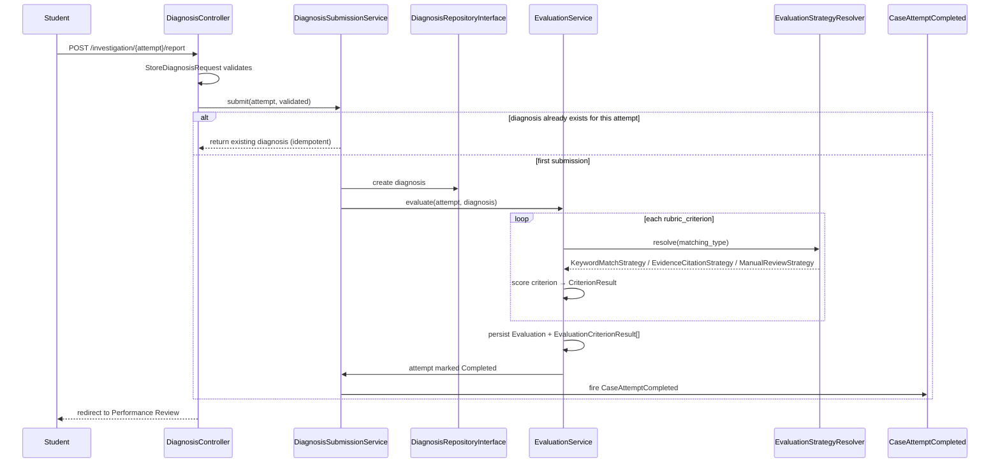
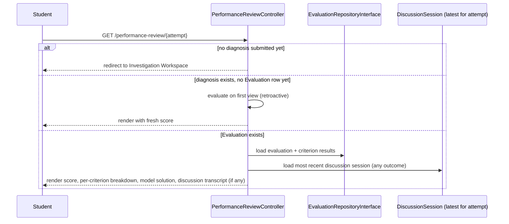
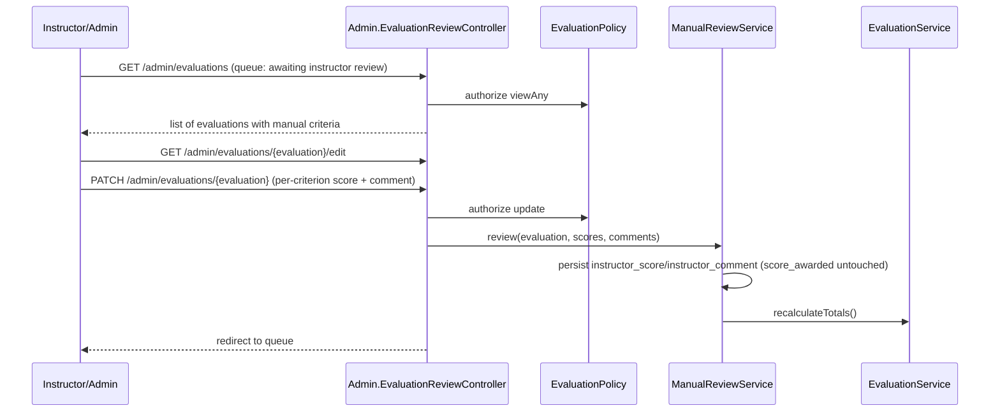

# 35 — Sequence Diagrams

> **Related:** [36-data-flow](36-data-flow.md) · [09-discussion-engine](09-discussion-engine.md) · [14-state-machine](14-state-machine.md)

## Student Investigation (opening an evidence item)

## Engineering Discussion (a full turn)

See the detailed sequence diagram (including `LeakageGuard` and transaction rollback behavior) in [14-state-machine.md](14-state-machine.md#discussionservice).

## Diagnosis Submission

## Performance Review

## Admin Review (Manual Review workflow)

