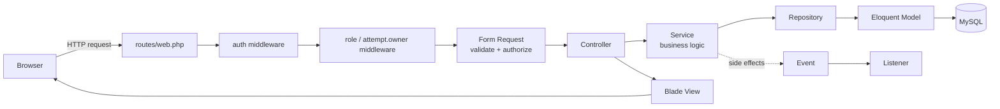
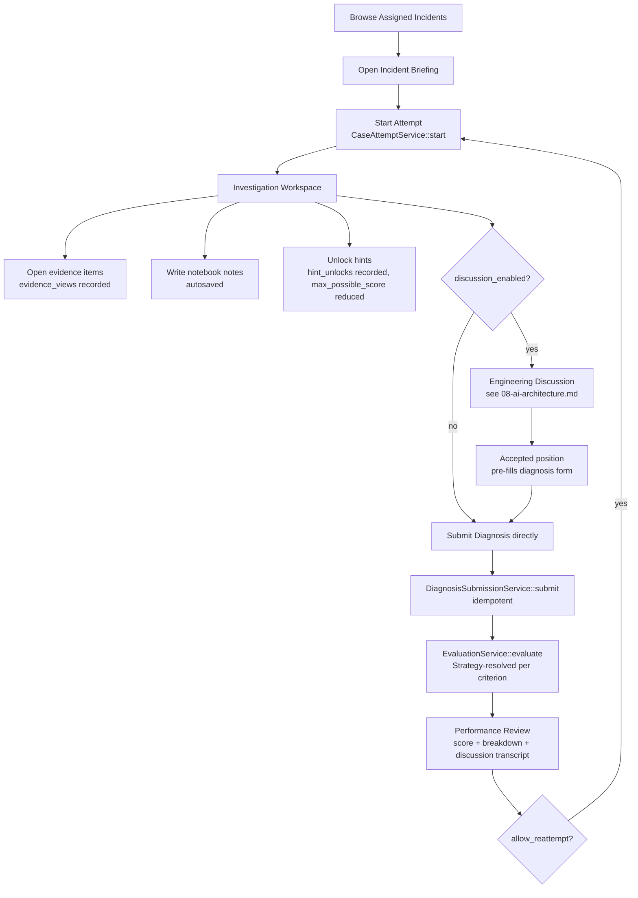
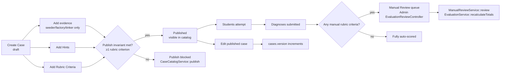
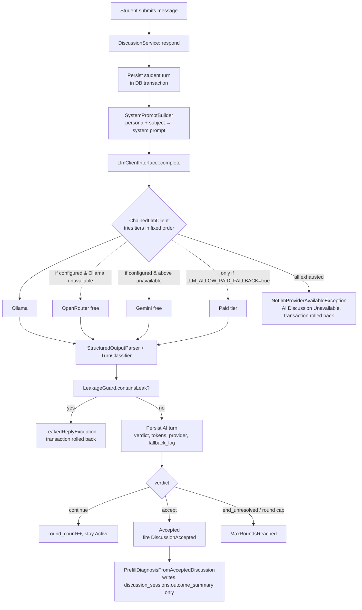
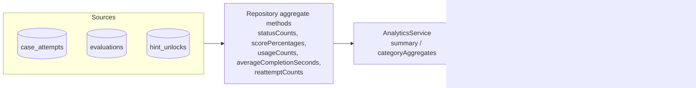

# 36 — Data Flow

> **Related:** [35-sequence-diagrams](35-sequence-diagrams.md) · [04-system-architecture](04-system-architecture.md) · [08-ai-architecture](08-ai-architecture.md)

## End-to-End Request Lifecycle (general shape)

Every write path in the application follows this exact shape — there is no path where a controller queries Eloquent directly for domain data, and no path where business logic lives in a Blade view beyond trivial display branching (e.g., which evidence-type renderer to show).

## The Student Investigation Journey (full data flow)

## The Admin Content Lifecycle

## The Engineering Discussion Turn (data flow)

## Analytics Data Flow

Every `AnalyticsService` method accepts the same optional `?array $caseIds` scope — platform-wide (`null`), single-case, or category-rollup — composed from one implementation rather than three, per [20-design-decisions.md](20-design-decisions.md).
