

&nbsp;

&nbsp;

&nbsp;

# AI CaseLab

## Executive Report

### A plain-language guide to the project, for internship supervisors, university faculty, and evaluators

&nbsp;

&nbsp;

**Prepared by:**
Wasan Saeed Aldossary

**University:**
Imam Abdulrahman Bin Faisal University — College of Computer Science and Information Technology, Department of Computer Science

**Internship Organization:**
Dolf Technology

**Supervisors:**
Mohammad Fakhruddin · Abdelmonaem Abdallah

**Purpose of this document:**
A non-technical companion to the full engineering report — written so that no software background is required to understand what was built, why it matters, and what it achieved.

**Date:** August 2026

&nbsp;

&nbsp;

<!-- pagebreak -->

## Table of Contents

1. Cover Page
2. Executive Summary
3. Project Overview
4. The Problem
5. Why This Project Matters
6. Project Objectives
7. Scope
8. Target Users
9. User Journey
10. Main Features
11. AI Discussion Feature
12. Admin Console
13. Student Experience
14. Technologies Used
15. Development Timeline
16. Major Challenges
17. How Challenges Were Solved
18. Internship Achievements
19. Skills Developed
20. Lessons Learned
21. Future Improvements
22. Project Impact
23. Conclusion
    - What Makes AI CaseLab Different
    - Project at a Glance
    - The Internship Journey, at a Glance
    - Internship Outcomes
    - Executive Conclusion
    - Closing & Acknowledgments

<!-- pagebreak -->

# 2. Executive Summary

**AI CaseLab is a training website that teaches computer science students how to investigate broken software — the way a professional engineer actually does it on the job.**

Most coding education asks students to write a program from a blank page and checks whether it runs correctly. That is a real and valuable skill, but it is only half of what a working software engineer does. The other half — arguably the more common one — is being handed a system someone *else* built, told "this is broken, figure out why," and asked to investigate it using incomplete information: a customer complaint, a log file, a database snapshot, a piece of code. AI CaseLab was built to teach that second skill, which almost no existing tool teaches directly.

The platform presents a student with a realistic, simulated workplace incident — for example, "customers report checkout failing intermittently since this morning's deployment" — along with the same kind of evidence a real engineer would examine. The student investigates, forms a hypothesis, and submits a diagnosis, which is scored automatically against a transparent rubric. Before submitting, the student can optionally debate their reasoning with an AI reviewer, modeled on a real code-review conversation, which pushes back on weak reasoning instead of simply accepting the first answer offered.

The project was completed as an internship with **Dolf Technology**, delivered in two stages: a complete investigation-and-grading platform first, followed by the AI reviewer as a second, additive stage. It was built with the same discipline expected on a professional engineering team — planned in stages, tested continuously, and documented as it went rather than after the fact — and finished with **520 automated tests**, a **40-document engineering handbook**, and a fully working, live product that this report's own screenshots were taken from.

This report explains what the platform does, why it was built, how the pieces work conceptually, and what the internship achieved — without requiring any programming knowledge to follow.

<!-- pagebreak -->

# 3. Project Overview

AI CaseLab is a web application — something a student opens in a browser and logs into, no installation required. It has two sides:

- **The student side**, styled as a "Virtual Engineering Office." A student is cast as a junior engineer, and every screen reinforces that: the homepage is an **Inbox**, the list of available exercises is **Assigned Incidents**, and the workspace where a student investigates is the **Investigation Workspace**. This isn't just decoration — it is a deliberate design choice to make the practice feel like real work, not a quiz.
- **The admin side**, called the **Admin Console**, where an instructor or administrator writes new incidents, manages hints and scoring rules, reviews submissions that need a human judgment call, and views a dashboard of how a whole class of students is performing.

At its core, a student works through one **Case** — a simulated incident — from start to finish:

1. Read a support ticket describing a problem.
2. Examine evidence: logs, a snapshot of a database, a piece of code, a captured web response, or a screenshot.
3. Optionally unlock hints, at a small cost to their score, if they get stuck.
4. Optionally talk it through with an AI reviewer before committing to an answer.
5. Submit a written diagnosis (what went wrong, and how they would fix it).
6. Receive an automatic, itemized score explaining exactly what was right, what was missed, and why.

Every part of that flow shown in this report is a real screenshot of the actual, working application — not a mockup.

<!-- pagebreak -->

# 4. The Problem

Three gaps motivated this project:

- **Coursework teaches writing code, not reading it.** University assignments and coding-practice platforms almost universally ask a student to produce a correct program from a specification. They rarely ask a student to read someone else's unfamiliar code under time pressure and figure out why it's misbehaving — which is the daily reality of a junior engineer's first months on the job.
- **Existing "automated judge" platforms grade the wrong thing.** Tools that check whether submitted code passes a set of tests are excellent at measuring algorithmic correctness. They cannot measure diagnostic reasoning, evidence-gathering, or the ability to explain *why* a conclusion is right — skills that matter just as much in a real incident.
- **There is no scalable way to practice defending your reasoning under scrutiny.** In a real workplace, a proposed fix gets challenged in a code review or an incident retrospective before it ships. Very few students get to practice that experience — being pushed on their reasoning by someone more experienced — before they encounter it for real, on the job, for the first time.

<!-- pagebreak -->

# 5. Why This Project Matters

Diagnostic reasoning is a skill, and skills improve with realistic, repeated, feedback-rich practice — the same argument that already justifies automated coding-practice platforms for algorithmic skill. No comparable tool existed for diagnostic skill at the time this project began.

There is also a direct, practical gap between what graduating computer science students are assessed on and what early-career software roles actually demand day to day — especially in on-call rotations, incident response, and code review, where the ability to read, question, and diagnose an unfamiliar system is exercised constantly, and the ability to write a novel algorithm from scratch is exercised rarely.

The AI reviewer specifically addresses a second, narrower gap: a student can complete a graded investigation successfully while never having their reasoning challenged in real time — the single most valuable and hardest-to-scale part of a real code review. Recent, low-cost, and even locally-runnable AI models made it practical, for the first time, to offer that experience without depending on an expensive service, provided the system was engineered carefully so the AI never accidentally reveals the answer it is supposed to be evaluating the student's approach to.

<!-- pagebreak -->

# 6. Project Objectives

- Build a realistic incident-simulation platform where evidence (logs, code, database data, API responses, screenshots) behaves like real engineering material, not quiz content.
- Score a student's investigation on a transparent, per-item rubric — not just a right/wrong final answer — so a student understands exactly why they earned the score they did.
- Give instructors a complete authoring and management platform: creating incidents, hints, and scoring rules, publishing them safely, and reviewing anything that needs human judgment.
- Add an AI-powered reviewer that behaves like a real senior engineer in a review conversation: challenges reasoning, asks for evidence, and never simply hands over the answer.
- Guarantee, structurally, that the AI reviewer can never silently rack up a paid bill — it must default to free and local options, with any paid option requiring a deliberate, explicit choice by whoever runs the platform.
- Deliver the whole project with professional engineering discipline: staged delivery, continuous automated testing, and documentation written as the work happened.

<!-- pagebreak -->

# 7. Scope

**What was built and is live today (this report's screenshots are all of this):**

- The complete student investigation journey: Inbox, incident catalog, incident briefing, the Investigation Workspace with a multi-type evidence viewer, a hint system, an auto-saving notebook, diagnosis submission, and an automatically-scored Performance Review.
- The complete admin/instructor authoring platform: incident, category, hint, and rubric management; a publish workflow; a manual-review queue; and a class-wide analytics dashboard.
- The Engineering Discussion: an AI reviewer available on incidents an instructor chooses to enable, with two selectable personas and a bounded, safe conversation.
- A visual design system giving the whole product a single, consistent, professional look rather than a default off-the-shelf appearance.

**What is intentionally not built yet, and why that's stated plainly rather than hidden:** every real engineering project has a boundary, and this one documents its boundary honestly instead of pretending it doesn't exist.

- A dedicated admin screen for authoring evidence items does not exist yet — evidence for the current incidents was added directly rather than through a form. This is a known, deliberately-scoped gap, not an oversight, and is the clearest next step for growing the incident library.
- A **Work History** screen (a dedicated list of a student's past attempts, beyond what's already summarized on the Inbox) is a planned addition not yet built — a small, contained piece of future work rather than a missing core capability, since recent activity is already visible from the Inbox today.
- Real-money AI providers exist only as an explicit, off-by-default option — never a launch requirement.

<!-- pagebreak -->

# 8. Target Users

| Who | What they get from the platform |
|---|---|
| **Students** | A realistic, repeatable way to practice diagnosing problems in systems they didn't write, with an AI reviewer that challenges their thinking and an automatic, itemized score that explains itself. |
| **Instructors** | A complete authoring tool for incidents, hints, and grading rules, plus a queue for the few scoring decisions that need a human's judgment call. |
| **Administrators** | Everything an instructor can do, plus platform-wide oversight — including a class-level analytics dashboard showing completion rates, score distribution, and where students are getting stuck. |
| **Guests** | Can preview one sample incident before creating an account, to see what the platform does. |

<!-- pagebreak -->

# 9. User Journey

The diagram below shows a student's path through one incident, start to finish. Every step is a real, working screen.

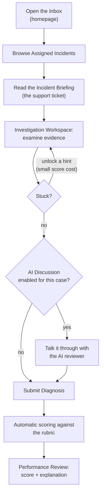

The next three sections walk through this journey in more visual detail: the platform's overall feature set, the AI Discussion feature specifically, and then the full student experience with screenshots at every stop.

<!-- pagebreak -->

# 10. Main Features

- **Assigned Incidents catalog** — a filterable list of available exercises, by category, difficulty, and status.
- **Investigation Workspace** — a multi-pane workbench (not a quiz form) where a student explores evidence, takes notes, and tracks their own progress.
- **Evidence Explorer & Viewer** — five distinct evidence types (support ticket, log excerpt, database snapshot, API response, screenshot), each rendered in a format that resembles the real developer tool it imitates — a genuine log viewer, a genuine code viewer, a genuine table view of database rows.
- **Hint system** — hints exist, but they cost points to unlock, so a student trades score for help deliberately, never by accident.
- **Engineering Notebook** — a free-text notes panel that autosaves as the student writes, for jotting down suspicions and dead ends along the way.
- **Engineering Discussion** — the AI reviewer, covered in the next section.
- **Diagnosis submission & automatic scoring** — a student states a root cause, a proposed fix, and their confidence level, citing the evidence they relied on; the system scores it automatically against a rubric built for that specific incident.
- **Performance Review** — the results screen: an overall score, a breakdown of exactly which rubric items were met, a comparison to the class average, and — if used — the full AI Discussion transcript.
- **Admin Console** — the instructor/admin side: incident authoring, a publish workflow, a manual-review queue, and analytics. Covered in Section 12.

<!-- pagebreak -->

# 11. AI Discussion Feature (Explained Conceptually)

This is the project's signature feature, and the one most worth explaining carefully in plain language, since it's easy to imagine it as "just a chatbot." It is deliberately not that.

**The idea.** Before a student's diagnosis is treated as final, they can open a conversation with an AI reviewer and state their current thinking. The AI reviewer does not grade the conversation and does not simply agree — it plays the role of a more experienced engineer in a real code review, asking pointed questions, pushing back on weak reasoning, and asking the student to point at specific evidence rather than accepting a vague answer. This mirrors how a real fix gets challenged in review *before* it ships, not critiqued after the fact once it's already too late to change.

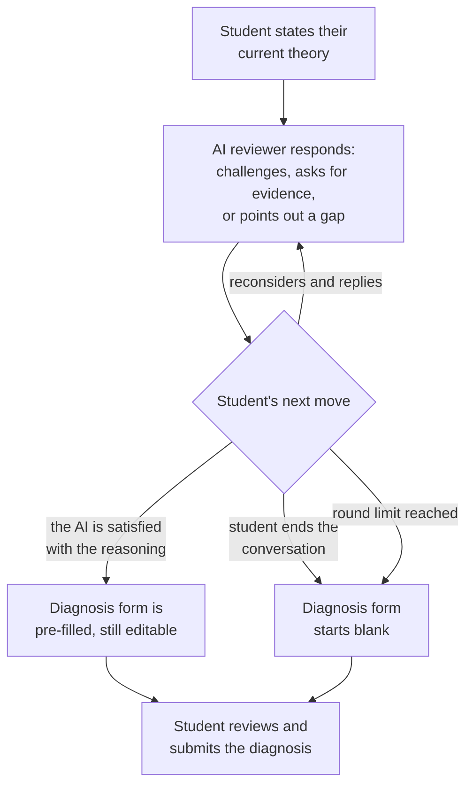

**Two reviewer styles are available**, chosen per incident by an instructor:

- **Mentor** — supportive but rigorous; nudges a student toward the right evidence without simply stating it.
- **Interviewer** — sharper and more probing, closer to a technical interview than a friendly chat.

**Two safety guarantees were treated as non-negotiable, and were engineered so they cannot be quietly bypassed:**

1. **The AI can never reveal the case's model answer**, no matter how the conversation is steered — this is checked independently of what the AI itself was instructed to do, so a cleverly-worded student prompt can't trick it into leaking the answer.
2. **The system can never silently start spending real money.** By default, the AI reviewer runs on a free, locally-hosted model first, falling back to other free options if needed. A paid AI provider exists only as an explicit, off-by-default setting an operator must deliberately turn on — never something that happens automatically.

**What it looks like in practice** — a real, live exchange captured from the working platform, with the student's opening theory on the right and the AI reviewer's response on the left:

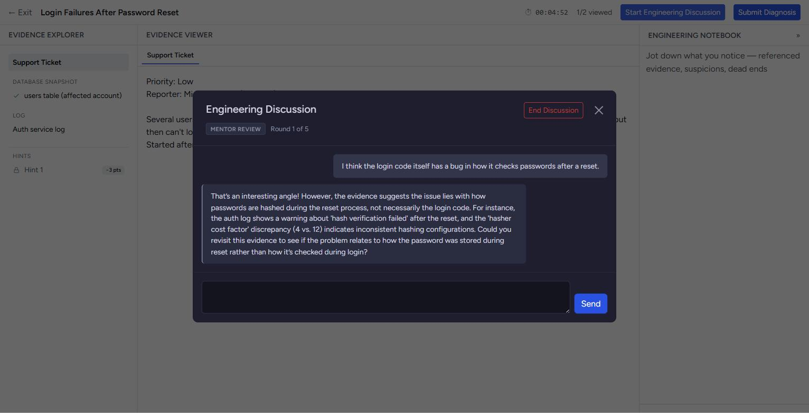

The full transcript of this conversation is preserved and shown to the student on their Performance Review page, alongside the automatic score — visible in Section 13.

<!-- pagebreak -->

# 12. Admin Console

Instructors and administrators get a separate, more conventional back-office interface — the workplace framing is deliberately dropped here, since admins are staff, not role-playing engineers.

**Dashboard** — an at-a-glance view of how many incidents are published, in draft, or archived, plus anything that needs attention and a recent-activity feed:

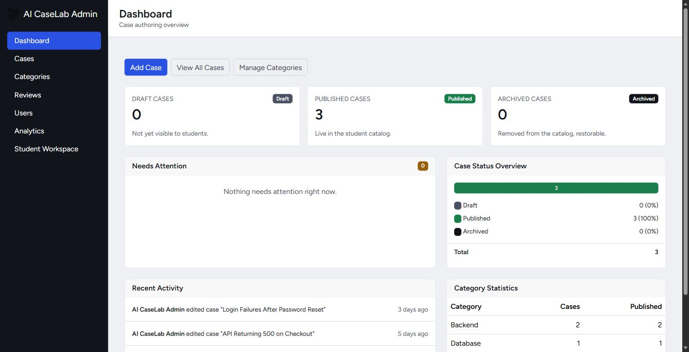

**Incident authoring** — every incident an admin has created, with its category, difficulty, and publish status at a glance:

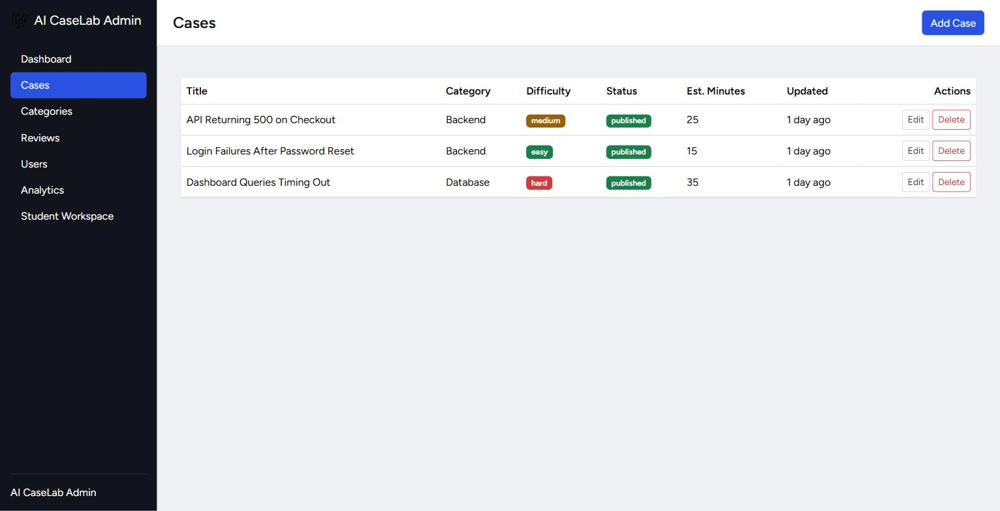

**The case editor** is also where an instructor turns the AI Discussion feature on or off for a specific incident, and chooses which reviewer persona and how many rounds of conversation it allows — the same panel shown here also confirms this is a genuine, per-incident configuration option, not a global switch:

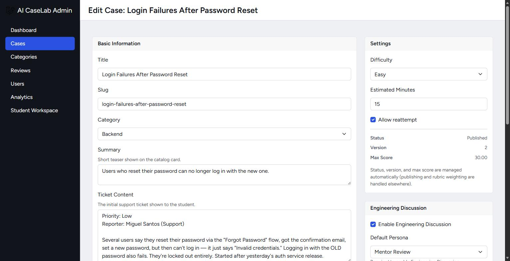

**Analytics** — a class-wide view of completion rate, average score, how long students take, how often hints and re-attempts are used, and a score-distribution breakdown, so an instructor can spot an incident that's miscalibrated (too easy, too hard, or confusingly written) at a glance:

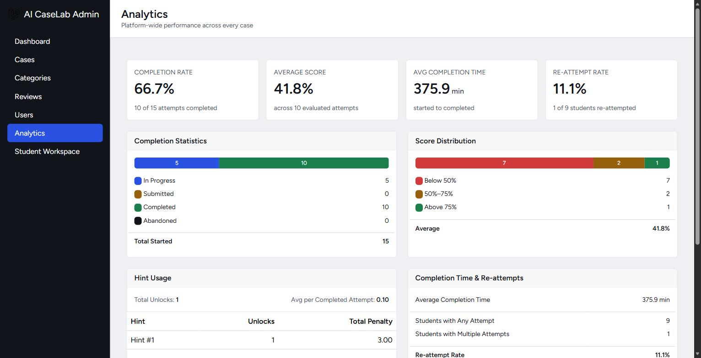

**Manual review queue** — most scoring is fully automatic, but a small number of rubric items (ones that genuinely require human judgment, such as "did the student propose a sound fix," not just "did they mention the right keyword") are queued here for an instructor to score by hand:

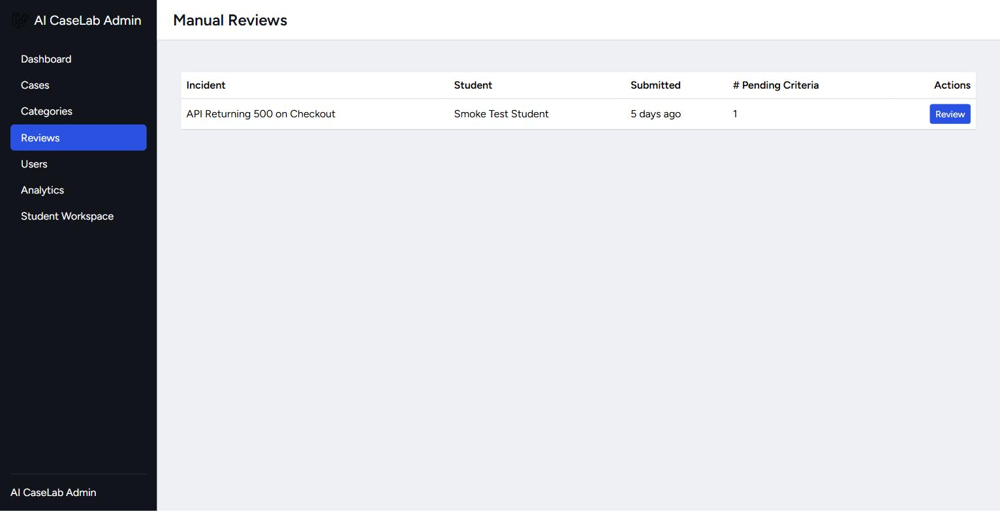

<!-- pagebreak -->

# 13. Student Experience

This section walks through the actual student journey end to end, in the order a real student experiences it — every image below is a real screenshot of the live application, not a design mockup.

**Inbox** — the landing page after logging in:

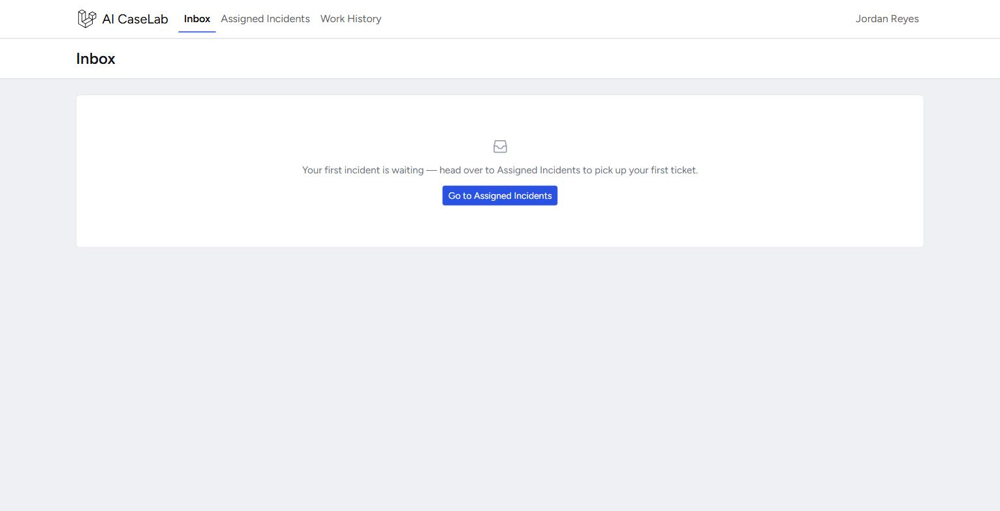

**Assigned Incidents** — the catalog of available exercises, filterable by category, difficulty, and status:

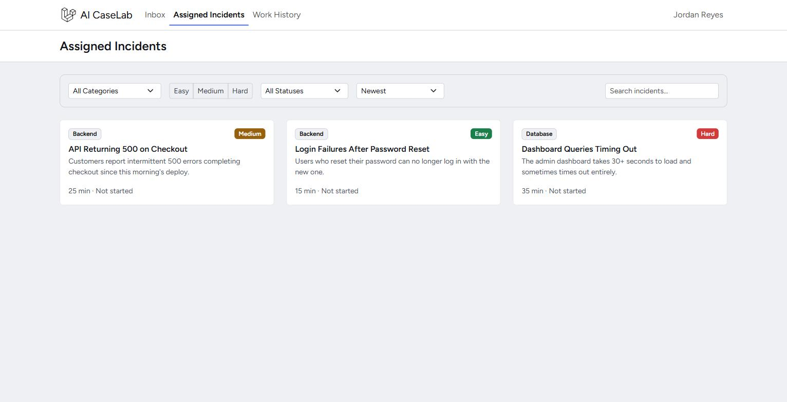

**Incident Briefing** — before starting the clock, a student reads the support ticket and sees exactly what they'll be investigating and how scoring works:

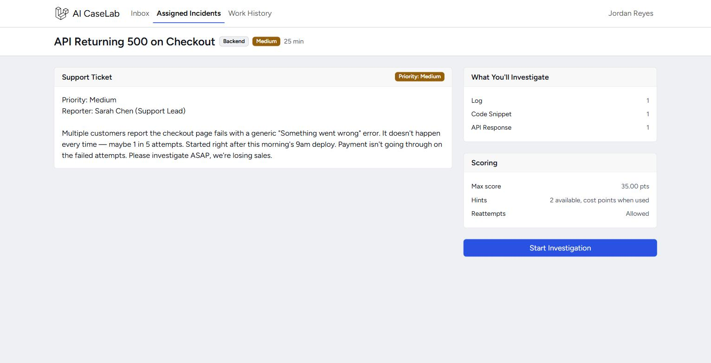

**Investigation Workspace — evidence** — the core screen. Evidence is presented in a format that mirrors the real developer tool it imitates. Here, an application error log rendered as a genuine dark-panel log viewer, not a plain block of text:

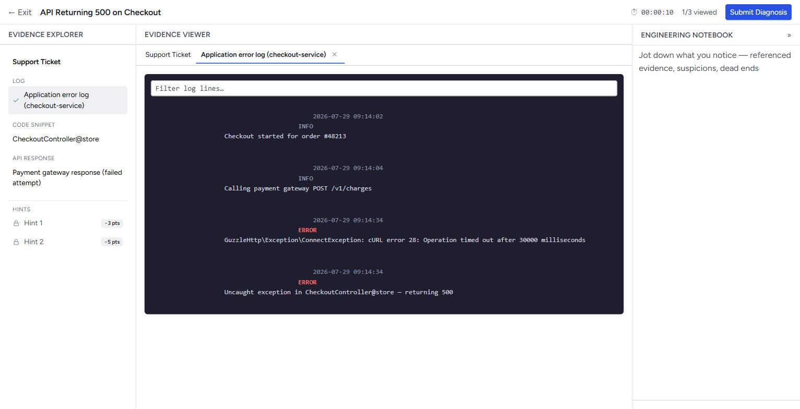

A different incident's evidence — a snapshot of a database table, rendered as an actual table, exactly as an engineer would see it in a real database tool:

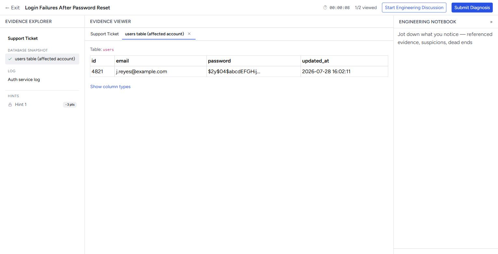

**Hints, notes, and evidence together** — a hint unlocked (at its stated point cost), the relevant code snippet with the suspicious lines highlighted, and the Engineering Notebook with the student's own notes, all visible in one workspace:

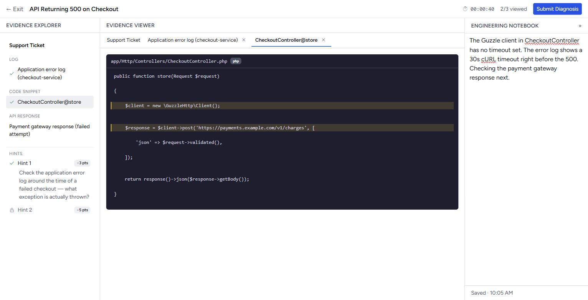

**Submitting a diagnosis** — root cause, proposed fix, a confidence level, and which pieces of evidence the student is relying on:

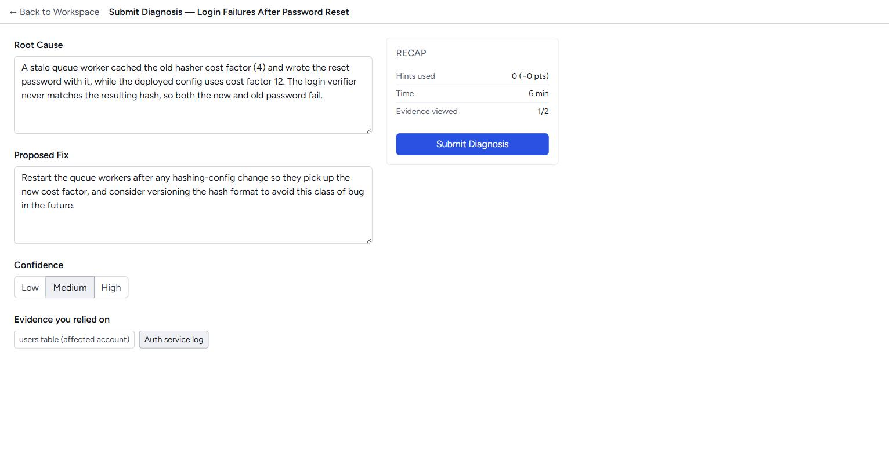

**Performance Review** — the result: an overall score, above/below the class average, and an itemized breakdown showing exactly which rubric criteria were fully met, partially met, or missed, with the reasoning shown for each:

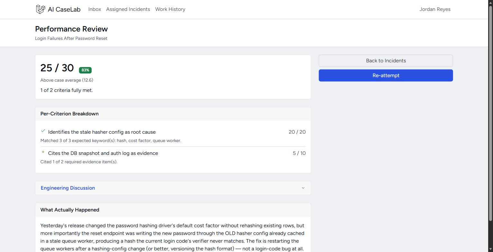

Where an AI Discussion took place, its full transcript is available right on the same page — nothing is hidden or thrown away:

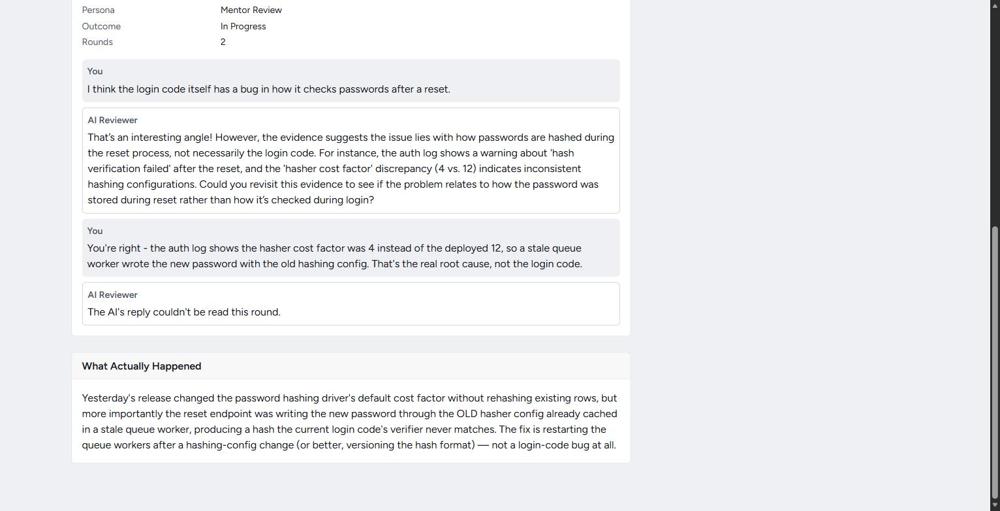

<!-- pagebreak -->

# 14. Technologies Used (Simple Explanation Only)

No entry below needs a computer science background to understand — each is described by what it *does*, not how it works internally.

| Technology | What it actually is, in plain terms |
|---|---|
| <svg class="ico" viewBox="0 0 24 24" fill="none" stroke="currentColor" stroke-width="1.5" stroke-linecap="round" stroke-linejoin="round"><rect x="6" y="6" width="12" height="12" rx="2"/><path d="M9 2v4M15 2v4M9 18v4M15 18v4M2 9h4M2 15h4M18 9h4M18 15h4"/></svg>**Laravel (PHP)** | The application's engine — the part that handles logins, saves data, and decides what each page shows. A widely-used, industry-standard choice for exactly this kind of web application. |
| <svg class="ico" viewBox="0 0 24 24" fill="none" stroke="currentColor" stroke-width="1.5" stroke-linecap="round" stroke-linejoin="round"><rect x="6" y="6" width="12" height="12" rx="2"/><path d="M9 2v4M15 2v4M9 18v4M15 18v4M2 9h4M2 15h4M18 9h4M18 15h4"/></svg>**MySQL** | The database — where every incident, evidence item, student attempt, and score is stored, reliably and permanently. |
| <svg class="ico" viewBox="0 0 24 24" fill="none" stroke="currentColor" stroke-width="1.5" stroke-linecap="round" stroke-linejoin="round"><rect x="6" y="6" width="12" height="12" rx="2"/><path d="M9 2v4M15 2v4M9 18v4M15 18v4M2 9h4M2 15h4M18 9h4M18 15h4"/></svg>**Bootstrap** | The visual styling toolkit used as a foundation, then customized with the project's own color palette, typography, and component styles so the product doesn't look like a generic template. |
| <svg class="ico" viewBox="0 0 24 24" fill="none" stroke="currentColor" stroke-width="1.5" stroke-linecap="round" stroke-linejoin="round"><rect x="6" y="6" width="12" height="12" rx="2"/><path d="M9 2v4M15 2v4M9 18v4M15 18v4M2 9h4M2 15h4M18 9h4M18 15h4"/></svg>**A small amount of JavaScript** | Handles the interactive touches — autosaving notes as you type, unlocking a hint without reloading the page, and the live AI Discussion chat panel. |
| <svg class="ico" viewBox="0 0 24 24" fill="none" stroke="currentColor" stroke-width="1.5" stroke-linecap="round" stroke-linejoin="round"><rect x="6" y="6" width="12" height="12" rx="2"/><path d="M9 2v4M15 2v4M9 18v4M15 18v4M2 9h4M2 15h4M18 9h4M18 15h4"/></svg>**AI language models (Ollama, OpenRouter, Gemini)** | The "brain" behind the Engineering Discussion — three interchangeable options, tried in a fixed, cost-safe order, so the AI reviewer keeps working even if one option is temporarily unavailable, and never silently switches to a paid one. |
| <svg class="ico" viewBox="0 0 24 24" fill="none" stroke="currentColor" stroke-width="1.5" stroke-linecap="round" stroke-linejoin="round"><rect x="6" y="6" width="12" height="12" rx="2"/><path d="M9 2v4M15 2v4M9 18v4M15 18v4M2 9h4M2 15h4M18 9h4M18 15h4"/></svg>**Automated tests (520 of them)** | Not a technology students or supervisors interact with directly, but the safety net that let this project be rebuilt, refactored, and extended repeatedly without silently breaking something that used to work. |

<svg class="ico" viewBox="0 0 24 24" fill="none" stroke="currentColor" stroke-width="1.5" stroke-linecap="round" stroke-linejoin="round"><polyline points="20 6 9 17 4 12"/></svg>
Key takeawayEvery tool on this list is an industry-standard choice used by real engineering teams — not a simplified "teaching" substitute. A student who understands this platform is looking at the same category of technology used in professional software jobs.

<!-- pagebreak -->

# 15. Development Timeline

The project was delivered in clearly separated stages, each one fully working and fully tested before the next began — never one large, un-reviewable block of work.

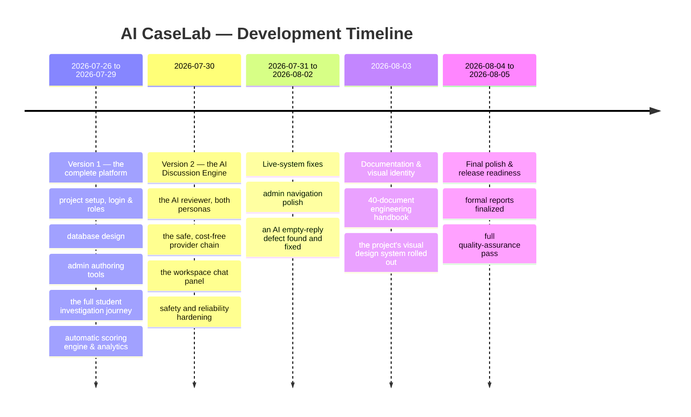

<svg class="ico" viewBox="0 0 24 24" fill="none" stroke="currentColor" stroke-width="1.5" stroke-linecap="round" stroke-linejoin="round"><circle cx="12" cy="12" r="9"/><path d="M12 7v5l3 2"/></svg>
Key takeawayThe complete two-version platform — investigation engine and AI reviewer both — was working end-to-end within the first five days. Everything after that was hardening, documentation, and polish, not core functionality still being built.

Version 1 established the complete platform a student and instructor would use even without any AI involved at all. Version 2 was then built as a strictly additive second stage — nothing in Version 1 needed to be changed or rebuilt to add it, a deliberate design choice covered further in Section 17.

<!-- pagebreak -->

# 16. Major Challenges

Real engineering work runs into real problems. Five are worth highlighting here, because each one reflects a genuine skill exercised during the internship — not just a bug fixed. Each is paired with how it was actually resolved in Section 17.

1

The AI reviewer couldn't connect to the free, local AI model at all, at first.Every single request to the local AI option (Ollama) failed outright, for a reason that wasn't obvious from the code alone.

2

Three different AI services, three different "languages."Each of the project's three AI providers expects requests formatted slightly differently — forcing them into one shared piece of code risked creating more problems than it solved.

3

A safety bug where the AI's raw, unprocessed output could reach a student.In a rare failure case, the fallback behavior would show literal, unformatted technical data instead of a clean message.

4

A confusing, intermittent bug where the AI reviewer sometimes replied with nothing at all.The hardest of the five to track down — no error, no crash, and no obvious pattern.

5

Individual screens needed a real design review, not just a "does it work" check.The AI Discussion panel worked correctly the first time it was built, but a dedicated visual review found its header was cramped and poorly aligned.

<!-- pagebreak -->

# 17. How Challenges Were Solved

Each row below pairs a challenge from Section 16 with how it was actually resolved — this is the part of the internship that most closely resembles the real job the platform itself is designed to teach.

| # | Challenge | How it was solved |
|---|---|---|
| 1 | AI model connection failure | Traced to a single missing piece of the web address the system used to reach the local AI model — found using a dedicated tool that makes a real, live request instead of a simulated one. The fix was one line; the diagnostic tool was kept permanently as a standing safeguard. |
| 2 | Three incompatible AI services | Accepted that the three services are genuinely different rather than forcing an artificial resemblance. Each got its own small, independent piece of code built to the same simple shared shape. Proof it worked: adding the third provider required zero changes anywhere else. |
| 3 | Raw AI output could leak to a student | Every failure case — not just the one already noticed — now resolves to the same safe, generic message, with two new permanent automated tests targeting that exact class of edge case. |
| 4 | Mysterious empty AI replies | Solved through methodical investigation: checked the raw stored data, traced where the empty value came from, then captured the AI's actual raw output. Certain AI models spend part of their response budget on invisible "internal reasoning" before writing a visible answer — the limit was too tight for that. A follow-up controlled test on a different model confirmed the cause. |
| 5 | Cramped AI Discussion header | Given the persona and round counter their own row, with actions cleanly right-aligned — a small, deliberate fix that also motivated the project's full, formal visual design system. |

<svg class="ico" viewBox="0 0 24 24" fill="none" stroke="currentColor" stroke-width="1.5" stroke-linecap="round" stroke-linejoin="round"><polyline points="20 6 9 17 4 12"/></svg>
Key takeawayChallenge 1 and Challenge 4 were both found only by testing against the real AI service — not a simulated stand-in. Every provider had thorough simulated tests, and none of them could have caught either problem. For anything that talks to an outside system, testing the real thing is not optional.

The before-and-after below is a real screenshot comparison of the exact same screen, taken before and after the Challenge 5 fix:

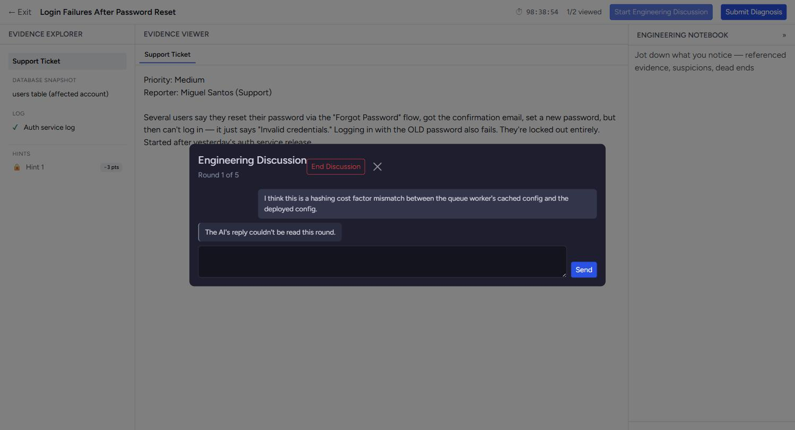

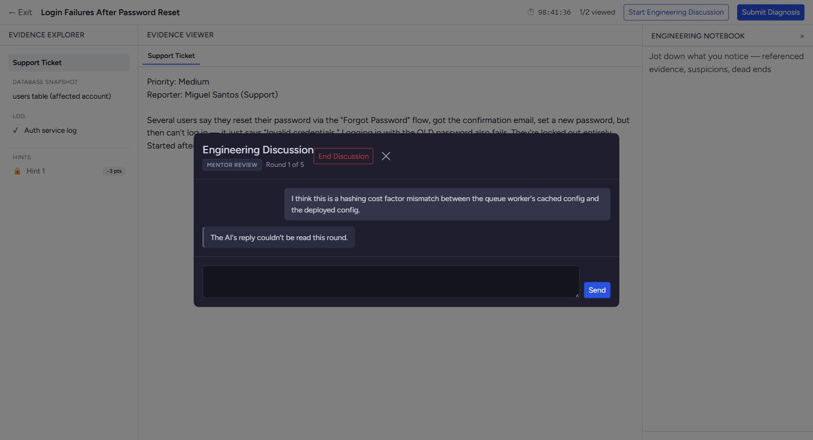

<!-- pagebreak -->

# 18. Internship Achievements

## Key Achievements at a Glance

<svg class="ico" viewBox="0 0 24 24" fill="none" stroke="currentColor" stroke-width="1.5" stroke-linecap="round" stroke-linejoin="round"><circle cx="12" cy="12" r="9"/><polyline points="8.5 12.5 11 15 15.5 9"/></svg>520automated tests (1,489 checks)

<svg class="ico" viewBox="0 0 24 24" fill="none" stroke="currentColor" stroke-width="1.5" stroke-linecap="round" stroke-linejoin="round"><path d="M4 19.5V6a2 2 0 0 1 2-2h13v15H6a2 2 0 0 0-2 2Z"/><path d="M19 17H6a2 2 0 0 0-2 2"/></svg>40engineering documents in the handbook

<svg class="ico" viewBox="0 0 24 24" fill="none" stroke="currentColor" stroke-width="1.5" stroke-linecap="round" stroke-linejoin="round"><circle cx="12" cy="12" r="9"/><path d="M12 7v5l3 2"/></svg>22formally tracked development phases

<svg class="ico" viewBox="0 0 24 24" fill="none" stroke="currentColor" stroke-width="1.5" stroke-linecap="round" stroke-linejoin="round"><path d="M5 21V4"/><path d="M5 4h13l-3 5 3 5H5"/></svg>2major versions delivered (platform, then AI reviewer)

<svg class="ico" viewBox="0 0 24 24" fill="none" stroke="currentColor" stroke-width="1.5" stroke-linecap="round" stroke-linejoin="round"><rect x="6" y="6" width="12" height="12" rx="2"/><path d="M9 2v4M15 2v4M9 18v4M15 18v4M2 9h4M2 15h4M18 9h4M18 15h4"/></svg>3independent AI providers integrated and validated live

<svg class="ico" viewBox="0 0 24 24" fill="none" stroke="currentColor" stroke-width="1.5" stroke-linecap="round" stroke-linejoin="round"><path d="M9 18h6"/><path d="M10 22h4"/><path d="M12 2a7 7 0 0 0-4 12.7c.6.5 1 1.3 1 2.3h6c0-1 .4-1.8 1-2.3A7 7 0 0 0 12 2z"/></svg>$0required AI cost — paid tier is off unless deliberately enabled

Beyond these numbers, the internship delivered:

- A **complete, working, two-sided web platform** — student investigation experience and instructor authoring/analytics platform — built from an empty project to a finished, demonstrable product.
- A **formally specified visual design system**, rolled out across the entire product with a documented, verified before-and-after check that nothing broke along the way.
- A **real, working AI integration** validated against actual AI providers, not just simulated test responses — including catching and fixing genuine defects that only showed up under real conditions.
- A structural, provable guarantee that the platform **can never silently spend real money** on AI usage.
- The complete project developed and delivered under a **disciplined, staged process** — the same kind of process rigor a professional engineering team is expected to follow, applied consistently across the entire internship.

<!-- pagebreak -->

# 19. Skills Developed

- **Full-stack web development** — building both the visible, interactive parts of a website and the server-side logic and database behind it.
- **Database design** — modeling a real, moderately complex set of related data (incidents, evidence, students, attempts, scores, conversations) so it stays consistent and query-able as the product grows.
- **Working with AI systems in a production setting** — not just calling an AI model, but integrating multiple providers safely, handling their failures gracefully, and designing guardrails against unwanted behavior.
- **Product and interaction design** — designing an entire user journey (Section 9) before writing code for it, and building and applying a formal visual design system.
- **Rigorous testing discipline** — writing and maintaining hundreds of automated checks, and understanding the difference between "the code looks right" and "it's been proven to actually work."
- **Real-world debugging** — methodically isolating the true cause of a subtle, intermittent problem (Section 17, Challenge 4) rather than guessing at a fix.
- **Technical and non-technical writing** — producing both a rigorous engineering handbook and this plain-language report from the same underlying project.
- **Professional software workflow** — structured version control, staged delivery, and treating documentation as part of the deliverable, not an afterthought.
- **Security-conscious design thinking** — building safeguards (Section 11) that hold up even against a deliberately adversarial user, not just a well-behaved one.

<!-- pagebreak -->

# 20. Lessons Learned

- **Staged, checkpointed delivery is what made this project traceable.** Every stage of work ended with a complete, automatically-verified checkpoint before the next one began. That discipline is the specific reason this report — and the full engineering handbook behind it — could be written accurately from the project's own real history, instead of being reconstructed from memory afterward.
- **Testing against the real thing catches problems that testing against a simulation cannot.** Every AI provider had thorough tests using simulated responses, and none of them could have caught the actual connection bug in Section 16 — that only a genuine, live request against the real service ever surfaced.
- **A safeguard against a "must never happen" scenario is strongest when it's structural, not just a runtime check.** The guarantee that the platform can never silently spend real money on AI usage was built so that the code path to a paid provider doesn't meaningfully exist unless someone deliberately enables it.
- **A documented, deliberate gap is not the same thing as an oversight.** Every known limitation in this platform (Section 7) was a conscious decision made and recorded at a specific point, not something nobody thought about.
- **Writing down *why* a decision was made, at the moment it's made, is dramatically more valuable than trying to reconstruct it later.** This is the single habit most responsible for both the engineering handbook and this report being accurate rather than approximate.

<svg class="ico" viewBox="0 0 24 24" fill="none" stroke="currentColor" stroke-width="1.5" stroke-linecap="round" stroke-linejoin="round"><path d="M9 18h6"/><path d="M10 22h4"/><path d="M12 2a7 7 0 0 0-4 12.7c.6.5 1 1.3 1 2.3h6c0-1 .4-1.8 1-2.3A7 7 0 0 0 12 2z"/></svg>
The single biggest lessonDiscipline in the moment — testing continuously, documenting decisions as they happened, verifying against real systems instead of assumptions — is what made every other deliverable in this report possible, including the report itself.

<!-- pagebreak -->

# 21. Future Improvements

Realistic, scoped next steps — each one an addition to the existing design, not a rebuild of it:

- **An admin screen for authoring evidence items directly**, rather than adding them behind the scenes — the single most limiting gap for growing the incident library.
- **A dedicated Work History screen**, giving a student a complete, browsable list of every past attempt beyond what the Inbox already summarizes.
- **User management tools for admins**, to manage student and instructor accounts directly from the Admin Console.
- **In-app notifications**, so a student is alerted the moment their evaluation is ready rather than needing to check back.
- **Additional AI reviewer personas** beyond Mentor and Interviewer — a Security Review persona, a System Design Interview persona, and a Code Review persona are already planned, each reusing the same underlying design.
- **Usage and cost analytics for the AI reviewer**, since the underlying data (which provider answered, how many tokens were used) is already being recorded — only the reporting view is missing.
- **Real-time, word-by-word AI replies**, instead of waiting for a complete response — a natural next step once usage grows enough to justify it.

<!-- pagebreak -->

# 22. Project Impact

| For | The impact |
|---|---|
| **Students** | A safe, repeatable place to practice diagnostic reasoning against realistic incidents, with immediate, itemized feedback and an AI reviewer that resists a shallow answer instead of just grading it. |
| **Instructors** | A complete authoring platform plus a manual-review queue for the judgment calls automation shouldn't make alone, and an analytics dashboard for spotting a miscalibrated exercise early. |
| **The institution/program** | A portfolio-quality, extensible teaching tool that can grow — new incident types, new AI reviewer personas — without rebuilding what already exists. |
| **The student who built it** | A complete, demonstrable, end-to-end engineering project — spanning product design, database design, full-stack development, a real AI integration, rigorous testing, and professional documentation — built and delivered under the same discipline a professional engineering team is expected to follow. |

<!-- pagebreak -->

# 23. Conclusion

The remainder of this report closes out the internship record: what sets this project apart, a final snapshot of its scope, a recap of the journey from planning to delivery, what the internship achieved, a formal closing statement for evaluators, and a note of thanks.

<!-- pagebreak -->

## What Makes AI CaseLab Different

| | Typical coding-practice platforms | A generic AI chatbot tutor | **AI CaseLab** |
|---|---|---|---|
| **What's graded** | Whether submitted code passes a test suite | Nothing — it just answers questions | The *investigation process* itself, via a transparent, per-criterion rubric |
| **The scenario** | A blank-page problem with one correct algorithm | An open-ended chat with no fixed scenario | A realistic, evidence-bearing incident — logs, code, database data, API responses |
| **The AI's role** | Not involved | Answers questions directly, on request | Challenges the student's reasoning *before* grading — and is structurally barred from ever revealing the answer |
| **Cost safety** | Not applicable | Usually requires a paid API key | Defaults to free, local AI — a paid provider is only ever used if explicitly, deliberately enabled |
| **Feedback** | Pass/fail | Conversational, not scored | An itemized score explaining exactly what was credited, and why |

<svg class="ico" viewBox="0 0 24 24" fill="none" stroke="currentColor" stroke-width="1.5" stroke-linecap="round" stroke-linejoin="round"><polyline points="20 6 9 17 4 12"/></svg>
In one sentenceAI CaseLab is the only one of these three that grades how a student investigates a problem, not just whether they can write an answer.

<!-- pagebreak -->

## Project at a Glance

<svg class="ico" viewBox="0 0 24 24" fill="none" stroke="currentColor" stroke-width="1.5" stroke-linecap="round" stroke-linejoin="round"><path d="M4 19.5V6a2 2 0 0 1 2-2h13v15H6a2 2 0 0 0-2 2Z"/><path d="M19 17H6a2 2 0 0 0-2 2"/></svg>41pages in this report

<svg class="ico" viewBox="0 0 24 24" fill="none" stroke="currentColor" stroke-width="1.5" stroke-linecap="round" stroke-linejoin="round"><rect x="3" y="3" width="18" height="14" rx="2"/><path d="M8 21h8M12 17v4"/></svg>17real screenshots of the live application

<svg class="ico" viewBox="0 0 24 24" fill="none" stroke="currentColor" stroke-width="1.5" stroke-linecap="round" stroke-linejoin="round"><circle cx="6" cy="6" r="3"/><circle cx="18" cy="18" r="3"/><path d="M9 6h6a3 3 0 0 1 3 3v6"/></svg>4diagrams explaining how the platform works

<svg class="ico" viewBox="0 0 24 24" fill="none" stroke="currentColor" stroke-width="1.5" stroke-linecap="round" stroke-linejoin="round"><polyline points="20 6 9 17 4 12"/></svg>26/27planned features fully implemented and tested

<svg class="ico" viewBox="0 0 24 24" fill="none" stroke="currentColor" stroke-width="1.5" stroke-linecap="round" stroke-linejoin="round"><rect x="6" y="6" width="12" height="12" rx="2"/><path d="M9 2v4M15 2v4M9 18v4M15 18v4M2 9h4M2 15h4M18 9h4M18 15h4"/></svg>6core technologies powering the platform

<svg class="ico" viewBox="0 0 24 24" fill="none" stroke="currentColor" stroke-width="1.5" stroke-linecap="round" stroke-linejoin="round"><path d="M4 19.5V6a2 2 0 0 1 2-2h13v15H6a2 2 0 0 0-2 2Z"/><path d="M19 17H6a2 2 0 0 0-2 2"/></svg>2companion reports — this one, and the full engineering report

The one documented gap behind the "26 of 27" figure is in-app notifications (Section 7) — a conscious, recorded scope decision, not an oversight.

<!-- pagebreak -->

## The Internship Journey, at a Glance

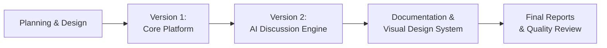

A full, dated breakdown of this journey is in Section 15 — this is the same story, at a glance.

<!-- pagebreak -->

## Internship Outcomes

By the end of this internship, the work had produced:

- A project taken from an **empty repository to a fully tested, two-version, production-quality web platform** — not a prototype or a proof of concept.
- A **real, validated AI integration**, engineered with the same safety and cost discipline expected of a production system, not a classroom demo.
- A **complete professional documentation library** written alongside the code, not reconstructed afterward.
- Direct, first-hand practice of the exact discipline the platform itself is built to teach: investigating a real, unexpected failure under incomplete information, and defending the resulting diagnosis with evidence (Section 17).

<!-- pagebreak -->

## Executive Conclusion

AI CaseLab set out to teach a skill that conventional coding education largely skips: investigating a system you did not build, under incomplete information, and defending your conclusion under scrutiny. It delivers that as a complete, working, two-sided platform — a realistic investigation experience for students and a full authoring and analytics platform for instructors — with an AI reviewer at its center that behaves like a genuine, safety-conscious engineering colleague rather than a chatbot bolted on for novelty.

The project was built in two clearly separated stages, tested continuously along the way to **520 automated checks**, documented in real time rather than reconstructed afterward, and finished with a formal visual identity that makes it look and feel like a real, coherent product. Every screenshot in this report was taken from that finished, live application — this is not a proposal or a prototype description; it is a record of what was actually built.

Beyond the product itself, the internship exercised the full range of skills a professional software engineer relies on: design, implementation, testing, debugging, security-conscious thinking, and clear communication to both technical and non-technical audiences — this report being an example of the last of those.

Completed as an internship with **Dolf Technology**, under the academic supervision of **Imam Abdulrahman Bin Faisal University**, the project stands as a complete, evidence-backed record of what was actually designed, built, and delivered.

<!-- pagebreak -->

## Closing & Acknowledgments

<svg class="ico" viewBox="0 0 24 24" fill="none" stroke="currentColor" stroke-width="1.5" stroke-linecap="round" stroke-linejoin="round"><polyline points="20 6 9 17 4 12"/></svg>

Thank you to **Imam Abdulrahman Bin Faisal University**, the **College of Computer Science and Information Technology**, and the **Department of Computer Science**, for the academic foundation this project builds on and the opportunity to complete it.

Thank you to **Dolf Technology**, the organization that hosted this internship, for the opportunity to design, build, and deliver a complete project under real engineering conditions.

Thank you to my supervisors, **Mohammad Fakhruddin** and **Abdelmonaem Abdallah**, for the guidance and rigor they brought to every stage of this project — the insistence that a claim is only as good as the evidence behind it shaped how this platform was built and how this report was written.

And thank you to everyone whose support made a project of this scope possible within an internship timeline.

&nbsp;

*This report, and the complete engineering documentation behind it, were prepared as the final record of the AI CaseLab internship project.*

