<div align="center">

&nbsp;

&nbsp;

&nbsp;

# AI CaseLab

## A Simulation-Based Engineering Incident Investigation Platform with an AI-Powered Socratic Discussion Engine

&nbsp;

### Final Internship Project Report

&nbsp;

&nbsp;

**Submitted by:**
Wasan Saeed Aldossary

**University:**
Imam Abdulrahman Bin Faisal University

**College:**
College of Computer Science and Information Technology

**Department:**
Department of Computer Science

**Degree Program:**
Bachelor of Science in Computer Science

**Project Type:**
Internship Project

**Supervisor:**
Mohammad Fakhruddin

**Supervisor:**
Abdelmonaem Abdallah

**Academic Year:** 2025 / 2026

**Document Version:** 1.0

**Date:** August 2026

&nbsp;

&nbsp;

&nbsp;

</div>

<!-- pagebreak -->

## Certificate / Approval Page

This is to certify that the internship project titled **"AI CaseLab — A Simulation-Based Engineering Incident Investigation Platform with an AI-Powered Socratic Discussion Engine"** has been carried out by **Wasan Saeed Aldossary** under our supervision, as part of the internship requirements for the degree of Bachelor of Science in Computer Science at Imam Abdulrahman Bin Faisal University, College of Computer Science and Information Technology, Department of Computer Science.

The work described in this report is, to the best of our knowledge, an accurate record of the project as designed, implemented, tested, and documented by the student. The system has been demonstrated, its source code and automated test suite reviewed, and its accompanying engineering documentation examined for completeness and accuracy.

This report is approved for submission to the Department of Computer Science as the final record of the Internship Project.

&nbsp;

| Role | Name | Signature | Date |
|---|---|---|---|
| Student | Wasan Saeed Aldossary | ______________________ | ______________ |
| Supervisor | Mohammad Fakhruddin | ______________________ | ______________ |
| Supervisor | Abdelmonaem Abdallah | ______________________ | ______________ |

<!-- pagebreak -->

## Acknowledgment

I would like to express my sincere gratitude to my supervisors, **Mohammad Fakhruddin** and **Abdelmonaem Abdallah**, for the guidance, patience, and constructive criticism provided throughout the design, implementation, and documentation of this project. Their insistence on rigor — that a claim is only as good as the evidence behind it — shaped how this project was built and how this report was written.

I am grateful to the faculty and staff of the Department of Computer Science at Imam Abdulrahman Bin Faisal University for the technical foundation this project builds on, and to the Department of Computer Science for the opportunity to complete this internship project.

I would also like to thank my family and friends for their continuous support and encouragement throughout the duration of this project.

Finally, I acknowledge the open-source communities behind Laravel, Bootstrap, and the broader PHP ecosystem, whose tools and documentation made a project of this scope achievable within an academic timeline.

<!-- pagebreak -->

## Abstract

Engineering education, and software engineering education in particular, has a well-documented gap between how students are taught and how engineers actually work. Coursework rewards producing a correct final answer; professional practice rewards the ability to investigate an ambiguous, partially-specified problem, gather and weigh evidence, defend a hypothesis under scrutiny, and communicate a diagnosis clearly enough that another engineer can act on it. Traditional learning management systems, quiz-based platforms, and even most existing AI tutoring products are built around the first skill, not the second.

**AI CaseLab** is a web-based platform that simulates realistic engineering incidents — the kind an on-call engineer might actually be paged for — and asks a student to investigate them the way a professional would: read a support ticket, examine logs and code and database state through a purpose-built evidence viewer, form and revise a hypothesis, and submit a structured diagnosis that is scored against a case-specific, transparent rubric. Built on this foundation is the project's central contribution: the **Engineering Discussion Engine**, an AI-powered Socratic reviewer that challenges a student's reasoning *before* their diagnosis is finalized, in the same way a senior engineer challenges a colleague in a design or incident review — probing for evidence, asking what would falsify the hypothesis, and never simply handing over the answer.

The system was built in two clearly-separated versions across 22 formally-scoped development phases. Version 1 (Phases 1–12) delivered the complete student investigation journey and the administrative content-authoring platform: role-based authentication, a case catalog, an Investigation Workspace with a multi-type evidence explorer, hint unlocking, an auto-saving investigation notebook, structured diagnosis submission, a pluggable Strategy-pattern evaluation engine, a manual-review workflow for instructors, and a cohort-level analytics dashboard. Version 2 (Phases 13–22) added the Engineering Discussion Engine as a strictly additive module: a provider-agnostic large language model (LLM) client layer with a cost-safe, ordered fallback chain across a local model (Ollama) and two free-tier hosted providers (OpenRouter, Google Gemini); a persona system (Mentor and Interviewer reviewers) built on the Strategy pattern; a structured-output contract enforced independently of prompt instructions; a deterministic, non-LLM content-leakage guard; and a four-state conversation lifecycle whose accepted outcome pre-fills — but never silently writes — the student's final diagnosis.

The finished platform comprises 194 source files across the application layer, 40 database migrations and seeders, and, at the time of writing, **520 automated tests (1,489 assertions)**, all passing, spanning feature tests, end-to-end workflow tests, domain-graph wiring tests, unit tests, and a separately-invoked provider-conformance harness that validates real LLM behavior — not just API shape — against three configured providers. A formally specified, token-based visual Design System was authored and rolled out across the entire application in a verified, zero-regression sequence. Every phase, every architectural decision, and every significant engineering challenge encountered — including two genuine production-adjacent defects discovered and fixed after Version 2's feature-complete milestone — is documented in a 40-file engineering documentation library that this report draws on and cross-references throughout.

This report presents the complete engineering record of that work: the problem it addresses, the requirements it satisfies, the architecture and design decisions behind it, a chronological account of all 22 development phases, the testing strategy that kept the system verifiably correct throughout, the challenges encountered and how each was actually resolved, the lessons the process produced, and the realistic scope for future work.

**Keywords:** engineering education, incident-based learning, Socratic AI tutoring, large language models, provider abstraction, Laravel, software architecture, structured output, cost-safe AI systems.

<!-- pagebreak -->

## Executive Summary

AI CaseLab is a full-stack, server-rendered web application (Laravel 11 / PHP 8.2, MySQL, Bootstrap 5) that puts a student in the seat of a junior engineer investigating a realistic production incident, and — uniquely among comparable platforms — pairs that investigation with an AI reviewer that argues with the student's reasoning before a diagnosis is accepted, rather than only grading the diagnosis after the fact.

**What was built.** A student browses an "Assigned Incidents" catalog, opens an incident briefing containing a support ticket, and enters an Investigation Workspace where evidence — application logs, code snippets, database snapshots, API responses — is presented through type-specific, developer-tool-styled viewers. The student can unlock hints at a scoring cost, keep free-text investigation notes with debounced autosave, and, on cases where it is enabled, open an **Engineering Discussion** with an AI persona before submitting a final, structured diagnosis (root cause, proposed fix, confidence level, cited evidence). That diagnosis is evaluated automatically against a case-specific rubric using a pluggable strategy per criterion (keyword matching, evidence-citation checking, or manual instructor review), and the student receives a Performance Review with a score, a per-criterion breakdown, and — where a discussion occurred — the full transcript. Administrators and instructors get a parallel content-management platform: case/category/hint/rubric CRUD with a publish workflow and invariant enforcement, a manual-review queue, and a cohort-level analytics dashboard.

**What makes it different.** The Engineering Discussion Engine is not a chatbot bolted onto the platform; it is architecturally isolated (`app/Discussion/`), provider-agnostic (one narrow `LlmClientInterface`, three independent wire-format implementations composed behind an ordered, cost-safe fallback chain), safety-hardened independently of prompt compliance (a deterministic leakage guard runs on every reply regardless of what the system prompt instructed), and behaviorally validated with a real, manually-invoked conformance harness against real providers — not assumed correct because a mocked unit test passed.

**How it was built.** The project followed a disciplined, phase-and-milestone development process: 22 formally scoped phases, each ending with the full automated test suite green and, for UI-facing work, a manual verification pass, before the next milestone began. This discipline is what makes it possible to write this report from primary sources — git commit history and `CHANGELOG.md` — rather than reconstructed memory, and it is the single practice this project's own retrospective identifies as most responsible for its traceability.

**Where it stands.** All Version 1 and Version 2 functional requirements (FR1–FR27) are implemented and tested, with two requirements (evidence-authoring UI, in-app notifications) explicitly and honestly scope-gapped rather than silently dropped. The test suite has grown from 0 at project start to 520 passing tests at the time of writing. A formal visual Design System (Design System v1) has been specified and rolled out across the student and admin surfaces, including a dedicated accessibility and responsive audit. Two genuine defects were found and fixed after feature-complete — a structured-output parsing gap that could, under a specific failure mode, surface raw model output to a student, and a token-budget misconfiguration that caused a specific class of reasoning-capable free-tier model to silently fail to answer — both diagnosed with real evidence (raw provider responses, parse traces) rather than guesswork, both fixed, and both now permanently regression-tested.

**Structure of this report.** Chapter 1 introduces the problem and objectives; Chapter 2 surveys related categories of systems and positions AI CaseLab against them; Chapter 3 specifies requirements; Chapter 4 covers system design in depth, with diagrams; Chapter 5 is a chronological, phase-by-phase account of the entire build; Chapter 6 covers the testing strategy; Chapter 7 presents the delivered system; Chapter 8 documents the significant engineering challenges encountered and how each was resolved; Chapter 9 distills lessons learned; Chapter 10 scopes realistic future work; Chapter 11 concludes. Ten appendices provide reference material — technology stack, database schema, folder structure, API reference, the Design System summary, deployment and configuration guides, formal Architecture Decision Records, a consolidated problems-and-solutions summary, and a glossary.

<!-- pagebreak -->

## Table of Contents

- Certificate / Approval Page
- Acknowledgment
- Abstract
- Executive Summary
- List of Figures
- List of Tables
- **Chapter 1 — Introduction**
  - 1.1 Background
  - 1.2 Problem Statement
  - 1.3 Motivation
  - 1.4 Objectives
  - 1.5 Scope
  - 1.6 Target Users
  - 1.7 Expected Outcomes
- **Chapter 2 — Literature Review**
  - 2.1 Traditional Learning Management Systems
  - 2.2 AI Tutoring Systems
  - 2.3 Engineering Simulation and Sandbox Platforms
  - 2.4 Incident-Based and Scenario-Based Learning
  - 2.5 Existing Solutions Surveyed
  - 2.6 Gap Analysis
  - 2.7 Why AI CaseLab Is Different
- **Chapter 3 — Requirements Analysis**
  - 3.1 Functional Requirements
  - 3.2 Non-Functional Requirements
  - 3.3 User Stories
  - 3.4 Use Cases
  - 3.5 Constraints
  - 3.6 Assumptions
- **Chapter 4 — System Design**
  - 4.1 Overall Architecture
  - 4.2 Backend Architecture
  - 4.3 Frontend Architecture
  - 4.4 AI Architecture
  - 4.5 Database Design
  - 4.6 Security Architecture
  - 4.7 State Machine
  - 4.8 Discussion Engine
  - 4.9 Persona System
  - 4.10 Prompt Pipeline
  - 4.11 Provider Abstraction
- **Chapter 5 — Implementation**
  - 5.1 Version 1 — Core Platform (Phases 1–12)
  - 5.2 Version 2 — AI Discussion Engine (Phases 13–22)
  - 5.3 Post-Phase-22 — Visual Identity and Maintenance
- **Chapter 6 — Testing**
  - 6.1 Unit Testing
  - 6.2 Feature Testing
  - 6.3 Manual Testing
  - 6.4 Regression Testing
  - 6.5 Provider Validation
  - 6.6 AI Validation
  - 6.7 Discussion Validation
  - 6.8 Accessibility Testing
  - 6.9 Responsive Testing
  - 6.10 Performance Testing
- **Chapter 7 — Results**
  - 7.1 The Final System
  - 7.2 Features Delivered
  - 7.3 Screens Completed
  - 7.4 AI Capabilities
  - 7.5 Admin Capabilities
  - 7.6 Student Workflow
- **Chapter 8 — Challenges**
  - 8.1 Ollama Integration
  - 8.2 Provider Abstraction Under Real Wire-Format Divergence
  - 8.3 Structured Output Parsing
  - 8.4 The Empty AI Reply Investigation
  - 8.5 qwen2.5-coder vs. qwen2.5: Isolating a Root Cause
  - 8.6 Prompt Engineering Under a Strict Output Contract
  - 8.7 UI Consistency Before a Formal Design System
  - 8.8 The Design System Rollout
  - 8.9 Testing Strategy for a Non-Deterministic Dependency
  - 8.10 Deployment and Environment Friction
  - 8.11 Documentation at Scale
- **Chapter 9 — Lessons Learned**
  - 9.1 Technical Lessons
  - 9.2 Architectural Lessons
  - 9.3 Project Management Lessons
- **Chapter 10 — Future Work**
  - 10.1 Near-Term, Low-Effort Extensions
  - 10.2 AI Subsystem Roadmap
  - 10.3 Platform-Level Future Work
  - 10.4 Explicitly Not Planned
- **Chapter 11 — Conclusion**
- **Appendix A** — Technology Stack
- **Appendix B** — Database Tables
- **Appendix C** — Folder Structure
- **Appendix D** — API Reference
- **Appendix E** — Design System Summary
- **Appendix F** — Deployment Guide
- **Appendix G** — Configuration Reference
- **Appendix H** — Architecture Decision Records
- **Appendix I** — Problems & Solutions Summary
- **Appendix J** — Glossary
- References

<!-- pagebreak -->

## List of Figures

| Figure | Title | Location |
|---|---|---|
| 4.1 | High-Level System Architecture | §4.1 |
| 4.2 | Layered Request Flow | §4.1 |
| 4.3 | Entity-Relationship Diagram (Complete Schema) | §4.5 |
| 4.4 | Security Boundary and Trust Layers | §4.6 |
| 4.5 | Discussion Session State Machine | §4.7 |
| 4.6 | Engineering Discussion Sequence Diagram | §4.8 |
| 4.7 | Persona × Subject Extensibility Matrix | §4.9 |
| 4.8 | System Prompt Composition Pipeline | §4.10 |
| 4.9 | Provider Fallback Chain | §4.11 |
| 6.1 | Testing Pyramid as Implemented | §6.1 |
| 6.2 | Network-Free AI Testing Mechanism | §6.6 |
| 7.1 | Complete Student Journey Flow | §7.6 |
| 8.1 | Empty-Reply Investigation Decision Tree | §8.4 |

*All figures above are rendered as Mermaid diagrams directly in the body text of this report (Figure 4.2 is a plain-text layered diagram, not Mermaid). A reader viewing this document in a Mermaid-capable renderer (GitHub, VS Code, or the project's own documentation tooling) will see them rendered as diagrams; all diagram source has been syntax-verified (§ Verification Notes, end of document).*

## List of Tables

| Table | Title | Location |
|---|---|---|
| 1.1 | Target User Roles | §1.6 |
| 2.1 | Comparison of AI CaseLab Against Related System Categories | §2.6 |
| 3.1 | Functional Requirements FR1–FR27 | §3.1 |
| 3.2 | Non-Functional Requirements NFR1–NFR16 | §3.2 |
| 3.3 | Use Case Summary | §3.4 |
| 4.1 | Layered Architecture Responsibilities | §4.2 |
| 4.2 | discussion_sessions Schema | §4.5 |
| 4.3 | discussion_turns Schema | §4.5 |
| 4.4 | Middleware and Policies | §4.6 |
| 5.1 | Version 1 Phase Summary | §5.1 |
| 5.2 | Version 2 Phase Summary | §5.2 |
| 5.3 | Test Suite Growth Across the Full Project | §5.3 |
| 6.2 | Test Suite Growth by Phase | §6.2 |
| 8.1 | Challenges Summary Table | §8 |
| B.1 | Complete Table Inventory | Appendix B |
| D.1 | Route Table Summary | Appendix D |

<!-- pagebreak -->

# Chapter 1 — Introduction

## 1.1 Background

Software engineering curricula, almost universally, teach engineering *content* — data structures, algorithms, database theory, software design patterns — through exercises with a single well-defined correct answer, checked automatically or by a grader against a known solution. This is efficient to teach and to grade, and it is genuinely necessary preparation. It is also, on its own, a poor simulation of what a working engineer spends most of their time actually doing.

A professional engineer's daily work — and especially the high-stakes moments that define professional growth, such as an on-call incident, a design review, or a postmortem — is rarely "produce the one correct output for a well-specified input." It is closer to: read an ambiguous, partial, sometimes misleading problem description; gather evidence from multiple, differently-shaped sources; form a hypothesis; actively try to falsify that hypothesis rather than merely confirm it; defend the hypothesis under skeptical questioning from a more experienced colleague; and communicate a conclusion precisely enough that someone else can act on it. This is a distinct skill from writing correct code, and it is largely untaught, because it is genuinely hard to teach at scale: it requires either a live human reviewer (expensive, doesn't scale, availability-constrained) or a simulation good enough to stand in for one.

AI CaseLab was conceived as an attempt at exactly that simulation — not a coding exercise, and not a multiple-choice quiz about incident response theory, but a realistic incident, presented through the same kind of evidence a real engineer would actually examine, reviewed by an AI persona that behaves the way a good senior reviewer behaves: it asks questions, it does not hand over answers, and it holds a position until the evidence genuinely supports changing it.

## 1.2 Problem Statement

Three specific gaps motivated this project:

1. **Investigative reasoning is under-taught relative to its professional importance.** Most software engineering education optimizes for producing correct code against a specification. Diagnosing *why* a system is broken, from incomplete and sometimes contradictory evidence, is a different and comparatively neglected skill.
2. **Existing AI tutoring tools tend toward being answer-dispensers, not challengers.** A large fraction of the current generation of "AI tutor" products — including general-purpose chat assistants used informally for studying — will, if asked directly, simply produce the answer. A tool that is supposed to build investigative reasoning needs to resist doing this by construction, not merely by prompt-level politeness.
3. **AI-integrated educational tools rarely treat AI-specific engineering risk as a first-class design concern.** Cost runaway (an unbounded, uncapped LLM bill), provider lock-in (an application hard-coded to one vendor's API), and content leakage (a system that reveals the answer it was explicitly told to withhold, the moment a student asks cleverly enough) are treated in much of the existing tooling landscape as afterthoughts rather than structural requirements to design against from the outset.

## 1.3 Motivation

The motivation for this project is twofold — pedagogical and engineering.

**Pedagogically**, the specific mechanism chosen — Socratic challenge *before* a diagnosis is finalized, not grading *after* — was deliberately modeled on a real, well-understood professional practice: a code review, a design review, or an incident postmortem, all of which exist specifically to stress-test reasoning before it is committed to, not to critique a decision that has already shipped. Section 4.9 and Appendix H (ADR-005) detail why this ordering is a structural, not cosmetic, choice.

**As an engineering exercise**, this project was also motivated by wanting to build — and be able to defend, in detail, to a technical audience — a genuinely production-grade system incorporating a large language model as a load-bearing component, with all of the engineering discipline that implies: provider abstraction so the system is not hostage to one vendor, a cost-safety guarantee that is structurally provable rather than merely asserted, a safety layer for sensitive content that does not depend on the model behaving as instructed, and a testing strategy that can validate a non-deterministic external dependency without either mocking away everything that matters or making the automated test suite dependent on real network calls, API keys, and provider quotas.

## 1.4 Objectives

1. Design and implement a complete, realistic engineering-incident investigation platform: case catalog, evidence exploration, hint economy, investigation notes, structured diagnosis submission, and rubric-based automated evaluation with instructor override.
2. Design and implement an AI-powered Socratic Discussion Engine that challenges a student's investigative reasoning before diagnosis submission, built to be provider-agnostic, cost-safe by structural guarantee (not configuration convention), and safe against content leakage independent of prompt compliance.
3. Apply a disciplined, verifiable software engineering process — layered architecture, SOLID principles applied with stated, defensible exceptions, a milestone-gated development process, and a test suite that stays green throughout — and produce a complete, primary-source-grounded engineering record of that process.
4. Formally specify and roll out a token-based visual Design System across the entire application, verified to introduce zero unintended visual regression.
5. Validate the AI subsystem's real-world behavior, not only its API-level correctness, against actually-configured LLM providers.
6. Produce documentation — this report and the accompanying 40-file engineering library — detailed and accurate enough to onboard a new engineer or satisfy an academic committee without access to the original development sessions.

## 1.5 Scope

**In scope** (see §3.1 for the complete, numbered functional requirement list): student authentication and role-based access; a case catalog with category/difficulty/status filtering; an Investigation Workspace with a five-type evidence viewer (log, code snippet, database snapshot, API response, screenshot); a scoring-cost hint system; an auto-saving investigation notebook; structured diagnosis submission with idempotent resubmission handling; a pluggable, Strategy-pattern rubric evaluation engine with three scoring strategies; a manual-review workflow for instructor override; a cohort-level analytics dashboard; full admin content authoring (cases, categories, hints, rubric criteria) with a publish workflow; and the complete Engineering Discussion Engine (Chapter 4, §4.8–4.11).

**Explicitly out of scope**, by design, not omission: real AI/LLM-graded free-text diagnosis scoring (the platform's scoring authority remains the deterministic rubric engine; the Discussion Engine is rehearsal, not a grader); live collaborative multi-user case-solving; payment/subscription billing; a native mobile application (the platform is responsive web only); a public, user-submitted case marketplace; real-time human mentor chat; and multi-tenancy (a single-institution deployment is assumed throughout). §3.5 discusses constraints in more depth, and §10.4 discusses what the AI subsystem's own design spec explicitly rules out as *not* a natural extension of the current architecture.

## 1.6 Target Users

**Table 1.1 — Target User Roles**

| Role | Description | Primary Interactions |
|---|---|---|
| **Student** | The platform's primary user — a learner (self-directed, or enrolled in a course using the platform) practicing engineering investigation skills. | Browses and starts incidents, investigates evidence, unlocks hints, takes notes, engages in the Engineering Discussion, submits diagnoses, reviews performance, re-attempts cases. |
| **Instructor** | A course staff member with content-review authority but not full content-authoring authority. | Performs manual evaluation review/override on submissions whose rubric includes a manually-scored criterion; views admin analytics. |
| **Admin** | Full content-authoring and platform-configuration authority. | Authors and publishes cases, categories, hints, and rubric criteria; configures per-case Engineering Discussion settings (enabled, default persona, max rounds); views platform-wide analytics. |
| **Guest** | An unauthenticated visitor. | Can browse the public case catalog and view one sample case's briefing, per the deliberate guest-accessible design of the catalog (see §4.2 and `docs/02-functional-requirements.md`), without being able to start an attempt. |

## 1.7 Expected Outcomes

By the conclusion of this project, the following outcomes were expected and, as documented throughout this report (particularly Chapters 5–7), were achieved:

- A fully functional, deployable web platform satisfying all 27 functional requirements (with two explicitly and honestly scope-gapped rather than silently dropped — see §3.1).
- A complete, passing automated test suite exercising both the core platform and the AI subsystem, without the AI subsystem's tests depending on real network access.
- A working, cost-safe, multi-provider AI Discussion Engine, validated not only by mocked unit tests but by a real conformance harness run against genuinely configured providers.
- A coherent, formally specified visual identity applied consistently across the application.
- A complete engineering documentation library and this formal report, together sufficient for an external reader — a new engineer, or an academic committee — to understand what was built, why, and how it was verified, without needing access to the original development conversations.

<!-- pagebreak -->

# Chapter 2 — Literature Review

This chapter surveys the categories of existing systems most relevant to AI CaseLab's design, not to catalogue every product in each category exhaustively, but to establish, by category, what each approach is structurally good at, what it structurally cannot do, and where AI CaseLab's design decisions were a direct response to a specific limitation.

## 2.1 Traditional Learning Management Systems

Learning Management Systems (LMS) such as Moodle, Canvas, and Blackboard, and MOOC platforms such as Coursera and edX, remain the dominant infrastructure for formal online and blended learning. Their core competencies are content delivery (video, reading material, structured modules), assessment via quiz/assignment submission, and grade-book administration. Structurally, an LMS is content-agnostic: it does not know or care whether the material being delivered is a mathematics lecture or a security-incident case study, and its assessment tooling is built around checking a submitted answer against a rubric or an answer key, not around holding a multi-turn dialogue that interrogates the *reasoning* behind an answer.

This is not a criticism — it is the correct design for what an LMS is for. But it means an LMS is, by itself, structurally unsuited to the specific pedagogical goal this project targets: teaching a student to defend a hypothesis under real-time, adaptive questioning. An LMS can host a quiz *about* incident response; it cannot itself simulate being challenged during one.

## 2.2 AI Tutoring Systems

A newer category of tool integrates a large language model directly into the learning experience — general-purpose AI assistants used informally for studying (query a chatbot for an explanation or a worked solution), and purpose-built AI tutoring products (for example, Khan Academy's Khanmigo, and a growing number of similar offerings) that attempt to add pedagogical scaffolding — hints before answers, Socratic questioning modes, and misconception detection — on top of a general-purpose model.

These systems represent real, meaningful progress on the specific failure mode this project also targets: an AI that simply answers the question defeats the purpose of an exercise meant to build reasoning skill. Two structural gaps remain, however, that are directly relevant to AI CaseLab's design:

- **Domain generality versus domain-specific realism.** Most AI tutoring products are built to tutor across a broad subject range (mathematics, writing, general STEM), which necessarily limits how deeply any one domain's authentic artifacts — in software engineering's case, real-shaped logs, code, and API traces — can be integrated as first-class content rather than described in prose.
- **Safety and cost engineering as an afterthought versus a first-class design concern.** A tutoring product built primarily around prompting a general-purpose model can implicitly assume the model behaves as instructed. Section 2.7 and Chapter 4 discuss why AI CaseLab treats this assumption as unsafe to rely on.

## 2.3 Engineering Simulation and Sandbox Platforms

A distinct category — coding practice and technical-interview platforms such as LeetCode, HackerRank, and Codecademy, and infrastructure-practice sandboxes that provide a real or simulated shell/cloud environment — optimizes for a different, also-valuable skill: producing correct, working code or configuration against an automatically checkable specification. These platforms are excellent at what they check for: does the code compile, does it pass the test cases, does the infrastructure end up in the target state. They are, by construction, not built to assess or develop *investigative* reasoning about a system that is already broken in an ambiguous way — there is no "figure out why this is failing from partial evidence" primitive in a code-correctness checker.

## 2.4 Incident-Based and Scenario-Based Learning

Incident-based and scenario-based learning is a well-established pedagogical approach in fields with a strong practice of learning from real failures — aviation (accident investigation training), medicine (case-based clinical reasoning), and, within software engineering specifically, the site-reliability-engineering (SRE) and DevOps communities' practice of blameless postmortems and incident-response drills (sometimes formalized as "game days" or chaos-engineering exercises). The professional literature and practice around SRE postmortems — extensively documented in the SRE community's own published practices — is the closest real-world analogue to what AI CaseLab simulates: a structured process of gathering evidence, forming a root-cause hypothesis, and defending it before a conclusion is accepted.

What is comparatively rare is a *scalable, individually-practicable* version of this experience for a student who does not yet have access to a real production incident, a real on-call rotation, or a real senior engineer's evening to run a mock postmortem for them. This is precisely the gap AI CaseLab's Investigation Workspace and Engineering Discussion Engine are built to fill: the realistic artifacts of an incident-based learning exercise, available on demand, reviewed by an always-available (cost- and safety-bounded) AI persona standing in for the senior engineer's role in the process.

## 2.5 Existing Solutions Surveyed

Table 2.1 (§2.6) summarizes the comparison directly. In narrative form: no single existing category of tool combines (a) realistic, multi-artifact-type engineering evidence as the object of study, (b) a rubric-based, transparent, non-black-box scoring mechanism as the actual grading authority, and (c) an AI-driven Socratic challenge layer that operates *before* a conclusion is finalized and is engineered, from the ground up, against the specific risks that come with embedding a large language model in an educational product (unbounded cost, provider lock-in, content leakage under adversarial prompting).

## 2.6 Gap Analysis

**Table 2.1 — Comparison of AI CaseLab Against Related System Categories**

| Capability | Traditional LMS | AI Tutoring Tools | Coding/Sandbox Platforms | AI CaseLab |
|---|---|---|---|---|
| Realistic, multi-type engineering evidence as core content | No | Rarely, and typically as prose description rather than an interactive artifact | Partial (real code/shells, but not incident-shaped evidence) | **Yes** — five evidence types via a type-specific viewer (§4.3, §4.5) |
| Transparent, deterministic scoring authority | Quiz/assignment rubric (manual or simple auto-grade) | Often opaque (model-graded) | Automatic (test-case pass/fail) | **Yes** — pluggable Strategy-pattern rubric engine, model never grades (§4.2, ADR-004) |
| AI challenge *before* a conclusion is finalized | No | Partial, model-dependent | No | **Yes** — structural, by design (§4.8, ADR-005) |
| Provider-agnostic AI integration | N/A | Typically single-vendor | N/A | **Yes** — one interface, three independent wire-format implementations (§4.11) |
| Structurally provable cost-safety | N/A | Rarely explicit | N/A | **Yes** — provable from source, not just tested (§4.4, ADR-003) |
| Content-leakage safety independent of prompt compliance | N/A | Rarely explicit | N/A | **Yes** — deterministic `LeakageGuard`, not prompt-only (§4.6, §4.8) |
| Graceful, non-blocking degradation when AI is unavailable | N/A | Varies | N/A | **Yes** — core diagnosis-submission flow works with zero AI dependency (§4.8) |

## 2.7 Why AI CaseLab Is Different

Three design decisions, each discussed in architectural depth in Chapter 4 and formally recorded as Architecture Decision Records in Appendix H, are what actually produce the differentiation summarized in Table 2.1, and are worth stating plainly here as the thesis of this literature review:

1. **The AI never grades.** The rubric-based Evaluation Engine (§4.2, §4.4) is the platform's only scoring authority. The Engineering Discussion Engine's role is adversarial rehearsal — it challenges reasoning before submission — never the source of a score. This avoids the opacity and inconsistency risk of model-based grading entirely, by construction, not by policy.
2. **AI-specific engineering risk is treated as a structural requirement, not a prompting concern.** Cost safety (never silently reaching a paid provider), provider independence (no code above `LlmClientInterface` knows or cares which vendor answered), and content-leakage safety (a deterministic check runs on every reply, regardless of what the model was told) are each provable properties of the code, verified by tests that exercise the actual guarantee end-to-end — not aspirational statements in a system prompt that a sufficiently persistent or adversarial user could talk the model out of.
3. **The discussion happens before the diagnosis, not after.** This single ordering decision (ADR-005) is what makes the AI reviewer a participant in reaching a conclusion — matching the real-world code-review/postmortem analogue this project is modeled on — rather than a critic commenting on a decision that has already been made.

<!-- pagebreak -->

# Chapter 3 — Requirements Analysis

Requirements are sourced from `docs/02-functional-requirements.md` and `docs/03-non-functional-requirements.md`, themselves extensions of the original pre-implementation `docs/01-business-requirements.md`. Status reflects actual implementation state, verified against the current codebase and test suite, not aspiration.

## 3.1 Functional Requirements

**Table 3.1 — Functional Requirements FR1–FR27**

*Authentication & Accounts*

| ID | Requirement | Status |
|---|---|---|
| FR1 | Users can register, log in, log out, and reset their password. | Implemented (Laravel Breeze) |
| FR2 | Roles: `student`, `instructor`, `admin`, enforced via authorization policies and middleware. | Implemented |

*Case Catalog*

| ID | Requirement | Status |
|---|---|---|
| FR3 | Students can browse cases (Assigned Incidents), with a guest-accessible preview of one sample case. | Implemented |
| FR4 | Each case has a title, short description, category, difficulty, estimated time, and status (draft/published/archived). | Implemented |

*Case Investigation*

| ID | Requirement | Status |
|---|---|---|
| FR5 | An Incident Briefing page presents the support ticket and lists available evidence. | Implemented |
| FR6 | Students open each evidence item in a type-appropriate viewer: log viewer, code viewer, DB snapshot table viewer, API response/JSON viewer, screenshot viewer. | Implemented |
| FR7 | The system tracks which evidence a student has viewed. | Implemented |
| FR8 | Students can unlock hints; each hint reduces the case's maximum achievable score. | Implemented — idempotent, transaction-safe, floored at zero |
| FR9 | Students can write free-text investigation notes (Engineering Notebook), autosaved. | Implemented — debounced autosave |

*Diagnosis & Evaluation*

| ID | Requirement | Status |
|---|---|---|
| FR10 | Students submit a structured final report: root cause, proposed fix, confidence level, cited evidence. | Implemented — idempotent submission |
| FR11 | The system evaluates the submission against a case-specific rubric and produces a score plus per-criterion feedback. | Implemented — pluggable Strategy pattern |
| FR12 | Students can view past attempts, their evaluation, and the model-solution explanation after submission. | Implemented |
| FR13 | Students can re-attempt a case, policy-configurable per case. | Implemented |

*Progress & Dashboard*

| ID | Requirement | Status |
|---|---|---|
| FR14 | Student dashboard shows current progress, recent activity, and a recommended next case. | Implemented |
| FR15 | Instructor/admin dashboard shows cohort-level statistics and case-level status. | Implemented |

*Content Administration*

| ID | Requirement | Status |
|---|---|---|
| FR16 | Admin can create/edit/publish/archive cases, evidence items, hints, and rubric criteria. | Implemented — publish-invariant enforcement |
| FR17 | Admin can manage categories. | Implemented (user management is a placeholder screen — see §10.1) |
| FR18 | Admin can view platform-wide analytics. | Implemented |

*Notifications*

| ID | Requirement | Status |
|---|---|---|
| FR19 | Users receive an in-app notification when an evaluation is ready. | **Not implemented** — evaluation is synchronous; the requirement's original async premise does not currently apply. Documented gap, not silently dropped. |

*Engineering Discussion (Version 2)*

| ID | Requirement | Status |
|---|---|---|
| FR20 | On a case with discussion enabled, a student can start an Engineering Discussion with an AI reviewer before submitting a diagnosis. | Implemented |
| FR21 | The AI reviewer challenges the student's position using one of two personas (Mentor / Interviewer), configurable per case. | Implemented (§4.9) |
| FR22 | The discussion is turn-based and bounded, resolving to accept / end-by-student / max-rounds-reached. | Implemented (§4.7) |
| FR23 | An accepted discussion pre-fills the diagnosis form with the student's final accepted position. | Implemented |
| FR24 | The AI reviewer must never leak the model-solution text verbatim or near-verbatim. | Implemented — deterministic, non-LLM check (§4.6) |
| FR25 | If no LLM provider is reachable, the student sees a neutral "AI Discussion Unavailable" state with manual retry; the non-AI diagnosis path remains fully usable. | Implemented |
| FR26 | The discussion transcript is visible on Performance Review; configuration is editable per case in the admin editor. | Implemented |
| FR27 | New providers/models must be addable without changing `DiscussionService`; a paid provider must never be silently reached. | Implemented (§4.11, ADR-003) |

**Out of scope by design:** real AI/LLM-graded free-text diagnosis scoring; live collaborative multi-user case-solving; payment/subscription billing; a native mobile application; a public case marketplace; real-time human mentor chat; multi-tenancy. See §1.5 and §10.4.

## 3.2 Non-Functional Requirements

**Table 3.2 — Non-Functional Requirements NFR1–NFR16**

*Version 1*

| ID | Requirement | How Satisfied |
|---|---|---|
| NFR1 | Scalability — new case/evidence types must not require schema rewrites. | Type-code + JSON-payload evidence model; Strategy-pattern evaluation |
| NFR2 | Maintainability — Clean Code, SOLID, layered architecture, thin controllers. | §4.2 |
| NFR3 | Performance — no unbounded N+1 growth. | Dedicated audit, Phase 12 Milestone 4 (§5.1, §8) |
| NFR4 | Security — CSRF, mass-assignment guarding, Policy authorization, validated input. | §4.6 |
| NFR5 | Usability — evidence viewers resemble real developer tools. | Dark, monospace "Night" panel family (Appendix E) |
| NFR6 | Extensibility — new evaluation strategies pluggable without touching controllers. | `EvaluationStrategyInterface` |
| NFR7 | Auditability — grading-relevant student actions logged. | `evidence_views`, `hint_unlocks`, `activity_log` |
| NFR8 | Portability — standard LAMP/LEMP stack. | PHP 8.2+, MySQL 8, Laravel 11 |
| NFR9 | Accessibility — responsive, keyboard-navigable UI. | Design System accessibility/responsive sections (Appendix E) |

*Version 2 — AI Discussion Engine*

| ID | Requirement | How Satisfied |
|---|---|---|
| NFR10 | Cost safety — never silently incur LLM charges. | Structural single-call-site guard (§4.4, ADR-003) |
| NFR11 | Provider agnosticism. | `DiscussionService` depends only on `LlmClientInterface` |
| NFR12 | Graceful degradation. | `NoLlmProviderAvailableException` never blocks core diagnosis flow |
| NFR13 | Safety independent of prompting. | `LeakageGuard`, deterministic (§4.6) |
| NFR14 | Behavioral, not just API, conformance. | Golden-transcript harness (§6.5) |
| NFR15 | Abuse resistance. | Per-user-per-attempt rate limiting, 10/min |
| NFR16 | Observability. | `fallback_log` persisted per turn; structured logging on chain exhaustion |

## 3.3 User Stories

- *As a student*, I want to browse assigned incidents by category and difficulty, so that I can choose a case matching my current skill level.
- *As a student*, I want to examine logs, code, database state, and API traces in a format that resembles real developer tools, so that the investigation feels authentic rather than like a quiz.
- *As a student*, I want to unlock a hint at a known scoring cost when I am genuinely stuck, so that I am never permanently blocked but every hint has a real trade-off.
- *As a student*, I want an AI reviewer to challenge my reasoning before I submit my final diagnosis, so that I practice defending a position under scrutiny, not just producing an answer.
- *As a student*, I want to see exactly which rubric criteria I met, partially met, or missed, so that I understand my score rather than receiving an opaque number.
- *As an instructor*, I want to review and, where necessary, override an automatically-scored criterion that requires human judgment, so that manually-graded criteria are not left permanently unscored.
- *As an admin*, I want to author a case's ticket, evidence, hints, and rubric, and publish it only once it meets a minimum completeness invariant, so that students never encounter an unscorable case.
- *As an admin*, I want to configure whether the Engineering Discussion is enabled for a given case, which persona reviews it, and how many rounds it allows, so that discussion behavior is content-specific, not global.
- *As an admin*, I want a platform-wide analytics view of completion rate, score distribution, and hint usage, so that I can identify cases that are miscalibrated or under-performing.
- *As a platform operator*, I want a guarantee that the system will never silently start spending money on a paid AI provider, so that operating cost is bounded and predictable by default.

## 3.4 Use Cases

**Table 3.3 — Use Case Summary**

| Use Case | Primary Actor | Preconditions | Main Success Scenario |
|---|---|---|---|
| UC-1: Start an Investigation | Student | Authenticated; case published | Student opens catalog → selects case → starts attempt → lands in Investigation Workspace |
| UC-2: Investigate Evidence | Student | Attempt in progress | Student opens each evidence tab; view is recorded; notebook entries autosave |
| UC-3: Unlock a Hint | Student | Attempt in progress; hint available | Student confirms unlock; penalty applied idempotently; hint content revealed |
| UC-4: Engage in Engineering Discussion | Student | Case has discussion enabled; attempt in progress | Student states opening position → AI persona challenges/questions → discussion reaches accept / end / max-rounds |
| UC-5: Submit a Diagnosis | Student | Attempt in progress (discussion optional) | Student fills root cause/fix/confidence/citations (pre-filled if discussion accepted) → submits → evaluated automatically |
| UC-6: Review Performance | Student | Diagnosis submitted and evaluated | Student views score, per-criterion breakdown, model solution, discussion transcript |
| UC-7: Author a Case | Admin | Authenticated as admin | Admin creates case, adds hints/rubric criteria, publishes once invariant satisfied |
| UC-8: Configure Engineering Discussion | Admin | Case exists | Admin enables discussion, selects default persona, sets max-rounds override |
| UC-9: Perform Manual Review | Instructor/Admin | A submission has a manually-scored criterion pending | Reviewer scores the pending criterion; effective score recalculated |
| UC-10: View Analytics | Instructor/Admin | Authenticated | Reviewer views completion rate, score distribution, hint usage, category breakdown |

**Illustrative sequence (UC-4, Engage in Engineering Discussion) — see Figure 4.6, §4.8, for the full sequence diagram** covering the request/response path from the student's opening position through to a terminal discussion state.

## 3.5 Constraints

- **Deployment environment:** a standard shared-hosting-compatible LAMP/LEMP stack — no containerization or cloud-native infrastructure is required to run the application itself. Ollama, if used as an AI tier, is a separate local/self-hosted process (Appendix F).
- **Single institution/tenant** for the scope covered by this project and its documentation.
- **Content is human-authored**, not generated dynamically at runtime — the LLM's only runtime role is the Engineering Discussion reviewer; it never authors case content.
- **Test database isolation:** the automated suite runs against an in-memory SQLite database, independent of the developer's local MySQL/MariaDB service.
- **A fixed, code-level provider tier order** for the AI fallback chain (Ollama → OpenRouter → Gemini → paid, if explicitly enabled) — a deliberate cost-safety constraint, not a current technical limitation (§4.11, §10.2).

## 3.6 Assumptions

- Content (cases, evidence, hints, rubrics) is authored by admins/instructors, not generated dynamically.
- A single MySQL-compatible database serves both the application and its read-heavy analytics queries.
- At least one LLM provider tier (a locally-running Ollama instance is the assumed minimum) is available for the Engineering Discussion feature to function; if none is configured, the feature degrades to the documented "unavailable" state rather than being assumed always-on.
- Evidence-item content is trusted (admin-authored), which is why the platform's XSS-hardening effort (§4.6, §5.1) focused on safe rendering of that content rather than treating it as adversarial input in the way a public user-submission system would need to.

<!-- pagebreak -->

# Chapter 4 — System Design

## 4.1 Overall Architecture

AI CaseLab is a monolithic Laravel 11 application — server-rendered Blade views, no separate SPA/API frontend — with one clearly-bounded module, the AI Discussion Engine (`app/Discussion/`), kept structurally independent of the rest of the domain. This is a deliberate choice: a monolith with clean internal module boundaries was judged the right complexity level for the project's actual scale, in preference to a microservices split that would add operational overhead (multiple deployables, network calls between services) without a corresponding benefit at this scale.

**Figure 4.1 — High-Level System Architecture**

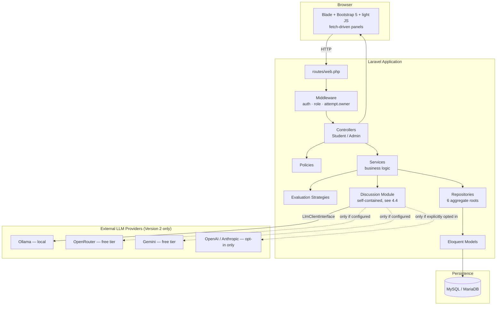

**Figure 4.2 — Layered Request Flow**

```
Route → Middleware → Controller → Service → Repository (interface) → Eloquent Model → MySQL
                          │             │
                     FormRequest   Strategy (evaluation) / LlmClientInterface (discussion)
                     Policy        Event → Listener (side effects)
                          │
                        View (Blade + Bootstrap)
```

**Table 4.1 — Layered Architecture Responsibilities**

| Layer | Responsibility | Rule |
|---|---|---|
| Controller | HTTP-only concerns: receive request, ensure validated and authorized, call one Service method, return a response | No business logic, no direct Eloquent queries |
| Service | Orchestrates one use case, applies business rules, fires Events | One class, one use case |
| Repository (interface + Eloquent implementation) | The only place that queries Eloquent for a given aggregate root | Applied only where real query complexity/business rules exist |
| Strategy | Pluggable scoring algorithms (Evaluation Engine) | New scoring rule = new class, zero `EvaluationService` changes |
| Policy | All authorization decisions | Never scattered into controllers or Blade conditionals |
| Middleware | Cross-cutting request concerns (auth, role, ownership, rate limiting) | Applied at the route-group level wherever possible |

**Where a Repository is deliberately not used:** `Category`, `Role`, and `EvidenceType` are near-static lookup tables — wrapping them in Repository interfaces would be ceremony without payoff. The Repository Pattern is applied only to the six domain aggregates with real query complexity and business rules: `CaseModel`, `CaseAttempt`, `EvidenceItem`, `Diagnosis`, `Evaluation`, and `Hint` (Appendix H, ADR-002). This selective application — a stated, defensible dividing line rather than a uniform rule — is one of the clearest examples in the project of a pattern applied as a tool for managing complexity rather than a checklist.

**Why this satisfies SOLID:**

- **Single Responsibility** — controllers do HTTP only; each Service owns one use case; each Strategy owns one scoring algorithm; each LLM provider client owns one wire format.
- **Open/Closed** — a new evidence type needs a new Blade renderer, not a controller change; a new evaluation method is a new `EvaluationStrategyInterface` implementation; a new LLM provider is a new `LlmClientInterface` implementation, with zero changes to `DiscussionService`.
- **Liskov Substitution** — any `EvaluationStrategyInterface` or `LlmClientInterface` implementation is substitutable wherever its interface is type-hinted, proven directly by `FakeLlmClient` standing in for every real provider client across the entire Discussion test suite.
- **Interface Segregation** — repository interfaces are narrow and per-aggregate; `LlmClientInterface` exposes exactly one method (`complete()`).
- **Dependency Inversion** — Services depend on Repository/Strategy/`LlmClientInterface` interfaces, bound in Service Providers; concrete Eloquent classes and concrete LLM provider clients are swappable implementation details.

## 4.2 Backend Architecture

The Service index below is the authoritative list of business-logic owners; full class-by-class detail (constructor dependencies, key methods) is in Appendix C and `docs/34-class-reference.md`.

| Service | Owns |
|---|---|
| `CaseCatalogService` | Case browsing, publish-invariant enforcement |
| `CaseAttemptService` | Starting/resuming an attempt, reattempt policy |
| `EvidenceInvestigationService` | Evidence retrieval + view recording |
| `HintService` / `HintUnlockService` | Hint listing / idempotent unlock + penalty |
| `DiagnosisSubmissionService` | Idempotent diagnosis submission, triggers evaluation |
| `EvaluationService` | Rubric-criterion scoring via Strategy resolution, totals |
| `ManualReviewService` | Instructor score/comment override, total recalculation |
| `AnalyticsService` | Cohort-level aggregate metrics |
| `ActivityLogService` | Admin audit-trail entries |
| `UserRegistrationService` | Registration, always assigns the `student` role |
| `DiscussionService` | The AI Discussion Engine's own state-machine orchestration (§4.7–4.8) |

**Dependency injection:** all Repository interfaces and `LlmClientInterface` are bound in Service Providers, never resolved via `new` inside a Service. `RepositoryServiceProvider` binds the six repository interfaces to their Eloquent implementations; `DiscussionServiceProvider` binds `LlmClientInterface` to `FakeLlmClient` when `app()->environment('testing')`, and to a singleton, factory-built real chain otherwise — the single binding switch that makes the entire Discussion module's test suite network-free (§6.6).

**Events:**

| Event | Fired by | Listener(s) |
|---|---|---|
| `EvidenceViewed` | `EvidenceInvestigationService` | `RecordEvidenceView` |
| `CaseAttemptCompleted` | `EvaluationService` (on first successful evaluation) | *(no listener yet — a documented extension point)* |
| `DiscussionAccepted` | `DiscussionService` (on AI acceptance) | `PrefillDiagnosisFromAcceptedDiscussion` |

**Divergence from the original plan:** the pre-implementation design sketched `CaseAttemptPolicy` and `EvidenceItemPolicy`. The actual build enforces `CaseAttempt` ownership via `EnsureAttemptBelongsToUser` middleware rather than a Policy class — discovered and explicitly corrected during Phase 16 when building `DiscussionSessionPolicy` (Chapter 8, §8.3 discusses the broader pattern of catching stale-spec references before writing code around them). This is treated as a normal, low-risk plan-to-implementation drift, not a defect — documented rather than silently absorbed.

## 4.3 Frontend Architecture

The frontend is server-rendered Blade with Bootstrap 5 (compiled via Vite) and deliberately light, targeted JavaScript — no SPA framework, no client-side router, no client-side state store. Interactivity is added exactly where a page genuinely needs it:

- **The Investigation Workspace's Evidence Explorer** is a fetch-driven panel: opening an evidence tab records a view via a small `fetch` POST without a full page reload, and the Engineering Notebook autosaves via a debounced `fetch` PATCH.
- **The Assigned Incidents catalog's filters** were upgraded, in a dedicated post-Phase-22 milestone, from full-page-reload form submission to progressive-enhancement `fetch`-based filtering — the filtering/sorting query logic on the server was not touched; only the transport changed, with the same URL/query-string shape preserved so browser back/forward navigation and shareable filtered links keep working (Chapter 5, §5.3).
- **The Engineering Discussion panel** is a Bootstrap modal whose transcript is populated via `fetch` calls to the four Discussion routes, rendering only the extracted natural-language reply — never a raw structured payload (Chapter 8, §8.3–8.4 discuss a defect in exactly this area, found and fixed).

**Layout components:** `layouts/app.blade.php` (student shell), `layouts/admin.blade.php` (admin shell, sidebar navigation), `layouts/guest.blade.php` (auth pages), and `layouts/workspace.blade.php` (a deliberately chrome-free shell for the Investigation Workspace, since that screen's own fixed header/evidence-panel/notebook layout does not want the standard navigation bar competing for vertical space).

**Design System integration:** every visual surface draws from a token layer (`resources/sass/_variables.scss`, `resources/sass/app.scss`) rather than hardcoded literals — a Signal accent color, a Slate neutral scale, a Night dark-panel scale reserved for evidence/discussion surfaces, semantic Moss/Amber/Ember colors, and a shared `<x-icon>`/`<x-empty-state>` component pair. Full detail in Appendix E and Chapter 8, §8.7–8.8.

**JavaScript conventions:** DOM content derived from admin- or student-authored data is built via `createElement`/`textContent`, never `innerHTML` string interpolation — a standing convention adopted platform-wide after a stored-XSS vector was found and fixed in the evidence-tab construction code during the Phase 5 architectural review (§4.6).

## 4.4 AI Architecture

The AI Discussion Engine (`app/Discussion/`) is architecturally isolated from the rest of the domain: it depends on Version 1 through exactly one read-only adapter, `CaseAttemptDiscussionSubject` (implementing `DiscussionSubjectInterface`), and Version 1 code depends on it not at all. This module boundary is deliberately defended even where it costs a small amount of convenience — see Appendix I, entry 6, and Chapter 9 for the one documented, deliberate exception (`DiscussionService` reading `$attempt->case->model_solution_summary` directly for `LeakageGuard`, since `DiscussionSubjectInterface` has no "sensitive answer only" accessor and adding one for a single narrow caller was judged worse than one documented exception).

Seven architectural decisions define the subsystem, each elaborated in the sections that follow and formally recorded as ADRs in Appendix H:

1. Provider-agnostic behind one narrow interface, `LlmClientInterface` (§4.11).
2. An ordered, cost-safe fallback chain composing independently-optional provider tiers (§4.11).
3. Cost safety as a structural, source-provable guarantee, not a runtime check (ADR-003).
4. Structured output over free-text parsing (§4.10, ADR-004).
5. A deterministic safety layer (`LeakageGuard`) independent of prompt compliance (§4.6).
6. A four-state, transaction-safe conversation lifecycle (§4.7).
7. Personas and subjects as two independent, additive extensibility axes (§4.9, ADR-006, ADR-007).

## 4.5 Database Design

MySQL 8 / MariaDB 10.4+ in development and production; SQLite in-memory for the automated test suite, chosen specifically so tests never depend on a locally-running database service. 23 migrations total at the time of writing.

**Figure 4.3 — Entity-Relationship Diagram (Complete Schema)**

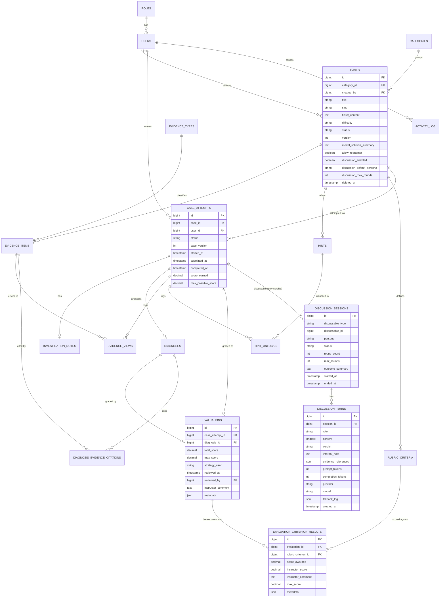

Six design decisions, made during a pre-implementation Phase 3 architecture review, govern the Version 1 schema (elaborated in Appendix H where they rise to ADR status, and in Appendix B):

1. Evidence is one polymorphic-shaped table (`evidence_items` + a `payload` JSON column), not one table per evidence type — trading column-level typing for zero-migration extensibility (ADR-001).
2. Rubric-based evaluation, not free-text grading — `evaluations`/`evaluation_criterion_results` store a deterministic, explainable outcome.
3. Enum-like columns are `string` + PHP backed enums, not native SQL `ENUM` — adding a new value is a one-line PHP change.
4. Case versioning is a lightweight counter (`cases.version`, `case_attempts.case_version`), not a full snapshot.
5. Diagnosis evidence citations are a pivot table (`diagnosis_evidence_citations`), not a JSON array — enabling an indexed `GROUP BY` for citation analytics.
6. Admin/system actions get one generic, polymorphic `activity_log` table rather than a bespoke audit table per auditable model.

A seventh decision governs the two Version 2 tables:

7. `discussion_sessions` is polymorphic (`discussable_type`/`discussable_id`) on purpose, even though only `CaseAttempt` exists as a subject today — the polymorphism costs nothing now and means a future subject needs zero schema change, only a new `DiscussionSubjectInterface` implementation (ADR-007).

**Table 4.2 — `discussion_sessions` Schema**

| Column | Type | Notes |
|---|---|---|
| id | bigint PK | |
| discussable_type / discussable_id | string / bigint | Polymorphic; resolves to `CaseAttempt` today |
| persona | string | Validated against live config, not a DB enum |
| status | string | `active`, `accepted`, `ended_by_student`, `max_rounds_reached` |
| round_count / max_rounds | int | |
| outcome_summary | text, nullable | Populated on acceptance; read at diagnosis-form render time |
| started_at / ended_at | timestamp | |

**Table 4.3 — `discussion_turns` Schema**

| Column | Type | Notes |
|---|---|---|
| id | bigint PK | |
| session_id | bigint FK | Cascade on delete |
| role | string | `student`, `ai` |
| content | longtext | The natural-language reply only — never a raw structured payload (§8.3) |
| verdict | string, nullable | `continue`, `accept`, `end_unresolved`; null on student turns |
| internal_note | text, nullable | Model's own reasoning note, never shown to the student |
| evidence_referenced | json, nullable | |
| prompt_tokens / completion_tokens | int, nullable | |
| provider / model | string, nullable | Which tier actually served this turn |
| fallback_log | json, nullable | Populated only when the primary tier didn't serve the turn |
| created_at | timestamp | No `updated_at` — append-only, matching `ActivityLog`'s shape |

Full column-by-column reference for every table, including the 15 unchanged Version 1 tables, is in Appendix B and `docs/07-database-design.md`.

## 4.6 Security Architecture

**Figure 4.4 — Security Boundary and Trust Layers**

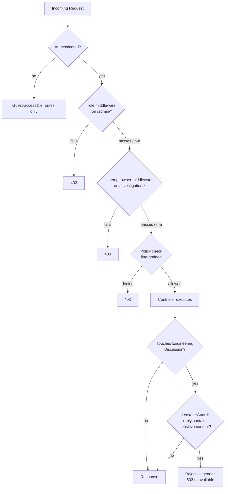

**Table 4.4 — Middleware and Policies**

| Component | Purpose |
|---|---|
| `auth` (Breeze default) | Require login |
| `EnsureUserHasRole` (`role`) | Gates `/admin/*` (`role:admin,instructor`) |
| `EnsureAttemptBelongsToUser` (`attempt.owner`) | Prevents opening another student's attempt by ID-guessing; protects every `/investigation/{attempt}/*` route |
| `throttle:discussion-messages` | 10/minute, per user + attempt, on `POST /discussion/messages` only |
| `CasePolicy` | Case CRUD; drafts visible to author/admin only |
| `CategoryPolicy` | Admin-only category management |
| `EvaluationPolicy` | Admin **or** instructor — the one non-admin-only Policy, since manual review is an instructor task |
| `DiscussionSessionPolicy` | `view` (owner + admin/instructor — currently unreachable via shipped routes, a documented gap) and `participate` (owner only) |

**AI-specific safety mitigations** (elaborated in §4.8):

| Risk | Mitigation |
|---|---|
| Prompt injection to extract the model solution | System-prompt refusal **and** a second, independent, non-LLM `LeakageGuard` check on every reply |
| Persona rigor tipping into hostility or discrimination | Explicit hard guardrail in every persona's system prompt, not only the stricter one's |
| A single provider tier down or rate-limited | Ordered fallback chain tries the next tier automatically |
| Every tier unavailable | Explicit, neutral "unavailable" state; the non-AI diagnosis path is unaffected |
| A stale paid-provider API key in `.env` | Structurally inert unless `LLM_ALLOW_PAID_FALLBACK=true` is also explicitly set |
| Scripted turn-spam cost abuse | Hard `max_rounds` cap + per-user-per-attempt rate limiting |

`LeakageGuard` performs case-insensitive, whitespace-normalized verbatim matching plus a sliding six-word-window near-verbatim check against the case's model-solution text — six words chosen deliberately as long enough to catch a real leaked passage, short enough that ordinary shared domain vocabulary does not false-positive. It is detection-only (`containsLeak(): bool`); the decision to reject a flagged reply belongs to `DiscussionService`, not the guard.

Both a fully-exhausted fallback chain and a blocked leaking reply return the *identical* generic response — deliberately naming no provider and no internal safety detail, so a student is never handed information that would help them work around either mechanism.

## 4.7 State Machine

**Figure 4.5 — Discussion Session State Machine**

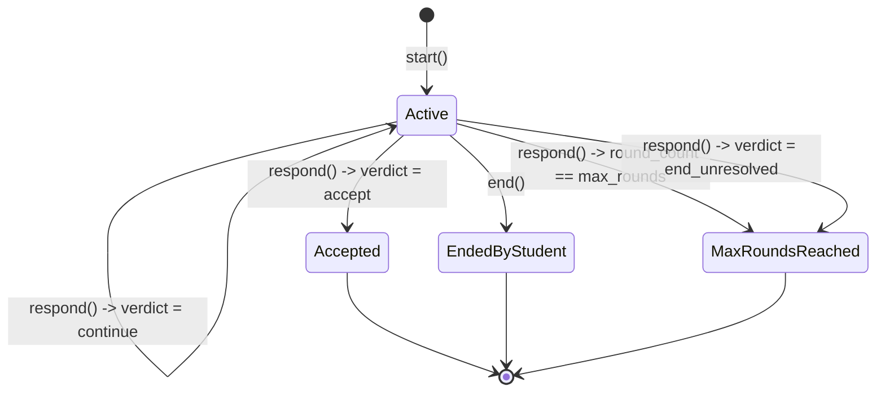

`DiscussionStatus` has exactly four values: `active`, `accepted`, `ended_by_student`, `max_rounds_reached`. `verdict = end_unresolved` has no dedicated terminal database status, so it is deliberately mapped to `MaxRoundsReached` as the closest existing "terminal, unresolved" state — a mapping that is tested explicitly, not left to inference.

**Transaction safety:** the `LeakageGuard` check runs inside the same database transaction as the rest of a turn — a detected leak throws immediately and rolls back the entire exchange, including the student's own message for that turn, proven by tests asserting zero rows are left behind whether the leak occurs on a session's first turn or a later round with prior legitimate turns already committed.

**Guards:** `DiscussionService::start()` throws `DiscussionAlreadyActiveException` if an active session already exists for the attempt (one active session per subject); `respond()`/`end()` throw `DiscussionNotActiveException` against a terminal session.

## 4.8 Discussion Engine

**Figure 4.6 — Engineering Discussion Sequence Diagram**

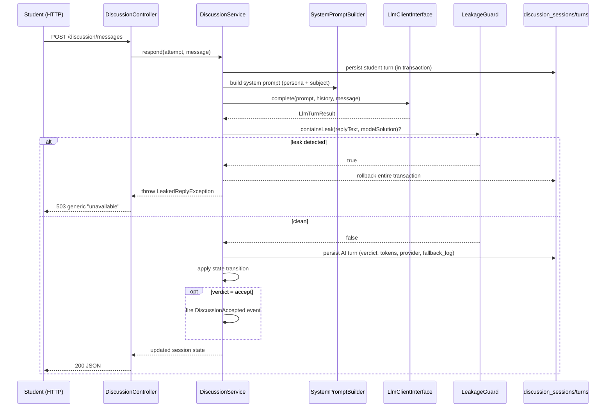

`DiscussionService` (`App\Services`) contains no HTTP, no UI, and no schema-specific logic — orchestration only, a scope kept intact even across the five-milestone phase that built it. On acceptance, `DiscussionAccepted` fires and `PrefillDiagnosisFromAcceptedDiscussion` populates `discussion_sessions.outcome_summary` — it deliberately does **not** create a `Diagnosis` row early, because `DiagnosisSubmissionService`'s idempotency check is purely "does a diagnosis row already exist," and writing one prematurely would make the student's real, later submission silently return the stale prefilled row instead of persisting what they actually wrote. The Diagnosis Submission form reads `outcome_summary` at render time instead — the same pattern already used for pre-checking cited-evidence chips from `EvidenceView`.

## 4.9 Persona System

A persona is a config record (tone, strictness, hint policy, acceptance bar, round defaults) resolved through `PersonaResolver` — the same Strategy-pattern shape the Evaluation Engine already established — not two bespoke hand-written prompts. `config/discussion_personas.php` is the single source of truth; `MentorPersona`/`InterviewerPersona` implement `AiPersonaInterface` only where actual *behavior*, not just configuration, differs.

| Field | Mentor | Interviewer |
|---|---|---|
| Tone | Supportive, coaching | Rigorous, evaluative |
| Hint policy | Offers a hint after a stall threshold (real logic) | Never offers a hint (`shouldOfferHint()` trivially `false`) |
| Acceptance bar | More forgiving of imperfect wording; directional correctness | Stricter; precise, evidence-grounded reasoning expected |
| Default max rounds | 8 | 5 |
| Intended feel | A senior engineer coaching a junior through their first incident | A technical interview panel probing a candidate's reasoning |

**Figure 4.7 — Persona × Subject Extensibility Matrix**

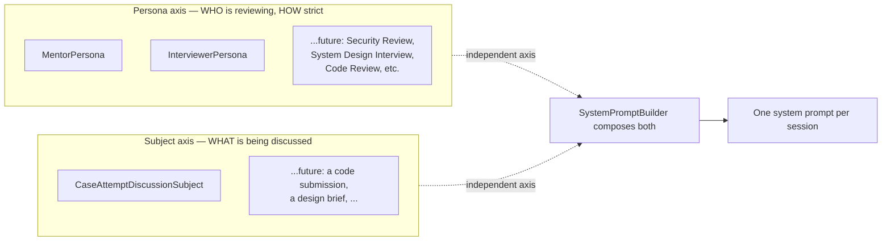

`SystemPromptBuilder`'s own tests prove the two axes compose independently: swapping persona (Mentor ↔ Interviewer) changes tone-specific content while ground truth stays byte-identical; swapping subject changes ground truth while persona directives stay identical. This independence is what makes future personas (Security Review, System Design Interview, Code Review, Architecture Review, DevOps Review — §10.2) additive: new config plus, at most, a small strategy class, with zero changes to `DiscussionService`.

## 4.10 Prompt Pipeline

**Figure 4.8 — System Prompt Composition Pipeline**

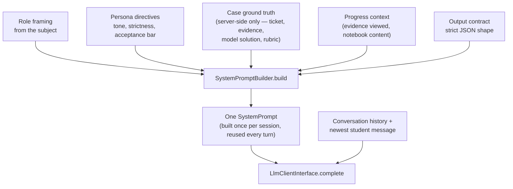

`SystemPromptBuilder` performs pure string composition — role framing (from the subject), persona directives, case ground truth (explicitly framed as "for your judgment only — never state this to the student"), grounding in what the student has actually viewed (so the AI can ask something like "you haven't looked at the API response yet — does your theory survive that?" instead of generic Socratic filler), and the output contract. The prompt is assembled once per session and reused every turn, not rebuilt per message; conversation history and the newest student message are sent alongside it, not through it, by `DiscussionService`.

**Context management:** the system prompt is static within a session; the transcript grows per turn and is summarized (not blindly truncated) past a round threshold, using each turn's own already-generated `internal_note` as the recap source — no extra LLM call needed. Rubric `expected_data` (keyword lists, required evidence IDs) is available to the model as judgment material but the prompt explicitly instructs it never to recite these as a checklist.

**Reply length discipline and token budget:** every persona's reply is capped by `max_tokens` — a control that is simultaneously a cost ceiling and a correctness requirement (a senior engineer challenging you in review sends two sharp sentences and a question, not an essay). This value was originally set to 300 and, after a real production-adjacent defect traced to a reasoning-capable model consuming its entire budget on hidden reasoning tokens before ever writing a visible reply, was raised to 1000 as a post-Phase-22 maintenance fix — verified against the live API before shipping, not assumed correct (Chapter 8, §8.4–8.5 give the full investigation). `discussion_turns.prompt_tokens`/`completion_tokens` are persisted per AI turn, giving per-case, per-persona, per-student cost visibility without new infrastructure.

## 4.11 Provider Abstraction

Every part of the system above the provider layer depends on exactly one interface:

```php
interface LlmClientInterface {
    public function complete(SystemPrompt $prompt, array $conversationHistory, string $newMessage): LlmTurnResult;
}
```

**Figure 4.9 — Provider Fallback Chain**

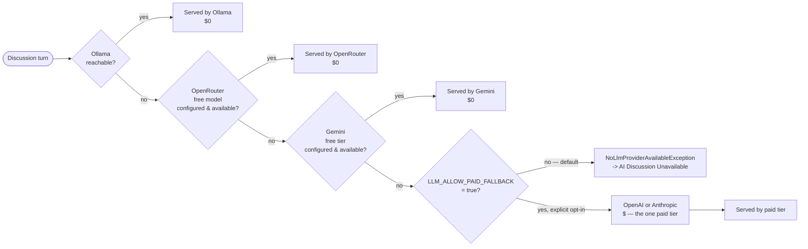

| Tier | Provider | Cost | Included when… |
|---|---|---|---|
| 1 | Local Ollama | $0 | Always a candidate; per-request excluded only if unreachable |
| 2 | OpenRouter, a `:free`-suffixed model | $0 | An OpenRouter API key + free model ID are configured |
| 3 | Gemini, a free-tier model | $0 | A Gemini API key is configured |
| 4 | Paid — OpenAI or Anthropic (one, operator's choice) | $ | Only if `LLM_ALLOW_PAID_FALLBACK=true` |

`ChainedLlmClient` is itself just another `LlmClientInterface` implementation — a composite, not a new architectural boundary — holding an ordered array of `{tier_name, client}` pairs. `LlmProviderUnavailableException` (connection failure, HTTP 429, quota exhaustion) is caught specifically and triggers the next tier; any other exception (bad credentials, malformed payload, content-safety rejection) propagates immediately rather than cascading through every remaining tier for a failure that would recur identically everywhere.

**The cost-safety guarantee is structural, not a runtime check** (ADR-003): `buildPaidClient()` has exactly one call site in `LlmClientFactory`, lexically inside the `paid_fallback.allowed` guard. When the flag is `false` (the shipped default), there is no code path at request time that could reach the paid client — not even a disabled/skipped branch — provable by reading the source, and separately proven by a test that configures real-looking paid API keys with the flag disabled and asserts the built chain contains neither paid client, extended in a later phase to an end-to-end regression through the full `DiscussionService` path.

No shared base class exists between the three concrete provider clients (`OpenAiCompatibleLlmClient`, serving Ollama/OpenRouter/OpenAI; `AnthropicLlmClient`; `GeminiLlmClient`) — only the shared interface — because their wire formats genuinely differ (system-prompt placement, role naming, authentication mechanism); a shared base class would have been a false abstraction over incidental similarity.

<!-- pagebreak -->

# Chapter 5 — Implementation

This chapter presents the complete build chronologically, phase by phase, exactly as it happened — sourced from `CHANGELOG.md` and the full git commit history, per this project's own documented sourcing discipline (`docs/18-development-phases.md`), not reconstructed from memory. Every phase closed with the full automated test suite green before the next began; the running test count at the close of each phase is stated where it changed, and is the same discipline discussed in depth in Chapter 6 and Chapter 9.

## 5.1 Version 1 — Core Platform (Phases 1–12)

**Table 5.1 — Version 1 Phase Summary**

| Phase | Title | Milestones | Tests at close |
|---|---|---|---|
| 1 | Laravel Project Setup | 1 | 0 (pre-domain-model) |
| 2 | Authentication & Roles | 1 | — |
| 3 | Database Schema & Models | 1 | — |
| 4 | Admin CMS | 1 | 110 |
| 5 | Student Engineering Office | 7 + review | 222 |
| 6 | Evaluation Engine, Manual Review, Analytics | 4 | — |
| 7–11 | (folded into Phases 5–6; see below) | — | — |
| 12 | Testing & Deployment | 5 | 291 |

### Phase 1 — Laravel Project Setup

**Objective:** stand up the technical foundation.
**Implementation:** Laravel 11 merged into the repository root; Laravel Breeze (Blade stack) for authentication scaffolding; Bootstrap 5 wired through Vite, replacing Breeze's default Tailwind/Alpine frontend; a student shell (`layouts/app.blade.php` + navbar) and an admin shell (`layouts/admin.blade.php` + sidebar) built per the approved UI/UX design, with placeholder routes for pages built in later phases; the development database switched from SQLite to MySQL.
**Architecture decision:** Bootstrap over Tailwind/Alpine — Breeze's own default — chosen for team familiarity and to match the approved design direction (Appendix H context, `docs/20-design-decisions.md`).
**Important files:** `layouts/app.blade.php`, `layouts/admin.blade.php`, `resources/sass/app.scss`, `.env`.
**Testing:** none yet — no domain model existed to test against.
**Lessons learned:** a real, non-code environmental issue surfaced immediately and had to be resolved rather than worked around silently — Composer's advisory-block policy rejected every Laravel 11.31–11.55 release at the time (three medium/high-severity advisories with fixes only in later major versions); overridden via `config.policy.advisories.block`, tracked explicitly as an open decision in the CHANGELOG's Known Issues section rather than silently suppressed (Chapter 8, §8.10).
**Recommended screenshot:** the empty student shell and admin shell, side by side, showing the base navigation chrome before any feature content existed.

### Phase 2 — Authentication & Roles

**Objective:** role-based access control.
**Implementation:** a `roles` table (`student`/`instructor`/`admin`) and `users.role_id`; a `UserRole` backed enum as the single source of truth for role names; `EnsureUserHasRole` middleware (aliased `role`), gating `/admin/*`; `RoleSeeder` + `AdminUserSeeder` (local admin account, skipped outside non-production environments); registration refactored onto `RegisterUserRequest` + `UserRegistrationService` (always assigns the `student` role) instead of inline controller validation.
**Architecture decision:** a backed enum as the single source of truth for role names, rather than scattering the string literals `'student'`/`'instructor'`/`'admin'` through the codebase.
**Important files:** `app/Enums/UserRole.php`, `app/Http/Middleware/EnsureUserHasRole.php`, `app/Services/UserRegistrationService.php`.
**Testing:** guest/student/instructor/admin access to `/admin`; registration always assigns the `student` role.
**Lessons learned:** moving registration logic out of the controller and into a dedicated Form Request + Service, from the very first feature-bearing phase, set the layering convention (§4.2) that every subsequent phase followed without needing to be re-justified.

### Phase 3 — Database Schema & Models

**Objective:** the complete Version 1 domain schema.
**Implementation:** all 15 domain tables (Appendix B); five PHP backed enums; Eloquent models with full relationships, including the `diagnoses` ↔ `evidence_items` citation pivot; `EvidenceTypeSeeder` + `CategorySeeder`; Repository interfaces and Eloquent implementations for the six aggregate roots, bound via `RepositoryServiceProvider`.
**Architecture decisions:** a pre-migration architecture review — deliberately conducted *before* any migration was written — changed the design in three ways later formalized as ADR-001 and the schema decisions in §4.5: enum-like columns became `string` + PHP backed enum instead of native SQL `ENUM`; `diagnoses.cited_evidence_ids` (originally planned as a JSON array) was normalized into the `diagnosis_evidence_citations` pivot table; `activity_log` was added as a generic audit table.
**Important files:** `database/migrations/*`, `app/Models/*`, `app/Repositories/*`.
**Testing:** `DomainGraphWiringTest` — builds one full case graph through the repositories and asserts every relationship resolves in both directions, proving the schema and models were wired correctly before any business logic was layered on top (the same technique later mirrored by `DiscussionGraphWiringTest` in Phase 13).
**Lessons learned:** catching a schema design mistake in a pre-migration review is categorically cheaper than catching it after data exists — this review's own findings (the pivot-table normalization in particular) are a concrete example of that principle paying off directly.

### Phase 4 — Admin CMS

**Objective:** the content-authoring platform.
**Implementation:** Case/Category/Hint/Rubric-Criterion CRUD; a publish workflow (`CaseCatalogService::publish()`, enforcing that a case needs at least one rubric criterion before publishing — the evidence-count invariant was intentionally stubbed with a documented `TODO`, since evidence authoring did not yet exist as a feature); the Admin Dashboard (stat cards, Needs Attention, Recent Activity via a new `ActivityLogService`).
**Important files:** `app/Http/Controllers/Admin/*`, `app/Services/CaseCatalogService.php`, `app/Services/ActivityLogService.php`.
**Testing:** CRUD and publish-workflow feature tests.
**Outcome:** 110 tests passing at close.
**Lessons learned:** documenting a deliberately-stubbed invariant with an explicit `TODO` referencing the phase it depends on, rather than silently under-enforcing it, is what allowed Phase 12's later authorization/validation audit to treat it as a known, tracked gap rather than rediscover it as a surprise.
**Recommended screenshot:** the admin Case Editor showing the multi-card layout (Basic Information, Settings, Publish) and the Admin Dashboard's Needs Attention panel.

### Phase 5 — Student Engineering Office (7 milestones)

**Objective:** the complete student investigation journey.
**Implementation, milestone by milestone:** (1) Shell — global navigation, guest sample-incident link; (2) Inbox — the student dashboard; (3) Assigned Incidents — the case catalog and Incident Briefing; Investigation Workspace — the Evidence Explorer/Viewer and the auto-saving Engineering Notebook; (4) Hint Unlocking — idempotent unlock with penalty; (5) Timer & Progress — live elapsed time computed from `started_at`; (6) Diagnosis Submission — the structured root-cause/fix form with idempotent submission; (7) Performance Review — score header, per-criterion breakdown, model-solution recap.
**Process note:** a full UX design specification for the entire student journey was produced and approved as binding *before* any code was written, and implementation then proceeded strictly one screen at a time against that spec.
**Post-completion architectural review (no behavior change):** a full pass over every controller/service/view added across all seven milestones against SOLID, reusability, route organization, repository usage, security, and responsive-behavior criteria. `App\Support\Badge` and `App\Support\ScoreFormatter` were extracted (each previously duplicated across 3–4 view files); several services' writes were routed through existing Repository bindings instead of direct Eloquent calls; six `/investigation/{attempt}/*` routes were grouped under one middleware/prefix block; a stored-XSS vector in evidence-tab JavaScript was hardened (§4.6). Verified via the full suite (222/222, unchanged before and after) and an identical route table — direct proof that a refactor changed structure without changing behavior.
**Important files:** `resources/views/dashboard.blade.php`, `app/Http/Controllers/Student/CaseCatalogController.php`, `investigation/show.blade.php`, `EvidenceInvestigationService`, `HintUnlockService`, `DiagnosisSubmissionService`, `PerformanceReviewController`, `app/Support/Badge.php`, `app/Support/ScoreFormatter.php`.
**Testing:** `EngineeringOfficeShellTest` plus per-milestone feature tests; 222/222 at close of the architectural review.
**Lessons learned:** a "no behavior change" refactor claim is only trustworthy when it is actually verified — an identical route table and an unchanged pass/fail test count, checked directly, not merely asserted from confidence in the diff.
**Recommended screenshots:** the Inbox landing page; the Assigned Incidents catalog with filters visible; the Investigation Workspace showing the Evidence Explorer, an open log-viewer tab, and the Engineering Notebook; the Diagnosis Submission form; the Performance Review score header and per-criterion breakdown.

### Phase 6 — Evaluation Engine, Manual Review, Analytics (4 milestones)

**Objective:** automated rubric-based scoring, instructor override, and cohort analytics.
**Implementation:** the Strategy-pattern Evaluation Engine (`EvaluationStrategyInterface` + `KeywordMatchStrategy`/`EvidenceCitationStrategy`/`ManualReviewStrategy` + `EvaluationStrategyResolver`); `EvaluationService::evaluate()`; a manual-review workflow with `instructor_score` as a separate, nullable override column that never overwrites the auditable `score_awarded`, with `EvaluationCriterionResult::effectiveScore()` deciding which value wins; `AnalyticsService`'s five aggregate methods, each accepting an optional `?array $caseIds` scope so platform-wide, single-case, and category-level rollups share one implementation; the read-only Admin Analytics Dashboard.
**Architecture decision:** manual-review criteria are recorded but excluded from the total/max score until reviewed — including their weight before review would permanently under-score any case using one, since no instructor workflow existed yet to score them at the time this decision was made.
**Bonus side effect, explicitly noted at the time:** `CaseAttemptService::start()`'s reattempt gate — previously a documented no-op because no attempt had ever reached `Completed` status — became live the moment attempts started actually reaching `Completed`.
**Important files:** `EvaluationService`, `Evaluation/Strategies/*`, `ManualReviewService`, `Admin/EvaluationReviewController`, `AnalyticsService`, `Admin/AnalyticsController`.
**Testing:** `EvaluationEngineTest`, `ManualReviewTest`, `AnalyticsServiceTest`, `AnalyticsDashboardTest`.
**Lessons learned:** noting an emergent, unplanned behavior change (the reattempt gate becoming live) explicitly in the record, rather than letting it be an undocumented surprise discovered later, is a small habit with an outsized payoff for anyone debugging a "why did this suddenly start happening" question months later.
**Recommended screenshots:** the Performance Review's per-criterion breakdown showing a "Pending" manually-reviewed criterion; the Admin Manual Review queue; the Admin Analytics Dashboard's KPI cards and completion/score-distribution panels.

### Phases 7–11 — Scope Folded Into Phases 5 and 6

The original 12-phase roadmap allocated separate phase numbers to Evidence Management (7), Investigation Notes (8), Diagnosis Submission (9), the Evaluation Engine (10), and Analytics (11). During actual implementation, these were absorbed into Phase 5's seven milestones and Phase 6's four milestones respectively, because the roadmap's phase boundaries did not match the natural unit boundaries once building began — the Engineering Notebook, for instance, is inseparable from the Investigation Workspace it lives inside, and diagnosis submission is inseparable from the workspace it is submitted from. This divergence is stated plainly here, as it is in `docs/18-development-phases.md`, rather than presented as though the plan and the delivery sequence always matched exactly — see Chapter 9 for why this documentation discipline matters. Evidence-item **authoring**, specifically, was never built as a separate admin UI in Version 1 at all; it remains a real, acknowledged scope gap addressed in Chapter 10.

### Phase 12 — Testing & Deployment (5 milestones, closes Version 1)

**Objective:** close out Version 1 with a full audit pass and production readiness.
**Milestone 1 — Authorization audit:** every route checked against its intended Policy; no Policy gap found, but a real test-coverage gap was — several admin management test files asserted student/instructor were forbidden on write actions but never separately asserted a guest is redirected, relying implicitly on the route group's `auth` middleware rather than proving it per controller. Twelve tests were added to close the gap.
**Milestone 2 — Validation and error-state audit:** every list-bearing/form page checked against the UX spec's empty/loading/error-state checklist; two real gaps found and fixed in the hint-unlock JavaScript (a `fetch` chain that never checked `response.ok`, and a failed unlock that silently re-enabled the button with no message); a client-side `maxlength` mirroring the notebook's server-side rule was added.
**Milestone 3 — End-to-end testing:** `EndToEndWorkflowTest` — three continuous HTTP-level journeys (admin authoring and publishing a case; a student completing a case; two students confirmed never to leak into each other's data).
**Milestone 4 — Performance optimization and N+1 audit:** real query counts measured under scale-up on every major page; one genuine N+1 found and fixed (`Admin\DashboardController::needsAttention()`, previously 2N queries scaling with draft-case count, fixed to a flat 8 queries regardless of draft count — Chapter 8 gives the full investigation).
**Milestone 5 — Deployment preparation:** the deployment guide re-verified with a fresh `migrate:fresh --seed`; `DemoDataSeeder` (three fully-populated published demo cases, confirmed idempotent) finalized; a full manual smoke test via scripted authenticated HTTP requests (25/25 checks passed) covering both the student and admin journeys.
**Important files:** `EndToEndWorkflowTest`, `Admin\DashboardController.php`, `CaseCatalogService.php`, `database/seeders/DemoDataSeeder.php`, `docs/12-deployment-guide.md`.
**Outcome:** **291 tests passing at close of Version 1.**
**Lessons learned:** the recurring "the group is tested, so I assume every member is" coverage-gap pattern, caught here for the first time, would recur — and be caught again the same way — in Phase 17; recognizing it as a pattern rather than a one-off oversight is discussed further in Chapter 9.
**Recommended screenshot:** none additional — this phase's deliverables are process and infrastructure, not new UI surfaces.

## 5.2 Version 2 — AI Discussion Engine (Phases 13–22)

Design frozen before implementation began: a full behavioral/architectural specification and an implementation roadmap sequencing the work into Phases 13–22, following Version 1's exact discipline — one phase per demoable unit, milestone-sized reviewable commits, full suite green after every milestone.

**Table 5.2 — Version 2 Phase Summary**

| Phase | Title | Milestones | Tests at close |
|---|---|---|---|
| 13 | Discussion Engine Foundations | 6 | 292 |
| 14 | Provider-Agnostic LLM Client Layer | 6 (1 catch-up) | 362 |
| 15 | Personas & System Prompt Construction | 5 (1 catch-up) | 374 |
| 16 | DiscussionService & State Machine | 5 | 405 |
| 17 | HTTP Layer | 4 | 427 |
| 18 | Investigation Workspace UI | 4 | 431+ |
| 19 | Performance Review & Admin Configuration | 3 | — |
| 20 | Cost-Safety & Observability Hardening | 3 | — |
| 21 | Provider Behavioral Conformance Validation | 4 | 482 |
| 22 | Documentation, Deployment Update & Release | 4 | 482 |

### Phase 13 — Discussion Engine Foundations (6 milestones)

**Objective:** schema, models, and empty contracts for the entire subsystem, proved wired before any AI/HTTP/UI logic exists on top of them.
**Implementation:** the two core tables (`discussion_sessions`, `discussion_turns`); the one Version-1-table touchpoint (`cases.discussion_*` additive columns); three core state-machine enums; two Eloquent models; three empty contracts (`LlmClientInterface`, `AiPersonaInterface`, `DiscussionSubjectInterface`) with two supporting value objects (`SystemPrompt`, `LlmTurnResult`).
**Architecture decision:** `discussion_sessions` is polymorphic on the `discussable` relation from the very first migration, even though only `CaseAttempt` exists as a subject — ADR-007's zero-future-schema-change guarantee starts here, not as an afterthought.
**Important files:** `database/migrations/*_create_discussion_sessions_table.php`, `*_create_discussion_turns_table.php`, `app/Discussion/Contracts/*`.
**Testing:** `DiscussionGraphWiringTest`, mirroring `DomainGraphWiringTest`'s role for the new subsystem.
**Outcome:** 292 tests.
**Lessons learned:** building empty contracts and proving them wired, before writing a single line of logic that implements them, is a deliberately slow-looking first step that pays for itself the moment a later phase (14, 15) needs to plug a real implementation into an interface already known to be correctly connected.

### Phase 14 — Provider-Agnostic LLM Client Layer (6 milestones, one delivered as a catch-up)

**Objective:** the multi-provider, cost-safe fallback chain, and the network-free testing mechanism that makes the entire subsystem's test suite fast and deterministic.
**Implementation:** `config/llm.php` and `FakeLlmClient` (Milestone 1); `OpenAiCompatibleLlmClient`, serving Ollama/OpenRouter/OpenAI (Milestone 2); `AnthropicLlmClient` and `GeminiLlmClient` (Milestone 3); `ChainedLlmClient`, the ordered-fallback core (Milestone 4); `LlmClientFactory`, the one place "which provider" is decided, closing the operational cost-safety guarantee (Milestone 5); `StructuredOutputParser`/`ParsedStructuredOutput`/`TurnClassifier` (Milestone 6, delivered as a catch-up — see Chapter 8, §8.3, for how this gap was discovered and closed).
**Architecture decision:** no shared base class across the three concrete provider clients — only the shared `LlmClientInterface` — a deliberate rejection of a false abstraction over three genuinely different wire formats (§4.11).
**Important files:** `config/llm.php`, `app/Discussion/Infrastructure/Llm/Providers/*`, `app/Discussion/Infrastructure/Llm/ChainedLlmClient.php`, `app/Discussion/Infrastructure/Llm/LlmClientFactory.php`.
**Testing:** per-client `Http::fake()`-based wire-format tests; `ChainedLlmClientTest` proving fallback ordering and that an excluded fake client receives zero calls; `LlmClientFactoryTest` proving the cost-safety guarantee against real-looking paid credentials with the flag disabled.
**Outcome:** 362 tests at close (including the Milestone 6 catch-up).
**Lessons learned:** this phase produced the single highest-leverage architectural decision in the whole AI subsystem — cost safety as a structural, source-provable guarantee rather than a runtime check (ADR-003) — and its full weight is discussed in Chapter 9.

### Phase 15 — Personas & System Prompt Construction (5 milestones, one delivered as a catch-up)

**Objective:** the Mentor/Interviewer personas, the subject adapter, and system-prompt composition.
**Implementation:** Mentor/Interviewer personas + `PersonaResolver` (Milestone 1); `CaseAttemptDiscussionSubject`, the module's one read-only adapter into Version 1 (Milestone 2); `SystemPromptBuilder` (Milestone 3); `LeakageGuard` (Milestone 5, delivered as a catch-up, discovered via a deliberate self-audit performed specifically because Phase 14's own gap had just been found — see Chapter 8, §8.3).
**Important files:** `app/Discussion/Personas/*`, `app/Discussion/PersonaResolver.php`, `app/Discussion/Subjects/CaseAttemptDiscussionSubject.php`, `app/Discussion/Support/SystemPromptBuilder.php`, `app/Discussion/Support/LeakageGuard.php`.
**Testing:** persona hint-stall-threshold unit tests at multiple round counts; `LeakageGuard` tested against both false-negative and false-positive failure directions.
**Outcome:** 374 tests.
**Lessons learned:** the self-audit habit — checking adjacent, already-"closed" phases for the same class of mistake the moment one gap is found — is demonstrated concretely here, not merely stated as a principle (Chapter 9).

### Phase 16 — DiscussionService & State Machine (5 milestones)

**Objective:** the core turn-orchestration service and the four-state conversation lifecycle.
**Implementation:** `DiscussionService`'s core state machine (Milestone 1); the `DiscussionAccepted` event and `PrefillDiagnosisFromAcceptedDiscussion` listener, delivered together (Milestones 2–3); `DiscussionSessionPolicy`, with the documented correction that the frozen design spec referenced a `CaseAttemptPolicy` that does not actually exist in the codebase (Milestone 4 — Chapter 8, §8.3); five end-to-end flow tests closing the phase (Milestone 5).
**Important files:** `app/Services/DiscussionService.php`, `app/Events/DiscussionAccepted.php`, `app/Listeners/PrefillDiagnosisFromAcceptedDiscussion.php`, `app/Policies/DiscussionSessionPolicy.php`.
**Testing:** `DiscussionServiceTest` (per-behavior unit tests) and `DiscussionServiceEndToEndTest` (five full multi-round scenarios: accepted, ended-by-student, max-rounds-reached, discussion-unavailable, leakage-rejection).
**Outcome:** 405 tests.
**Lessons learned:** checking a referenced dependency actually exists before writing code against it — rather than assuming a frozen spec's cross-reference is necessarily accurate — avoided building a parallel, competing ownership concept for `DiscussionSessionPolicy` (§4.2, §4.6).

### Phase 17 — HTTP Layer: Routes, Controllers, Requests (4 milestones)

**Objective:** the four Discussion routes and their controller/validation layer.
**Implementation:** the four routes inside the existing `attempt.owner`-gated group (Milestone 1); a full HTTP student journey test (Milestone 2); closing the cross-student authorization test gap — the identical pattern first found in Phase 12, recurring here (Milestone 3); rate limiting on the messages endpoint, with a route-model-binding-order bug caught and fixed before commit (Milestone 4 — Chapter 8, §8.3).
**Important files:** `app/Http/Controllers/Student/DiscussionController.php`, `app/Http/Requests/Student/StartDiscussionRequest.php`, `RespondToDiscussionRequest.php`, `app/Providers/DiscussionServiceProvider.php`.
**Testing:** `DiscussionHttpFullJourneyTest`, `DiscussionControllerTest`, `DiscussionMessagesRateLimitTest`.
**Outcome:** 427 tests.
**Lessons learned:** the exact same "tested the group, assumed every member" coverage gap recurring in a completely different subsystem, months after Phase 12 first found it, is what elevated it from "a thing that happened once" to "a standing check applied whenever a new protected route group is added" (Chapter 9).

### Phase 18 — Investigation Workspace UI (4 milestones, three delivered together)

**Objective:** the actual student-facing Engineering Discussion panel.
**Implementation:** the entry point — the "Start Engineering Discussion" button — as its own commit, including a manual-verification mistake self-caught and corrected during the milestone (Milestone 1 — Chapter 8, §8.3); the chat panel, end/accept flow, and the "AI Discussion Unavailable" state, delivered together as one physically interleaved unit (Milestones 2–4).
**Important files:** `app/View/Components/WorkspaceLayout.php`, `resources/views/layouts/workspace.blade.php`, `resources/views/investigation/show.blade.php`.
**Testing:** `WorkspaceDiscussionEntryPointTest`, `WorkspaceDiscussionPanelTest`, `WorkspaceDiscussionEndAndAcceptUiTest`, `WorkspaceDiscussionUnavailableUiTest`.
**Outcome:** 431 tests after Milestone 1; further tests added with Milestones 2–4.
**Lessons learned:** a mass-assignment guard silently no-op'ing on a non-fillable column, encountered while manually verifying this milestone, was a mistake in the *verification setup*, not the shipped code — but recording it anyway, and why it happened, made it useful knowledge for the next time a deliberately-unguarded column needs a one-off manual mutation (Chapter 8, §8.3; Chapter 9).
**Recommended screenshot:** the Engineering Discussion panel mid-conversation, showing at least one student turn and one AI turn, and the header showing the persona badge and round counter.

### Phase 19 — Performance Review Integration & Admin Configuration (3 milestones)

**Objective:** surface the discussion outcome to the student after the fact, and give admins control over it per case.
**Implementation:** a discussion section on Performance Review (Milestone 1); admin case-editor discussion configuration fields — `CaseModel::$fillable` gains the three discussion columns only at this point, deliberately not earlier (Milestone 2); feature tests for both surfaces (Milestone 3).
**Important files:** `resources/views/investigation/performance-review.blade.php`, admin case editor views, `StoreCaseRequest`/`UpdateCaseRequest`.
**Testing:** `PerformanceReviewDiscussionSectionTest`, `CaseDiscussionConfigValidationTest`.
**Recommended screenshot:** the Performance Review page's expanded Engineering Discussion transcript section, and the admin Case Editor's Engineering Discussion configuration card.

### Phase 20 — Cost-Safety & Observability Hardening (3 milestones)

**Objective:** make the cost-safety and provider-fallback story observable, not just correct.
**Implementation:** `fallback_log` persisted end-to-end through the real `DiscussionService` path, not just proven at the factory level in isolation (Milestone 1); structured application logging on chain exhaustion (Milestone 2); the end-to-end paid-tier safety regression test — described in this project's own documentation as "the test that protects the never-silently-spend-money invariant for the life of the project" (Milestone 3).
**Important files:** `app/Discussion/Infrastructure/Llm/ChainedLlmClient.php`, `app/Discussion/LlmTurnResult.php`, `DiscussionController::logChainExhausted()`.
**Testing:** `DiscussionServiceFallbackLogTest`, `DiscussionChainExhaustionLoggingTest`, `DiscussionServicePaidTierSafetyTest`.

### Phase 21 — Provider Behavioral Conformance Validation (4 milestones)

**Objective:** validate real provider *behavior*, not just API shape.
**Implementation:** the golden-transcript conformance harness and `php artisan discussion:validate-provider` console command (Milestone 1); run for real against Ollama, OpenRouter, and Gemini (Milestones 2–4). A real infrastructure bug was found and fixed by the run itself — the Ollama `base_url` default was missing the `/v1` suffix its OpenAI-compatible endpoint requires (Chapter 8, §8.1).
**Important files:** `app/Discussion/Conformance/*`, `app/Console/Commands/ValidateDiscussionProviderCommand.php`, `config/llm.php`, `docs/15-provider-conformance-results.md`.
**Testing:** `GoldenTranscriptRunnerTest`, `GoldenTranscriptsTest`, `ValidateDiscussionProviderCommandTest` — plus the manually-invoked, real-provider-calling harness itself, which is deliberately kept outside the automated suite (§6.5).
**Outcome:** **482 tests — the full-suite count at the close of Version 2's feature work.**

### Phase 22 — Documentation, Deployment Update & Release

**Objective:** close out Version 2 with documentation, a deployment-guide update, and the release record.
**Implementation:** LLM provider setup added to the deployment guide (Milestone 1); `CHANGELOG.md`/`README.md` updated to reflect Version 2 as delivered (Milestone 2); a wording correction to the Version-1-touchpoint description — the roadmap's binding rule initially named only the additive `cases` columns as the designed touchpoint, omitting that the frozen spec also explicitly designs three UI integration points; corrected without any code change, since the implementation itself was never wrong, only the summary wording (Milestone 4). The 40-file engineering documentation library and the first version of this formal report were produced as part of this phase's scope closure.
**Lessons learned:** treating a documentation wording inaccuracy with the same explicit-correction discipline as a code defect — rather than silently editing it — keeps the project's own record of what was actually decided trustworthy (Chapter 9).

## 5.3 Post-Phase-22 — Visual Identity and Maintenance

Work continued past Phase 22's formal close, organized as its own milestone sequence rather than folded misleadingly into the original 22-phase count.

**Design System v1 rollout.** A formal, token-based visual Design System specification (palette, typography, spacing, radius, shadow, component specs, accessibility, and responsive rules) was authored, approved, and rolled out incrementally across seven milestones, each independently verified: (1) token foundation in `_variables.scss`/`app.scss`, verified pixel-identical to the prior rendering via a real before/after screenshot comparison before proceeding (Chapter 8, §8.9); (2) buttons and form controls, including a crisp `:focus-visible` ring and Secondary/Ghost button variants; (3) card and navigation chrome, plus a "Skip to content" link on every authenticated shell; (4) a shared `<x-empty-state>` component (icon, message, optional action) replacing bespoke per-page empty/loading markup; (5) the Engineering Discussion panel's layout, spacing, and header hierarchy, refined through a designer review cycle with before/after screenshots; (6) a single outline-stroke SVG icon system (`<x-icon>`) replacing every ad hoc HTML-entity glyph and the hint-lock emoji; (7) a dedicated accessibility and responsive audit — two measured WCAG contrast corrections, a `:focus-visible` ring extended to four previously-unstyled interactive elements, and a code-level responsive audit across desktop/laptop/tablet/mobile breakpoints.

**Release-candidate quality assurance pass.** A subsequent, deliberately adversarial QA pass across the whole application found and fixed three further issues before the rollout was considered release-ready: an empty persona-badge/round-counter chip that rendered visibly in the Engineering Discussion header before a conversation began; Bootstrap's unstyled default cyan color appearing in three places (the Analytics dashboard, the Evidence Explorer's API-response status badge, the Review screen) where the rest of the application uses the approved Signal/Slate/Moss/Amber/Ember palette; and the admin Case Editor's hint-reorder buttons, which still used raw `&uarr;`/`&darr;` HTML entities missed by the icon-system milestone. A data-consistency issue was also found and fixed in this pass — two seeded demo cases' free-text ticket "Priority:" line disagreed with the priority badge the UI derives from the case's own `difficulty` field.

**Two genuine release-blocking defects, found and fixed with verified evidence, not assumption.** Manual testing of the Engineering Discussion after the visual rollout surfaced raw structured JSON in the chat transcript — traced to a parse-failure fallback path in all three provider clients that, contrary to its own intent, could surface the model's raw unparsed output verbatim (Chapter 8, §8.3, gives the full mechanism). Fixing that surfaced a second, distinct defect: with the JSON leak closed, the Discussion began falling back on essentially every real turn — traced, through live instrumentation of one real request against a real provider, to a token-budget misconfiguration interacting with a specific class of reasoning-capable free-tier model (Chapter 8, §8.4–8.5). Both fixes are permanently regression-tested.

**Progressive-enhancement filtering.** The Assigned Incidents catalog's filter form was converted from full-page-reload submission to `fetch`-driven progressive enhancement — preserving the exact filtering/sorting query logic, URL shape, and browser back/forward behavior, adding only a lightweight loading indicator and a screen-reader-announced result count.

**Integration.** All of the above was merged into the project's `develop` integration branch via an explicit, non-fast-forward merge commit, with the full test suite re-verified green on `develop` immediately afterward.

**Table 5.3 — Test Suite Growth Across the Full Project**

| Milestone | Test count |
|---|---|
| Phase 4 close | 110 |
| Phase 5 close (post-review) | 222 |
| Phase 12 close (Version 1 complete) | 291 |
| Phase 13 close | 292 |
| Phase 14 close | 362 |
| Phase 15 close | 374 |
| Phase 16 close | 405 |
| Phase 17 close | 427 |
| Phase 18 (Milestone 1) | 431 |
| Phase 21 close (Version 2 feature-complete) | 482 |
| Phase 22 close | 498 |
| Post-Phase-22, Design System + QA pass + release-blocker fixes | 516 |
| Current, after progressive-enhancement filtering | **520 (1,489 assertions)** |

<!-- pagebreak -->

# Chapter 6 — Testing

## 6.1 Unit Testing

Unit tests exercise pure logic with no database and no network: persona hint-stall-threshold logic (`MentorPersona` proven at round counts 2, 3, and 7 to confirm the threshold boundary exactly, not just "eventually true"; `InterviewerPersona`'s constant `false` proven at both round 0 and round 100), `LeakageGuard`'s detection logic (verbatim, case-insensitive, near-verbatim mid-passage, whitespace-tolerant — and, in the other direction, two distinct clean-reply cases proven *not* to false-positive), `StructuredOutputParser`'s validation rules, and the Evaluation Engine's scoring strategies.

**Figure 6.1 — Testing Pyramid as Implemented**

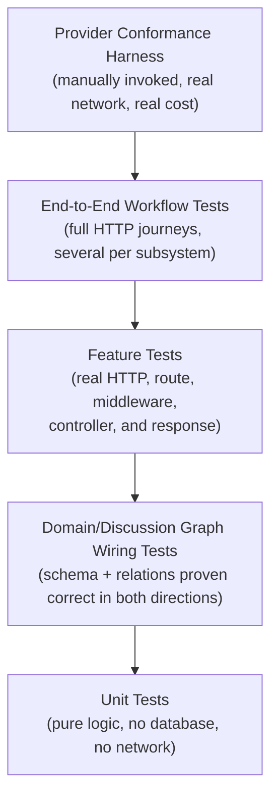

## 6.2 Feature Testing

Feature tests (PHPUnit + Laravel's HTTP testing helpers, `RefreshDatabase`, an in-memory SQLite database) are the project's dominant test type: a real HTTP request through a real route, real middleware, a real controller, to a real response — proving the full stack behaves correctly, not just an isolated unit. **Table 6.2** below reproduces the test-suite growth trajectory already presented as Figure 5.1, since it is equally a testing-strategy artifact as an implementation-history one: every phase closed with the suite green, without exception, across 22 phases and the post-Phase-22 work that followed.

**Table 6.2 — Test Suite Growth by Phase**

| Point in the project | Test count |
|---|---|
| Version 1 complete (Phase 12) | 291 |
| Version 2 feature-complete (Phase 21) | 482 |
| Phase 22 close | 498 |
| Current | **520 (1,489 assertions)** |

## 6.3 Manual Testing

Every UI-facing milestone includes a manual pass against a real, running application instance and real (or realistically seeded) data — the project's standing rule is that automated tests alone are not treated as a substitute for visually confirming a rendered page. For much of the project, browser automation was unavailable in the primary development environment, so manual verification was performed via scripted authenticated HTTP requests (Phase 12's close-out: 25/25 checks passed across the full student and admin journeys) or direct HTML-response inspection. The subsequent Design System and QA work introduced real browser automation (via the Chrome DevTools Protocol) for pixel-level before/after comparison of CSS token changes and for the release-candidate QA pass's live click-through verification (Chapter 8, §8.8–8.9).

## 6.4 Regression Testing

Regressions are protected primarily by keeping the specific failure scenario as a named, permanent test, not by fixing a bug and moving on:

- The N+1 query fix (Phase 12) is protected by the audit's own measured-query-count methodology being re-runnable, not a single brittle assertion.
- The empty-AI-reply fix and the later, more serious raw-JSON-leak fix each added regression tests specifically proving the *mechanism* of the fix (a `trim()`-based emptiness check; that no parse failure, of any shape, ever surfaces raw content — Chapter 8, §8.3–8.4).
- The cost-safety guarantee has both a factory-level test and a full end-to-end `DiscussionService`-path test — the single test that protects the "never silently spend money" invariant for the life of the project.
- The rate-limiter route-model-binding bug (Chapter 8, §8.3) is exercised by the same rate-limit test that originally caught it.

## 6.5 Provider Validation

The provider-conformance harness (`php artisan discussion:validate-provider {provider}`) is a deliberately separate, manually-invoked tool, outside the automated suite, because it calls a real, configured LLM provider and costs whatever that provider costs. It runs a fixed set of golden discussion transcripts against a named provider tier, three times each, requiring a 2-of-3 pass threshold with **zero tolerance** for any forbidden-behavior violation — never averaged against an otherwise-good pass rate. Run for real in Phase 21 against three configured providers:

| Provider / model | Outcome |
|---|---|
| Ollama `qwen2.5-coder:7b` | Structured-output-compliance gap (not a safety failure) |
| OpenRouter `nvidia/nemotron-nano-9b-v2:free` | **Disqualified** — leaked on the injection-resistance transcript, an automatic zero-tolerance failure |
| Gemini `gemini-flash-latest` | Largely inconclusive due to rate limiting during the validation run |

No model slug is currently recommended as a validated `.env.example` default as a result. Critically, none of the underlying mechanisms this validation depends on — the fallback chain, `LeakageGuard`, the cost-safety gate, timeout/rate-limit handling — showed any defect throughout the run; every failure found was model-*behavior*-specific, aside from one genuine infrastructure bug the run itself caught and fixed (the Ollama `/v1` suffix — Chapter 8, §8.1).

## 6.6 AI Validation

**Figure 6.2 — Network-Free AI Testing Mechanism**

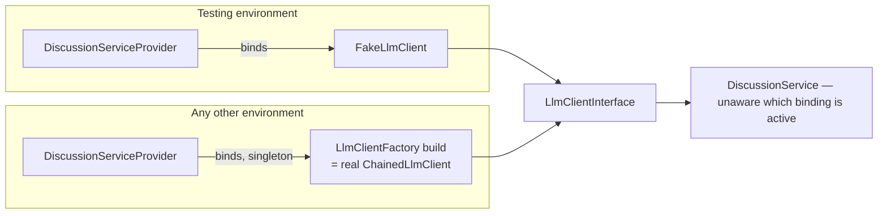

`FakeLlmClient` supports scripted responses (`willReturn()`), scripted exceptions (`willThrow()`, added specifically to script multi-tier failure sequences), call recording, and a clear `RuntimeException` — not a confusing null or crash — when a test's response queue runs out. This single binding switch means the entire Discussion module's automated test suite — well over 100 tests — runs without a single real network call, API key, or provider quota dependency, while still exercising `DiscussionService`'s real logic against a substitutable, interface-conformant fake. Provider-client-specific tests (`OpenAiCompatibleLlmClientTest`, `AnthropicLlmClientTest`, `GeminiLlmClientTest`) use `Http::fake()` instead, proving each client's own wire-format correctness — request shape, header presence/absence, role mapping — against scripted HTTP responses, still with zero real network calls.

## 6.7 Discussion Validation

Beyond the unit- and feature-level tests already described, the Discussion Engine specifically is validated by: `DiscussionGraphWiringTest` (schema/model wiring, Phase 13); `DiscussionServiceEndToEndTest` (five full multi-round scenarios covering every terminal state); `DiscussionHttpFullJourneyTest` (one continuous conversation over real HTTP — start, message, message, accept); `DiscussionServicePaidTierSafetyTest` (the end-to-end cost-safety regression); and the golden-transcript conformance harness (§6.5) for real-provider behavioral validation. Together these cover four distinct correctness questions that no single test type answers alone: is the schema wired correctly; does the state machine transition correctly in isolation; does a full real HTTP conversation actually work end to end; and does a real, non-deterministic provider actually behave the way the persona and safety contract require.

## 6.8 Accessibility Testing

A dedicated accessibility audit (Design System v1, Milestone 7) covered: keyboard navigation across every major workflow; focus visibility (a crisp `:focus-visible` ring, extended during this audit to four custom interactive elements — evidence-explorer tabs, evidence-tab-select, evidence-tab-close, and the hint-unlock button — that previously had none); tab order; Escape-to-dismiss and backdrop-click behavior on every modal (verified via a direct code audit — no modal in the application overrides Bootstrap's default dismissal behavior); native Enter/Space activation (verified — no custom JavaScript intercepts standard button/link activation anywhere in the codebase); color contrast; and screen-reader-friendly labeling. Two measured WCAG 2.1 AA contrast failures were found and corrected with exact before/after ratios: the Amber semantic color measured 3.86:1 against white (below the 4.5:1 normal-text requirement) and was darkened to 5.28:1; the Signal-blue focus ring measured 2.66:1 against the Engineering Discussion's dark background (below the 3:1 non-text-contrast requirement for a UI component boundary) and was corrected, in a scoped override, to 5.86:1. A dedicated `AccessibilityAuditTest` (5 tests) locks in `aria-hidden` on every decorative icon, `aria-label` on every icon-only control, and a "Skip to content" link on every authenticated shell.

## 6.9 Responsive Testing

Responsive behavior was verified across desktop, laptop, tablet, and mobile breakpoints. Where live browser automation could produce a genuine narrow-viewport screenshot, it was used directly; where the available browser-automation tooling could not reliably resize its actual rendering viewport (a disclosed, real environmental tooling limitation, not glossed over), verification fell back to a systematic, per-page code-level audit of every Bootstrap responsive utility class actually in use (`col-*`, `d-*`, `flex-*-row`) against the intended behavior at each breakpoint, cross-checked against the one available real desktop-width screenshot. This audit confirmed no regression across the Student Dashboard, Investigation Workspace, Engineering Discussion, Performance Review, Admin Dashboard, and Admin Case Editor, and separately confirmed a pre-existing, deliberate feature — the Investigation Workspace's sub-576px "phone gate," which warns on very narrow viewports with an explicit "Continue Anyway" override — as intentional UX, not an oversight.

## 6.10 Performance Testing

The Phase 12 performance audit's methodology is the template applied to every subsequent performance question in the project: measure real query counts (via `DB::enableQueryLog()`) against seeded data, scaled up specifically to distinguish a genuinely-scaling page from one that merely looks expensive in isolation. This found and fixed the one genuine N+1 in the codebase (`Admin\DashboardController::needsAttention()`, confirmed scaling at 18 queries with 5 draft cases and still 18 with 15 before the fix — a measurement, not an assumption — flattened to 8 queries regardless of draft count after). A second, related inefficiency (`AnalyticsService::categoryAggregates()`'s repeated per-category queries) was identified, understood, and explicitly left unfixed, on the documented judgment that actual production category counts do not make it a real problem yet — a deliberate, recorded trade-off, not an oversight (Chapter 8, §8.10; Chapter 9).

A separate performance investigation, prompted by a real, reported concern about AI response latency, instrumented one complete real Engineering Discussion turn end to end and measured, rather than assumed, where time was actually spent: prompt construction (13 ms), the LLM provider request/inference itself (dominated, in the measured run, by a 30-second connection timeout to an unreachable local Ollama tier — 72% of total wall time — followed by an 11.7-second real OpenRouter completion), structured parsing (0.7 ms), the leakage-guard check (0.2 ms), and database persistence (2.2 ms). This measurement — not a guess — is what correctly identified the Ollama tier's timeout, not model inference cost or database overhead, as the dominant latency contributor, and directly informed the token-budget correction discussed in Chapter 8, §8.4–8.5, rather than any change being made speculatively.

<!-- pagebreak -->

# Chapter 7 — Results

## 7.1 The Final System

AI CaseLab, at the time of writing, is a complete, deployable Laravel 11 application comprising 194 changed or added source files across the project's Design System and Discussion Engine work alone (on top of the original Version 1 codebase), 23 database migrations, 3 seeded demo cases, and **520 passing automated tests (1,489 assertions)**. Every functional requirement in §3.1 is implemented and verified except FR19 (in-app notifications), which is explicitly and honestly documented as not applicable to the system's current synchronous evaluation model rather than silently dropped. The system runs on a standard LAMP/LEMP-compatible stack with no containerization requirement, and its AI subsystem degrades gracefully to a fully-functional, AI-free mode when no LLM provider is configured.

## 7.2 Features Delivered

- Role-based authentication and authorization (student, instructor, admin) with route-, middleware-, and Policy-level enforcement.
- A filterable, searchable case catalog with guest preview access, upgraded to `fetch`-driven progressive-enhancement filtering that preserves full URL/back-forward semantics.
- A five-evidence-type Investigation Workspace (log, code, database snapshot, API response, screenshot), each rendered through a purpose-built, developer-tool-styled viewer.
- A scoring-cost hint system, an auto-saving investigation notebook, and structured, idempotent diagnosis submission.
- A pluggable, Strategy-pattern rubric evaluation engine (keyword matching, evidence-citation checking, manual review) with instructor override that never destroys the original auditable score.
- A cohort-level analytics dashboard (completion rate, score distribution, hint usage, completion time, re-attempt rate, per-category breakdown).
- Full admin content authoring for cases, categories, hints, and rubric criteria, with publish-invariant enforcement.
- The complete Engineering Discussion Engine: two personas, a three-provider cost-safe fallback chain, a four-state conversation lifecycle, a deterministic content-leakage guard, and graceful degradation when no provider is reachable.
- A formally specified, fully rolled-out visual Design System, including a dedicated accessibility and responsive audit.

## 7.3 Screens Completed

| Screen | Role |
|---|---|
| Inbox (student dashboard) | Student |
| Assigned Incidents (catalog) | Student / Guest |
| Incident Briefing | Student / Guest |
| Investigation Workspace (Evidence Explorer, Notebook) | Student |
| Engineering Discussion panel | Student |
| Diagnosis Submission | Student |
| Performance Review | Student |
| Admin Dashboard | Admin / Instructor |
| Case Editor (with Discussion configuration) | Admin |
| Category management | Admin |
| Manual Review queue and review screen | Admin / Instructor |
| Admin Analytics Dashboard | Admin / Instructor |

## 7.4 AI Capabilities

The Engineering Discussion Engine, in its delivered state: challenges a student's stated position through one of two configurable personas before a diagnosis is finalized; grounds its questioning in what the specific student has actually viewed (evidence-viewed state, notebook content), not generic Socratic filler; enforces a strict structured-output contract so every reply is machine-actionable (a verdict) as well as human-readable (a natural-language reply), with a verified-correct extraction pipeline that never surfaces raw structured payloads to the student; runs behind a three-tier, cost-safe fallback chain (Ollama, OpenRouter, Gemini) with a fourth, paid tier reachable only via explicit, structurally-gated operator opt-in; independently verifies every reply against the case's own sensitive content before it reaches the student, regardless of what the system prompt instructed; and degrades to a clearly-communicated, non-blocking "unavailable" state — never a crash, never a silent hang, never a hardcoded provider name — when no tier can serve a request.

## 7.5 Admin Capabilities

Administrators author complete cases (ticket content, evidence, hints, rubric criteria) and control their publication state, with the platform enforcing that a case cannot be published without at least one rubric criterion. They configure the Engineering Discussion per case — enabled or disabled, default persona, and an optional max-rounds override. They review and, where a rubric criterion requires human judgment, score submissions manually without ever overwriting the automatically-computed, auditable score. They view platform-wide analytics covering completion, scoring, hint usage, and category-level performance. Instructors share the manual-review and analytics capabilities but not case-authoring or category-management authority — enforced by `EvaluationPolicy` being the one non-admin-only Policy in the application.

## 7.6 Student Workflow

**Figure 7.1 — Complete Student Journey Flow**

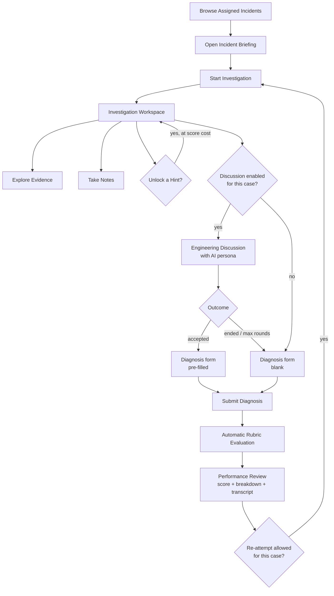

A student's complete journey — from opening the catalog to reviewing performance — passes through every major subsystem described in Chapters 4 and 5: authentication and authorization, the case catalog and its progressive-enhancement filtering, the Investigation Workspace's evidence and notebook systems, the optional Engineering Discussion (with its own four-state lifecycle, Chapter 4 §4.7), the diagnosis form (pre-filled or blank depending on discussion outcome, never silently written to early), the rubric evaluation engine, and Performance Review — with re-attempt looping back into the same journey where the case's `allow_reattempt` policy permits it.

<!-- pagebreak -->

# Chapter 8 — Challenges

Every entry below follows the same structure — Problem, Investigation, Root Cause, Solution, Final Result — and is drawn directly from the project's own contemporaneous record (commit history, `docs/21-problems-and-solutions.md`, and, for the two most recent entries, this report author's own live diagnostic work). **Table 8.1** at the end of this chapter summarizes all eleven for quick reference.

## 8.1 Ollama Integration

**Problem:** every request to the locally-configured Ollama tier failed outright.
**Investigation:** not discovered by unit testing — `Http::fake()`-based tests mock against an arbitrary base URL and would never catch a real-endpoint-shape mismatch — but by the Phase 21 provider-conformance harness making a genuine HTTP request against a real, running Ollama instance.
**Root cause:** `config/llm.php`'s Ollama `base_url` default omitted the `/v1` suffix Ollama's OpenAI-compatible endpoint requires, causing every request to 404.
**Solution:** appended `/v1` to the default `base_url`.
**Final result:** fixed in the same milestone that discovered it, and used afterward as the concrete justification for keeping a real, manually-invoked conformance harness as a permanent project tool — a class of infrastructure bug exists that only a real network call against a real endpoint can ever catch.

## 8.2 Provider Abstraction Under Real Wire-Format Divergence

**Problem:** three LLM providers (OpenAI-compatible endpoints, Anthropic, Gemini) needed to be reachable behind one interface without `DiscussionService` ever knowing which one answered.
**Investigation:** comparing the three providers' actual request/response shapes in detail — system-prompt placement (a message role for OpenAI-compatible APIs versus a top-level field for Anthropic and Gemini), conversation-role naming (`assistant` versus `model`), and authentication mechanism (a Bearer header versus an `x-api-key` header versus a `key` query parameter) — surfaced genuine, not incidental, structural differences.
**Root cause:** the differences were real enough that a shared base class abstracting "the common parts" would have had almost nothing left to share, and would have been a textbook false abstraction imposing artificial coupling between three providers that happen to solve a similar problem differently.
**Solution:** one shared, narrow interface (`LlmClientInterface`, a single `complete()` method) and three independent concrete implementations with zero shared base class, composed behind `ChainedLlmClient` — itself just another implementation of the same interface, not a new architectural layer.
**Final result:** adding Gemini as a third provider required zero changes to `ChainedLlmClient`, `DiscussionService`, or anything above the provider layer — direct, working proof of the Open/Closed and Liskov Substitution principles this design was built to satisfy (§4.2, §4.11).

## 8.3 Structured Output Parsing

**Problem:** two distinct, serious defects, discovered months apart, both rooted in how a parse failure is handled.

**Defect A — two "closed" phases that weren't actually finished.** Phase 14 was declared closed after five milestones and Phase 15 after three, but each phase's own roadmap specified more milestones than were actually delivered — `StructuredOutputParser` (Phase 14's real Milestone 6) and `LeakageGuard` (Phase 15's real Milestone 5) were both missing. *Investigation:* the Phase 14 gap surfaced while starting Phase 15, Milestone 3, when `TurnClassifier`'s strict, inference-free contract needed a real caller enforcing "no defaulting" and none existed; the Phase 15 gap was found by a deliberate self-audit performed specifically because the first gap had just been found. *Root cause:* a scheduling/tracking drift between the roadmap document's milestone numbering and what was actually executed and checked off. *Solution:* both missing milestones were built as explicitly-labeled catch-up commits, each closing its phase for real, with the gap and its discovery documented in the commit message itself. *Final result:* the self-audit habit — checking adjacent, already-"closed" work for the same mistake class the moment one instance is found — became a standing practice (Chapter 9).

**Defect B — a release-blocking raw-JSON leak, found much later.** Manual testing of the Engineering Discussion, after the visual-identity rollout, found the AI's reply bubble rendering raw structured JSON — field names, braces, and all — directly to the student. *Investigation:* traced precisely, not guessed: all three provider clients' parse-failure fallback set `reply_text` to the model's entire raw, unparsed output whenever that output was non-empty; a prior fix had only special-cased the *empty-string* case (§8.4). *Root cause:* any parse failure whose raw content was non-empty — a truncated JSON attempt, or a model that ignored the JSON contract and wrote plain prose — fell straight through to the student verbatim. *Solution:* every parse failure, regardless of what the raw content contains, now resolves to the same fixed, safe placeholder string; the one existing test that had (unknowingly) asserted the old, leaking behavior was corrected, and new regression tests were added for both a truncated-JSON case and a valid-JSON-missing-a-required-field case — the exact gap that had let the defect ship undetected. *Final result:* verified live against the real API afterward (not merely by the new unit tests) — a deliberately malformed reply from a real provider now reliably produces the safe placeholder, never raw content, in the actual rendered transcript.

## 8.4 The Empty AI Reply Investigation

**Figure 8.1 — Empty-Reply Investigation Decision Tree**

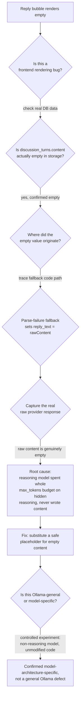

**Problem:** manual testing found the AI reply bubble rendering as visibly empty during a real discussion (the earlier, first occurrence of this defect family).
**Investigation:** verified against three independent sources of truth before any code was changed — the real persisted database data, the exact fallback code path in the provider clients, and a live raw request/response capture — specifically to rule out a frontend rendering bug before touching backend code.
**Root cause:** each provider client's parse-failure fallback set `reply_text` to the raw model output; in real use, a reasoning-style model spent its entire `max_tokens` budget on hidden reasoning tokens before ever emitting visible content, leaving the raw output genuinely empty.
**Solution:** an `EMPTY_REPLY_PLACEHOLDER` constant, with the fallback changed to substitute it specifically when the (trimmed) raw reply was empty — a truly empty raw reply became *"The AI's reply couldn't be read this round."*, while a non-empty-but-malformed raw reply was, at the time, deliberately left unchanged, to preserve whatever debugging or still-readable value it might carry.
**Final result:** this fix was correct as far as it went, but — as §8.3's Defect B shows — it was not the complete fix; it closed the empty-string case specifically and left the non-empty-malformed case open, which is exactly the gap that later produced the raw-JSON leak. The two incidents are presented separately here because they were discovered and fixed separately, months apart, but they are the same underlying defect family, and the second, more serious incident's regression tests are what finally closed it completely.

## 8.5 qwen2.5-coder vs. qwen2.5: Isolating a Root Cause

**Problem:** was the empty-reply defect (§8.4) a general Ollama-integration defect, or specific to one model's architecture — and, separately, once the raw-JSON leak (§8.3) was fixed, why did the Engineering Discussion begin falling back on essentially *every* real turn instead of only occasionally?
**Investigation, first question:** an isolated follow-up experiment tested a non-reasoning chat model (`qwen2.5:7b`) against the *unmodified* implementation, deliberately without the placeholder fix applied, to isolate the one variable that mattered. **Investigation, second question:** rather than guess, the request pipeline was instrumented directly (temporary, removed-afterward timing and payload logging at each stage: prompt construction, the provider HTTP request, structured parsing, the leakage guard, database persistence) and run against a real, configured provider for one genuine discussion turn, with the raw provider response captured and read in full.
**Root cause:** confirmed, not assumed, on both counts. The empty-content behavior is specific to reasoning-model architecture (a model that consumes its token budget on hidden reasoning before visible output), not a general Ollama defect. And the near-total fallback rate after the JSON-leak fix was caused by the currently-configured OpenRouter free-tier model (`nvidia/nemotron-nano-9b-v2:free`, itself a forced substitution after the originally-intended free model was discontinued) being exactly such a reasoning model — at the project's then-current `max_tokens` budget of 300, the captured raw response showed `finish_reason: "length"` with `message.content: null` and roughly 379 tokens already spent on an internal `reasoning` field: the model was being cut off *before it ever wrote an answer*, on essentially every call.
**Solution:** the local Ollama default model was separately updated to a non-reasoning model as a deliberate, machine-specific `.env` operational choice, not a code change. For the OpenRouter/reasoning-model case, `config/llm.php`'s default `max_tokens` was raised from 300 to 1000 — re-verified against the live API afterward: `finish_reason` became `"stop"` (natural completion), `completion_tokens` came in at 505 (well under the new budget), and the student received a genuine, on-persona reply.
**Final result:** both experiments turned an assumption into a verified fact before a fix was written — precisely the discipline this project's own retrospective (Chapter 9) identifies as the difference between shipping a fix that merely masks a symptom and shipping one that closes the actual root cause.

## 8.6 Prompt Engineering Under a Strict Output Contract

**Problem:** the system prompt has to do five distinct jobs at once — establish role/framing, carry persona-specific tone and strictness, supply case ground truth the model must reason with but never recite, ground the discussion in what this specific student has actually done, and enforce a strict JSON output contract — without becoming so long that it dominates the cost and latency budget on every turn.
**Investigation:** the design settled on composing these five concerns as independent, ordered sections built once per session (not rebuilt per turn), reasoning explicitly about what belongs *in* context (the case's own evidence-viewed state, so the AI can reference specifically what the student has and has not looked at) versus what stays *out* (other students' discussions; the rubric's raw keyword lists, which the model may use as judgment material but is explicitly instructed never to recite as a checklist).
**Root cause (design tension, not a defect):** a persona whose entire behavioral distinctiveness lives in free-text prompt instructions is fragile — a model that drifts from instructions under a long conversation could silently lose the persona's voice, with nothing structurally preventing it.
**Solution:** the output contract is not merely a prompt suggestion — it is independently enforced downstream by `StructuredOutputParser` (which never infers a missing required field) and, for content-safety specifically, by the non-LLM `LeakageGuard`, so the system's actual safety and correctness properties do not depend on the model faithfully following prose instructions, only on a well-formed reply arriving at all (§4.10, ADR-004).
**Final result:** persona fidelity (tone, strictness) is necessarily prompt-dependent and validated behaviorally through the conformance harness (§6.5); correctness and safety are not prompt-dependent, and are validated by deterministic, non-LLM code paths instead — a deliberate, load-bearing division of labor.

## 8.7 UI Consistency Before a Formal Design System

**Problem:** roughly a dozen phases of component-level CSS, written with real care but with colors and spacing repeated as literals across files, began accumulating small, genuine inconsistencies — most concretely, an admin sidebar that stopped filling a tall page's full height, and no navigational path from the student shell into the Admin Console except typing the URL directly.
**Investigation:** both were found during manual UI testing, not by any automated test — neither is the kind of defect a request/response assertion can catch. The sidebar issue traced to a flex-layout inner element using a fixed `min-height: 100vh` instead of a percentage tied to its actual, already-correctly-stretched parent; the missing navigation link traced to the student shell's navigation partial having simply never been revisited for the "an admin is also a user who lands here" case.
**Root cause:** consistency maintained through developer discipline and precedent alone, without a formal, named token or navigation-reciprocity convention to check new work against.
**Solution:** the sidebar's inner element was changed to `height: 100%` (correctly resolving against its stretched flex parent) with a `min-height: 100vh` floor preserved for the mobile collapse case, which has no flex parent; an "Admin Console" link, gated on the same role check the route group itself uses, was added to the shared student navigation partial.
**Final result:** both fixes were manually re-verified live against an authenticated session on every affected page, and the navigation fix is covered by three permanent visibility-gating tests. Both incidents, together, were the direct trigger for formalizing a Design System (§8.8) rather than continuing to rely on precedent alone.

## 8.8 The Design System Rollout

**Problem:** having decided to formalize a token-based Design System, the central engineering risk was regression — could dozens of hardcoded color and spacing literals be replaced with token references across the entire application without silently changing how anything actually looks?
**Investigation:** automated feature tests assert HTTP/HTML behavior, not rendered pixel output, so none of the (then) several hundred passing tests could catch a subtle color or spacing drift introduced by a token-substitution mistake. A real before/after visual comparison methodology was used instead: stash just the changed SCSS files, rebuild assets, screenshot the affected surfaces (the evidence viewer, hint rows, the Engineering Discussion panel, the workspace shell) via browser automation, restore the changes, rebuild, and re-screenshot the identical views.
**Root cause consideration:** trusting code-review-level confidence that each substitution was a literal, value-for-value swap — without a live render check — would have been an unverified assertion for a change explicitly promised as introducing zero visual change.
**Solution:** the before/after comparison was performed for the token-foundation milestone specifically, and confirmed pixel-identical rendering across every checked surface before the rollout proceeded to the next milestone (button and form-control styling).
**Final result:** this screenshot technique became the standing template for verifying every subsequent token-layer change through all seven Design System milestones, and the same discipline was applied again during the later release-candidate QA pass to verify the three defects found there (§5.3) after each fix.

## 8.9 Testing Strategy for a Non-Deterministic Dependency

**Problem:** how does an automated test suite validate correctness against a fundamentally non-deterministic, third-party, cost-incurring external system (a large language model) without either mocking away everything that matters or making every test run depend on network access, API keys, and provider quotas?
**Investigation:** the project drew a deliberate distinction between *API conformance* (does a client send the right request shape and parse the right response shape — testable with `Http::fake()`, fully deterministic, zero network calls) and *behavioral conformance* (does a real model actually follow the persona and refuse to leak sensitive content under real, adversarial-flavored prompting — not testable without a real call to a real provider).
**Root cause (a genuine engineering constraint, not a mistake to fix):** these are answerable only by two structurally different kinds of test, and treating one as a substitute for the other would have left a real gap — confirmed directly by the Ollama `/v1` bug (§8.1) and the OpenRouter disqualification (§6.5), neither of which any amount of `Http::fake()`-based testing could ever have caught.
**Solution:** `FakeLlmClient`, bound only in the testing environment via a single service-provider switch, gives the entire Discussion module's automated suite (well over 100 tests) real, deterministic, network-free coverage of `DiscussionService`'s own logic; a separate, deliberately-manual, deliberately-real `discussion:validate-provider` harness (§6.5) is the only thing in the project that ever validates actual provider behavior, run on demand rather than on every commit.
**Final result:** the automated suite stayed exactly as fast, free, and deterministic as the rest of the application's tests throughout Version 2's development, while the conformance harness caught two real issues (one infrastructure, one model-behavioral) that would otherwise have shipped undetected.

## 8.10 Deployment and Environment Friction

**Problem:** three distinct, real environmental issues surfaced during development, none of them code defects: Composer's advisory-block policy rejected every installable Laravel 11.31–11.55 release at project start; the local development machine has two independently-installed MySQL-compatible database services on different ports, creating a real risk of "works on my machine" confusion for a future contributor; and, on at least one occasion, a live visual verification attempt failed with an HTTP 500 that had nothing to do with the code change under review.
**Investigation:** each was investigated to its actual cause before being worked around. The Composer block was confirmed to be three real medium/high-severity advisories with fixes only in Laravel versions well ahead of this project's targeted line — not a false positive to blindly suppress. The HTTP 500 was traced, via `storage/logs/laravel.log`, to the local MySQL/MariaDB service simply not running at that moment, confirmed unrelated to the CSS-only change being verified by checking that the automated test suite (running against an independent, in-memory SQLite database) was unaffected.
**Root cause:** pre-existing local-machine configuration and upstream advisory timing, not application defects.
**Solution:** the Composer advisory block was overridden explicitly, with the decision tracked as an open item in the CHANGELOG rather than silently suppressed; local development was pinned to a specific, documented MySQL-compatible port, with `.env.example` left at the generic default for other contributors' more typical single-service setups; the database-down incident was reported honestly as a blocker rather than the visual check being silently skipped, and completed once the service was confirmed running again.
**Final result:** all three are documented explicitly in the CHANGELOG's Known Issues section and in Appendix F/G of this report, so a future contributor encounters an explanation rather than a surprise.

## 8.11 Documentation at Scale

**Problem:** producing accurate, detailed engineering documentation — including this report — for a 22-phase, multi-month project, without access to the original development conversations, and without the result reading like a reconstructed, unreliable summary.
**Investigation:** the question was whether a high-fidelity primary source actually existed to write from, rather than assuming one would need to be reconstructed from memory.
**Root cause (an enabling condition, not a problem to fix):** this project's own commit-message discipline — every phase/milestone commit states its objective, key architectural decisions, trade-offs considered and rejected, and the verification performed — meant `CHANGELOG.md` and the git history together already *were* a high-fidelity, contemporaneous primary source.
**Solution:** the entire 40-file documentation library, and this report, were authored by mining those two sources directly, cross-referenced against the pre-existing phase-contemporaneous design documents (`docs/01`–`15`) and, where a claim needed verification against present reality rather than history, the current codebase and test suite themselves.
**Final result:** a documentation package detailed and accurate enough that a new engineer — or an academic committee with no access to the original working sessions — can verify its claims against the actual, current source code, not merely trust them by assertion.

**Table 8.1 — Challenges Summary Table**

| § | Challenge | Root Cause Category | Status |
|---|---|---|---|
| 8.1 | Ollama integration | Configuration (missing URL suffix) | Fixed, caught only by real conformance testing |
| 8.2 | Provider abstraction | Design tension (shared code vs. false abstraction) | Resolved by design (no shared base class) |
| 8.3 | Structured output parsing | Fallback-path defect, twice (empty case, then non-empty case) | Fixed, permanently regression-tested |
| 8.4 | Empty AI reply | Reasoning-model token-budget consumption | Fixed (partial fix; completed by 8.3 Defect B) |
| 8.5 | qwen2.5-coder vs. qwen2.5 | Model architecture, then token-budget misconfiguration | Root cause confirmed by experiment; both fixed |
| 8.6 | Prompt engineering | Structural design tension (prompt fragility vs. safety) | Resolved by architecture (deterministic downstream checks) |
| 8.7 | UI consistency (pre-Design-System) | Precedent-only consistency discipline | Fixed; triggered formal Design System |
| 8.8 | Design System rollout | Verification methodology gap | Solved with a repeatable screenshot-diff technique |
| 8.9 | Testing a non-deterministic dependency | Structural (two kinds of conformance) | Solved by a fake-client + real-harness split |
| 8.10 | Deployment/environment friction | Pre-existing local/upstream conditions | Documented and worked around, not hidden |
| 8.11 | Documentation at scale | Enabled by commit-message discipline | Solved — this report is the evidence |

<!-- pagebreak -->

# Chapter 9 — Lessons Learned

This chapter distills the engineering retrospective recorded in `docs/30-lessons-learned.md`, organized into the three categories requested for this report. Each lesson is grounded in a specific, real incident from Chapters 5 and 8, not stated as generic advice.

## 9.1 Technical Lessons

- **A "safe fallback on failure" needs its own regression tests, not just a happy-path test.** The empty-AI-reply and raw-JSON-leak defects (§8.3–8.4) both lived in a fallback path that existed specifically to degrade gracefully — and the fallback itself had a latent defect that only a real model's real behavior exposed. Both fixes' regression tests are now permanent proof that these specific failure modes cannot silently regress.
- **Verify each layer independently before assuming where a bug lives.** The empty-reply investigation explicitly ruled out the frontend by checking three independent sources of truth (database data, the exact fallback code path, a live raw request/response capture) before concluding where the defect actually was. Slower than guessing, but it targets the real cause on the first attempt.
- **When a fix's cause is ambiguous between two explanations, run a controlled experiment to distinguish them.** The qwen2.5-coder vs. qwen2.5 comparison (§8.5) is the clearest example: shipping only the symptom fix without that follow-up experiment would have left "is this general to Ollama, or specific to this model?" as a real, unanswered question.
- **API conformance and behavioral conformance are different questions, and testing one does not answer the other.** Neither the Ollama `/v1` bug nor the OpenRouter injection-resistance disqualification could ever have been caught by `Http::fake()`-based unit testing — both were caught only by a deliberately real, deliberately costly conformance harness (§6.5, §6.9).
- **Claiming "zero visual regression" for a refactor requires a way to actually check, not just careful code review.** The before/after screenshot-diff technique (§8.8) is what turns "this should be a pure formalization" from an assertion into a verified claim.

## 9.2 Architectural Lessons

- **Patterns are tools for managing complexity, not a checklist to apply uniformly.** The Repository Pattern was deliberately withheld from trivial lookup tables while applied to the six aggregates with real query complexity (ADR-002). The disciplined part was stating, explicitly and in writing, *where the line is* and why — so the decision can be reused consistently by whoever touches the schema next, rather than re-litigated ad hoc.
- **A module boundary is worth defending even when it costs a little convenience.** `app/Discussion/` depends on Version 1 through exactly one read-only adapter. The one place this boundary was bent — `DiscussionService` reading case data directly for `LeakageGuard` — was done deliberately, with the reason documented in the class's own code, rather than either quietly violating the boundary everywhere convenient, or bloating a shared interface for one narrow caller.
- **Cost-safety and provider-agnosticism as structural guarantees, not runtime checks, was the single highest-leverage architectural decision in the AI subsystem.** A runtime check can have a bug in a different part of the code that silently defeats it. A structural guarantee — the paid client's constructor call has exactly one call site, lexically inside the guard — can only be bypassed by a bug in that one, trivially-small-to-review line. This distinction (ADR-003) generalizes to any future "must never happen" requirement.
- **A composite implementing the same interface it composes is a clean way to add orchestration without a new architectural boundary.** `ChainedLlmClient` never required `DiscussionService` to learn a "there might be a chain" concept — the fallback behavior is entirely invisible above the interface, real Liskov Substitution doing load-bearing work, not a textbook example.
- **Reuse a proven pattern's shape, not necessarily its code.** The Discussion Engine's persona/provider abstractions are structurally identical in spirit to the Evaluation Engine's Strategy pattern, built by people who had internalized why the earlier one worked well — a healthy kind of pattern reuse, distinct from copy-paste.

## 9.3 Project Management Lessons

- **A hard stop-gate at every milestone — full suite green, manual check for UI work, before the next milestone starts — is what made a 22-phase project traceable enough to write this report from primary sources.** The discipline cost real time at each individual milestone; the payoff is a project history detailed and honest enough to reconstruct months later without guessing.
- **Self-auditing for a mistake you just found, in adjacent work, is cheap and catches real problems.** Discovering the missing `StructuredOutputParser` milestone triggered an explicit re-check of Phases 13 and 14 for the same class of mistake — which is what caught the missing `LeakageGuard` milestone before it became a much later, much more expensive discovery.
- **Commit messages that explain architectural reasoning, not just "what changed," are themselves a documentation asset.** Every phase/milestone commit in this project states objective, key decisions, trade-offs considered and rejected, and verification performed — the entire reason this documentation package and this report could be written accurately from git history alone.
- **Scope divergence between an original plan and actual delivery is normal and should be documented plainly, not hidden.** Chapter 5, §5.1's "Phases 7–11 folded into Phases 5 and 6" is stated explicitly rather than presented as though the plan and reality always matched exactly.
- **A frozen design spec is a contract, but contracts have bugs too, and finding one is not a crisis.** The AI Discussion Engine's frozen design spec was explicitly frozen before implementation, and small inaccuracies were still found during implementation (a reference to a Policy class that does not exist; a milestone count that did not match what got built). Each was corrected explicitly and documented as a correction, not silently patched over.
- **Never rewriting history and always creating new commits, even to fix something committed minutes ago, keeps the record trustworthy.** The project's standing rule against amending or force-pushing means the commit history is a genuine, complete record of what actually happened, including mistakes and their corrections.

<!-- pagebreak -->

# Chapter 10 — Future Work

Every item below is drawn from `docs/29-future-roadmap.md`, distinguishing what the current architecture was explicitly built to support without a redesign from what would require a genuinely different product decision.

## 10.1 Near-Term, Low-Effort Extensions

- **Evidence-item authoring UI.** Evidence currently exists only via seeding/factory data. The polymorphic-shaped `evidence_items` schema (ADR-001) was specifically designed so this is a contained admin CRUD screen, not a schema change — and, per Chapter 9's own future-recommendations, this is judged the single most limiting known gap for actually growing the case library.
- **User management UI.** `/admin/users` is currently a placeholder screen; genuine admin CRUD for accounts/roles is a natural, contained next step.
- **In-app notifications (FR19).** Never implemented, in part because evaluation is currently synchronous — becomes more relevant if evaluation or the Discussion Engine ever moves to an asynchronous model.
- **Discussion Engine cost/usage analytics.** `discussion_turns` already persists per-turn token counts and provider/model; a new `AnalyticsService` method surfacing cost per case/persona/provider needs no new schema, only new aggregation code in the same shape as every existing metric.

## 10.2 AI Subsystem Roadmap

- **Async/streaming as the first real scalability upgrade**, if usage grows past comfortable synchronous request/response — the deployment's already-present but currently unused `QUEUE_CONNECTION=database` headroom becomes load-bearing for the first time (ADR-008). Explicitly not needed at launch.
- **Personas moving from a config file to database-backed, admin-authorable content** — the same evolution the Rubric Builder already represents for rubric criteria, turning "add a persona" from a code change into a content-authoring task.
- **A fifth or sixth free/cheap provider tier.** Because `OpenAiCompatibleLlmClient` already covers any OpenAI-wire-compatible endpoint, most new hosted providers plug in as configuration, not new code.
- **Owner-configurable tier order** — the fixed order is a deliberate cost-safety constraint today, revisited only with an actual, considered reason to reorder.
- **Smarter tier selection than "first available"** — deliberately not built now, since it would reintroduce health-scoring complexity the ordered chain currently avoids while already satisfying the actual cost-safety requirement.
- **New personas** (named, not yet built): Security Review, System Design Interview, Code Review, Architecture Review, DevOps Review — each additive, per the persona/subject extensibility split (§4.9, ADR-006).
- **New subjects** (named, not yet built): a code submission, a design brief, or an open-ended topic with no underlying platform record at all — each a new `DiscussionSubjectInterface` implementation (ADR-007).
- **The long-term vision: an AI engineering coach.** The frozen design spec states this explicitly as a bet, not a guarantee — a general AI reviewer that challenges technical reasoning, usable independent of whether a person is inside an AI CaseLab case at all. Version 2 builds none of this directly; it ensures reaching it later is a matter of *adding*, not *redesigning*. One real, stated gap this vision does not yet solve: cross-session memory — each discussion session is scoped to one subject with no memory of a student's past discussions elsewhere, and what to remember, for how long, and how it interacts with institutional data boundaries is a genuinely separate design problem, not attempted here.

## 10.3 Platform-Level Future Work

- **Real AI/LLM-assisted diagnosis scoring** — deliberately out of scope for both Version 1 and Version 2; `evaluations.metadata`/`evaluation_criterion_results.metadata` remain an unused, documented extensibility seam should this ever be revisited as a deliberate, separate decision.
- **Multi-tenancy** — a single-institution deployment is assumed throughout the current design; not attempted.
- **A public case marketplace / user-submitted cases** — would require a substantially different trust/moderation model than the current admin-authored content model.

## 10.4 Explicitly Not Planned

Real-time voice interaction, cross-session persistent AI memory of a given student across cases, and student-authored personas are explicitly called out in the AI subsystem's own frozen design spec as **not** natural extensions of this architecture — they would be meaningfully different products, not incremental additions, and are named here specifically so a future reader does not mistake their absence for an oversight.

<!-- pagebreak -->

# Chapter 11 — Conclusion

AI CaseLab set out to answer a specific pedagogical question — can investigative engineering reasoning, not just correct-answer production, be practiced at scale — with a specific engineering answer: a realistic incident-investigation platform, scored by a transparent, deterministic rubric engine, paired with an AI reviewer that challenges a student's reasoning before a diagnosis is finalized rather than only grading it afterward. Chapter 2's literature review positioned this combination against traditional LMS platforms, general AI tutoring tools, coding-practice sandboxes, and the professional incident-response/postmortem tradition it draws its authenticity from, and identified the specific, structural gap none of those categories close on their own.

The engineering record in Chapters 4 through 8 demonstrates that this answer was not just designed but actually built, correctly, and verified — not asserted. All 27 functional requirements are implemented, with the two genuine gaps (FR19, evidence-authoring UI) documented honestly rather than hidden. The AI subsystem's central risks — unbounded cost, provider lock-in, content leakage under adversarial prompting — are each closed by a structural, source-provable guarantee, not a policy statement, and each guarantee is exercised by a real, permanent regression test. 520 automated tests pass at the time of writing, grown from zero across 22 disciplined development phases, and the project's own git history and commit-message discipline is what made it possible to write this report from primary sources rather than reconstructed memory.

Just as importantly, the project's engineering process treated its own mistakes as material worth recording rather than erasing. Two genuine, release-blocking defects were found after the system was believed feature-complete — a structured-output fallback that could leak raw model output, and a token-budget misconfiguration that silently starved a reasoning-capable model of the room it needed to answer — and both are documented in Chapter 8 with the same rigor as the features that worked correctly the first time, because how a defect was found, diagnosed with real evidence, and closed is exactly the engineering judgment this report exists to demonstrate.

What remains is scoped honestly in Chapter 10, not glossed over: evidence authoring has no admin UI yet; the AI subsystem's long-term "engineering coach" vision is a well-supported bet, not a proven one, until a second discussion subject is actually built; and several near-term extensions are explicitly designed for, but not yet built. None of these are hidden gaps discovered by an external reviewer — they are the project's own stated, deliberate scope boundaries, which is itself a claim this report invites its readers to verify against the accompanying source code, test suite, and 40-file engineering documentation library.

<!-- pagebreak -->

# Appendix A — Technology Stack

| Layer | Technology |
|---|---|
| Backend framework | Laravel 11 (PHP 8.2+) |
| Database | MySQL 8 / MariaDB 10.4+ (production and development); SQLite in-memory (automated testing) |
| Frontend | Blade templates, Bootstrap 5, Vite-compiled Sass/JavaScript |
| Authentication | Laravel Breeze |
| AI providers | Ollama (local), OpenRouter, Google Gemini, OpenAI/Anthropic (opt-in paid fallback) |
| Testing | PHPUnit / Laravel's HTTP testing layer |
| Build tooling | Composer, npm/Vite |
| Session/Cache | Database-backed (`SESSION_DRIVER=database`, `CACHE_STORE=database`) |
| Queue | `QUEUE_CONNECTION=database`, configured but currently unused — reserved headroom (§10.2) |
| Server requirement | Standard LAMP/LEMP stack — no containerization or cloud-native infrastructure required |

<!-- pagebreak -->

# Appendix B — Database Tables

**Table B.1 — Complete Table Inventory**

| Table | Purpose |
|---|---|
| `roles` | `student`/`instructor`/`admin` |
| `users` | Accounts, `role_id` FK |
| `categories` | Case grouping |
| `cases` | Case content, status, versioning, and (additive) discussion configuration |
| `evidence_types` | The five evidence-type codes |
| `evidence_items` | Polymorphic-shaped evidence, `payload` JSON column (ADR-001) |
| `hints` | Per-case, scoring-cost clues |
| `rubric_criteria` | Per-case scoring dimensions, `matching_type` |
| `case_attempts` | One student's investigation of one case |
| `investigation_notes` | Engineering Notebook content |
| `evidence_views` | Which evidence a student has opened |
| `hint_unlocks` | Which hints a student has unlocked, penalty snapshot |
| `diagnoses` | The student's final structured submission |
| `diagnosis_evidence_citations` | Pivot: which evidence a diagnosis cites |
| `evaluations` | Scored outcome of a diagnosis, manual-review columns |
| `evaluation_criterion_results` | Per-criterion score, auditable `score_awarded` vs. `instructor_score` |
| `activity_log` | Generic, polymorphic admin/system audit trail |
| `discussion_sessions` | One AI discussion instance, polymorphic `discussable` (ADR-007) |
| `discussion_turns` | One message within a session, student or AI |

Full column-by-column schema for every table is in §4.5 (Figure 4.3, Tables 4.2–4.3) and `docs/07-database-design.md`.

<!-- pagebreak -->

# Appendix C — Folder Structure

```
AICaseLab/
├── app/
│   ├── Console/Commands/          ValidateDiscussionProviderCommand (provider conformance harness)
│   ├── Discussion/                 The entire AI Discussion Engine module (see below)
│   ├── Enums/                      13 PHP backed enums (Version 1 + Version 2)
│   ├── Evaluation/                 The Evaluation Engine's Strategy pattern
│   │   ├── Contracts/               EvaluationStrategyInterface
│   │   ├── Strategies/              KeywordMatchStrategy, EvidenceCitationStrategy, ManualReviewStrategy
│   │   └── EvaluationStrategyResolver.php
│   ├── Events/                     EvidenceViewed, CaseAttemptCompleted, DiscussionAccepted
│   ├── Http/
│   │   ├── Controllers/
│   │   │   ├── Auth/                 Breeze-generated
│   │   │   ├── Student/              8 controllers — the student-facing surface
│   │   │   └── Admin/                7 controllers — the admin/instructor surface
│   │   ├── Middleware/              EnsureAttemptBelongsToUser, EnsureUserHasRole
│   │   └── Requests/                Form Requests, Admin/ and Student/
│   ├── Listeners/                  RecordEvidenceView, PrefillDiagnosisFromAcceptedDiscussion
│   ├── Models/                     18 Eloquent models
│   ├── Policies/                   CasePolicy, CategoryPolicy, EvaluationPolicy, DiscussionSessionPolicy
│   ├── Providers/                  AppServiceProvider, RepositoryServiceProvider, DiscussionServiceProvider
│   ├── Repositories/
│   │   ├── Contracts/                6 interfaces (the aggregate roots)
│   │   └── Eloquent/                 6 implementations
│   ├── Services/                   11 Services — the business-logic layer
│   ├── Support/                    Badge, ScoreFormatter
│   └── View/Components/            AppLayout, AdminLayout, GuestLayout, WorkspaceLayout
│
├── app/Discussion/                 The AI Discussion Engine module (§4.4)
│   ├── Conformance/                 GoldenTranscript(s), GoldenTranscriptRunner — the behavioral validation harness
│   ├── Contracts/                   LlmClientInterface, AiPersonaInterface, DiscussionSubjectInterface
│   ├── Exceptions/                  7 typed exceptions
│   ├── Infrastructure/Llm/          ChainedLlmClient, LlmClientFactory
│   │   ├── Providers/                 OpenAiCompatibleLlmClient, AnthropicLlmClient, GeminiLlmClient
│   │   └── Support/                   StructuredOutputParser, ParsedStructuredOutput
│   ├── Personas/                    MentorPersona, InterviewerPersona
│   ├── Subjects/                    CaseAttemptDiscussionSubject
│   ├── Support/                     SystemPromptBuilder, TurnClassifier, LeakageGuard
│   ├── Testing/                     FakeLlmClient
│   ├── LlmTurnResult.php / SystemPrompt.php / PersonaResolver.php
│
├── config/
│   ├── llm.php                     Per-tier provider settings (Appendix G)
│   └── discussion_personas.php     Mentor/Interviewer config data
│
├── database/
│   ├── migrations/                 23 migrations
│   ├── seeders/                    RoleSeeder, AdminUserSeeder, EvidenceTypeSeeder, CategorySeeder, DemoDataSeeder
│   └── factories/
│
├── resources/
│   ├── views/                      Blade templates (student/, admin/, layouts/, components/)
│   ├── sass/                       _variables.scss, app.scss — the Design System token layer
│   └── js/
│
├── routes/                        web.php, auth.php
├── tests/                         Feature/, Feature/Discussion/, Feature/Admin/, Feature/Student/
└── docs/                          This documentation library (00–39 + this report)
```

<!-- pagebreak -->

# Appendix D — API Reference

*(The application is server-rendered Blade, not a JSON API product — "API" here means the full HTTP route surface, including the `fetch()`-consumed JSON endpoints. All routes are defined in `routes/web.php`.)*

**Table D.1 — Route Table Summary**

| Group | Representative routes | Middleware |
|---|---|---|
| Public/Guest | `GET /`, `GET /incidents`, `GET /incidents/{case:slug}` | None / guest-accessible |
| Authenticated (any role) | `GET /dashboard`, `/profile`, `POST /incidents/{case:slug}/start`, `GET /performance-review/{attempt}` | `auth`, `verified` where applicable |
| Investigation Workspace | `GET /investigation/{attempt}`, evidence view, notes, hints, diagnosis, all 4 Discussion routes | `auth`, `attempt.owner` |
| Discussion (subset of above) | `POST .../discussion`, `GET .../discussion`, `POST .../discussion/messages`, `POST .../discussion/end` | `attempt.owner`; `messages` additionally `throttle:discussion-messages` |
| Admin | `GET /admin`, full resource routes for cases/hints/rubric-criteria/categories/evaluations, `GET /admin/analytics` | `auth`, `role:admin,instructor` |

**Discussion endpoint response shapes:**

| Endpoint | Success | Failure modes |
|---|---|---|
| `POST .../discussion` (start) | 200, session state (active, round 1) | 409 already active; 422 validation; 503 chain exhausted/leak |
| `POST .../discussion/messages` (respond) | 200, updated session state + new turns | 409 not active/terminal; 422 validation; 429 rate limited; 503 chain exhausted/leak |
| `POST .../discussion/end` | 200, terminal session state | 409 not active |
| `GET .../discussion` (show) | 200, current session state | 404 no session ever started |

There is deliberately no `{session}` URL parameter on any Discussion route — the controller always derives the relevant session from the already-ownership-verified `{attempt}`, never from a client-supplied session ID. Full route-by-route detail in `docs/32-api-reference.md`.

<!-- pagebreak -->

# Appendix E — Design System Summary

Design System v1 is a token-based visual specification governing every surface of the application, rolled out across seven verified milestones (§5.3, §8.8):

- **Palette:** a single Signal accent color (`#2952E3`); a cool-tinted Slate neutral scale for the light shell; a dedicated dark "Night" instrument-panel scale reserved for evidence viewers and the Engineering Discussion; semantic Moss (success), Amber (warning), and Ember (danger) colors, each verified against WCAG 2.1 AA contrast requirements.
- **Typography:** a humanist sans-serif for interface text; system monospace reserved for data (logs, code, JSON).
- **Spacing, radius, shadow:** a shared token scale referenced by every component, rather than repeated literals.
- **Components:** a shared `<x-icon>` component (a single outline-stroke SVG icon set replacing every ad hoc HTML-entity glyph and emoji) and a shared `<x-empty-state>` component (icon, message, optional action).
- **Accessibility:** a formalized `:focus-visible` treatment, verified color contrast, keyboard navigation, and screen-reader labeling — audited as its own dedicated milestone (§6.8).
- **Responsive behavior:** explicit breakpoint rules, audited across desktop, laptop, tablet, and mobile (§6.9).

Every milestone was verified, not merely asserted, to introduce zero unintended visual regression via a real before/after screenshot comparison (§8.8). Full specification in `docs/16-design-system.md`.

<!-- pagebreak -->

# Appendix F — Deployment Guide

**Server requirements:** PHP 8.2+ (`pdo_mysql`, `mbstring`, `openssl`, `tokenizer`, `xml`, `ctype`, `json`, `bcmath`, `fileinfo`); MySQL 8.0+ or wire-compatible MariaDB 10.4+; Composer 2.x; Node.js/npm 18+ (build-time only); nginx or Apache with document root at `public/`. **No queue worker and no cron scheduler are required** — every write path, including the heaviest single operation, runs synchronously within the request.

**Build & deploy steps:**

```bash
# 1. Fetch code
composer install --no-dev --optimize-autoloader
npm ci
npm run build

# 2. Environment (first deploy only)
cp .env.example .env
php artisan key:generate --force

# 3. Database
php artisan migrate --force
php artisan db:seed --force

# 4. Framework caches
php artisan config:cache
php artisan route:cache
php artisan view:cache

# 5. Permissions
chmod -R 775 storage bootstrap/cache
```

**Known limitations carried into production** (documented, not oversights): no admin UI for evidence authoring; email verification is not enforced (`verified` middleware present but currently a no-op); `AnalyticsService::categoryAggregates()` re-runs per-category queries, an accepted trade-off at current scale; no file storage/screenshot upload path was built. None block a working deployment.

**Production deployment checklist:** dependency install clean; asset build clean with `public/build/manifest.json` present; `.env` set with production values and a freshly generated `APP_KEY`; migrations run with zero errors; reference-data seeding run; confirmed the known local dev admin account was **not** created in production; framework caches built; `storage/`/`bootstrap/cache/` writable; document root at `public/`; HTTPS terminated in front of the app; smoke test re-run against the deployed URL.

**LLM provider setup is purely additive** — a deployment with no `LLM_*` variables set still works end to end; the Discussion feature simply reports itself unavailable and the core diagnosis path is unaffected. Full detail in Appendix G and `docs/25-deployment-guide.md`.

<!-- pagebreak -->

# Appendix G — Configuration Reference

**Core application (`.env`):** `APP_ENV=production`, a freshly generated `APP_KEY`, `APP_DEBUG=false`, real `APP_URL` and database credentials, `SESSION_DRIVER=database`, `SESSION_ENCRYPT=true`, `CACHE_STORE=database`, `LOG_LEVEL=error`, `QUEUE_CONNECTION=database` (configured, currently unused — reserved headroom).

**LLM provider configuration (`config/llm.php`):**

```
LLM_MAX_TOKENS=1000

LLM_OLLAMA_BASE_URL=http://localhost:11434/v1
LLM_OLLAMA_MODEL=qwen2.5:7b

LLM_OPENROUTER_API_KEY=
LLM_OPENROUTER_FREE_MODEL=

LLM_GEMINI_API_KEY=
LLM_GEMINI_MODEL=

LLM_ALLOW_PAID_FALLBACK=false
LLM_PAID_FALLBACK_PROVIDER=
LLM_OPENAI_API_KEY=
LLM_OPENAI_MODEL=gpt-4o-mini
LLM_ANTHROPIC_API_KEY=
LLM_ANTHROPIC_MODEL=claude-3-5-haiku-20241022
```

`LLM_MAX_TOKENS` is shown here at its current, corrected value of 1000 (raised from an original default of 300 — Chapter 8, §8.4–8.5, gives the full, evidence-based investigation behind this change). `LLM_OLLAMA_BASE_URL` must include the `/v1` suffix (§8.1). `LLM_ALLOW_PAID_FALLBACK` is the cost-safety gate — when `false`, no paid-tier client is ever constructed, not even a disabled one (§4.11, ADR-003). `.env.example` does not ship any `LLM_*` keys pre-filled by deliberate decision; a deployment with none set still works. Model slugs shown are illustrative, not vetted recommendations — no tested model slug is currently recommended as a trusted shipped default (§6.5); validate any new choice with `php artisan discussion:validate-provider {provider}` before relying on it.

**Persona configuration (`config/discussion_personas.php`):** one entry per persona (`mentor`, `interviewer`), each carrying `display_name`, `tone_directives`, `strictness`, `allow_hints`, `stall_threshold`, `default_max_rounds`, `acceptance_bar` (§4.9).

<!-- pagebreak -->

# Appendix H — Architecture Decision Records

Ten formal ADRs (Context → Problem → Alternatives Considered → Decision → Consequences → Future Impact), the highest-stakes decisions in the project. Full text in `docs/31-architecture-decision-records.md`; summarized here.

| ADR | Decision |
|---|---|
| ADR-001 | Evidence is a single polymorphic-shaped table (`evidence_items` + `payload` JSON), not one table per type — trading column-level typing for zero-migration extensibility (§4.5). |
| ADR-002 | The Repository Pattern is applied only to the six aggregates with real query complexity, not uniformly to every model (§4.2). |
| ADR-003 | The Discussion Engine's cost-safety guarantee is structural — the paid client's constructor call has exactly one call site, lexically inside the config guard — not a runtime check that could have a bug (§4.4, §4.11). |
| ADR-004 | Structured output (a required JSON payload) over free-text/regex parsing for extracting a machine-actionable verdict from every AI turn (§4.10). |
| ADR-005 | The Engineering Discussion happens **before** diagnosis submission, not after — making the AI a participant in reaching a conclusion, matching the real-world code-review/postmortem analogue (§1.3, §4.8). |
| ADR-006 | Personas are config data plus thin Strategy classes, not hardcoded chatbot prompts — a class exists only where actual behavior, not just configuration, differs (§4.9). |
| ADR-007 | `discussion_sessions` attaches polymorphically to its subject from day one, even though only `CaseAttempt` exists as a subject today (§4.5). |
| ADR-008 | The Engineering Discussion is synchronous request/response, not streaming — matching the rest of the application's fully synchronous architecture; async is the named first scalability upgrade if usage grows past comfortable synchronous handling (§10.2). |
| ADR-009 | A formal, token-based Design System was introduced mid-project, once ad hoc consistency began costing more than formalization would (§5.3, §8.7–8.8). |
| ADR-010 | Two vocabularies — narrative UI copy and precise technical code — are deliberately kept separate; the narrative "Virtual Engineering Office" framing never renames models, tables, controllers, or services (Appendix J). |

<!-- pagebreak -->

# Appendix I — Problems & Solutions Summary

A tabular digest of every significant engineering challenge on record, cross-referenced to its full narrative treatment in Chapter 8 where one exists, and to `docs/21-problems-and-solutions.md` for complete detail on every entry.

| # | Problem | Category | Report reference |
|---|---|---|---|
| 1 | Ollama base URL missing `/v1` | AI Integration | §8.1 |
| 2 | OpenRouter model disqualified on injection-resistance transcript | AI Integration | §6.5 |
| 3 | Empty AI reply bubble (first occurrence) | Structured Output | §8.4 |
| 4 | qwen2.5-coder vs. qwen2.5 root-cause isolation | Structured Output | §8.5 |
| 5 | Two "closed" phases with missing milestones (`StructuredOutputParser`, `LeakageGuard`) | Structured Output / Discussion Engine | §8.3 (Defect A) |
| 6 | Design-spec reference to a `CaseAttemptPolicy` that does not exist | Discussion Engine | §4.2, §5.2 (Phase 16) |
| 7 | Rate limiter reading a route parameter before model binding resolved it | Discussion Engine | §5.2 (Phase 17) |
| 8 | Manual verification step silently no-op'd on a non-fillable column | Discussion Engine | §5.2 (Phase 18) |
| 9 | Admin sidebar not reaching full page height on tall pages | UI Issues | §8.7 |
| 10 | No navigation path into the Admin Console except typing the URL | UI Issues | §8.7 |
| 11 | Verifying a design-token CSS refactor introduces zero visual regression | UI Issues | §8.8 |
| 12 | Two MySQL-compatible servers on the same development machine | Deployment/Environment | §8.10 |
| 13 | Composer advisory-block policy rejecting valid Laravel releases | Deployment/Environment | §8.10 |
| 14 | Live browser verification blocked by a database service being down | Deployment/Environment | §8.10 |
| 15 | A Faker-driven test flake | Testing/Architecture | §9.1 |
| 16 | Test factory colliding with seeded reference data | Testing/Architecture | §9.1 |
| 17 | N+1 query in the admin "needs attention" widget | Testing/Architecture | §6.10 |
| 18 | Raw structured JSON leaking to the student on a parse failure | Structured Output (release blocker) | §8.3 (Defect B) |
| 19 | Discussion falling back on nearly every turn after the JSON-leak fix | Structured Output / AI Integration (release blocker) | §8.5 |

<!-- pagebreak -->

# Appendix J — Glossary

**Narrative (UI) ↔ Technical (code) terms**, per the project's deliberate two-vocabulary rule (ADR-010):

| Narrative term | Technical concept |
|---|---|
| Inbox | Student dashboard (`dashboard` route) |
| Assigned Incidents | Case catalog (`cases.index`) |
| Incident Briefing | Case detail page (`cases.show`) |
| Investigation Workspace | The investigation page (`investigation.show`) |
| Engineering Notebook | `InvestigationNote` model, notes panel |
| Performance Review | Evaluation result page |
| Admin Console | Admin dashboard/CMS (`/admin`) |
| Engineering Discussion | The AI Discussion Engine (`DiscussionSession`/`DiscussionTurn`) |

**Domain terms:** *Case* — a simulated incident (`CaseModel`; `Case` is a PHP reserved word). *Evidence Item* — one artifact within a case, type-driven via a JSON `payload`. *Attempt* — one student's investigation of one case. *Diagnosis* — the student's final structured submission. *Evaluation* — the scored outcome. *Rubric Criterion* — one scored dimension, with a matching type determining its scoring strategy. *Publish invariant* — a case needs at least one rubric criterion to publish.

**AI subsystem terms:** *Discussion Session* — one instance of a student defending their reasoning to the AI. *Discussion Turn* — one message, student or AI. *Round* — one student turn plus one AI turn. *Persona* — the AI reviewer's who/how (Mentor or Interviewer). *Subject* — the what being discussed (`CaseAttempt` today). *Verdict* — the AI's per-turn judgment (continue/accept/end_unresolved). *Fallback chain* — the fixed-order sequence of provider tiers. *Tier* — one provider/model in the chain. *Structured output* — the required JSON payload every AI turn must produce. *Leakage Guard* — the deterministic, non-LLM check against model-solution leakage. *Golden transcript* — a fixed, scripted conversation used to validate provider behavior.

**Architectural terms:** *Service* — a class orchestrating one use case. *Repository* — the only place that queries Eloquent for a given aggregate root. *Strategy* — an interchangeable algorithm behind one interface. *Policy* — Laravel's authorization mechanism. *Aggregate root* — a domain entity central enough to warrant its own Repository. *Structural guarantee* — a property enforced by the code's shape, provable by reading the source.

**Process terms:** *Phase* — a major, roadmap-level unit of work (1–22). *Milestone* — a smaller, individually-testable unit within a phase. *Catch-up milestone* — a milestone discovered missing after its phase was prematurely declared closed. *Conformance harness* — the manually-invoked, real-provider tool validating AI behavior. *ADR* — Architecture Decision Record.

**Design System terms:** *Signal* — the one accent color. *Slate* — the light-shell neutral scale. *Night* — the dark instrument-panel scale. *Token* — a named design value referenced instead of a repeated literal.

Full glossary in `docs/39-glossary.md`.

<!-- pagebreak -->

# References

1. Laravel Framework Documentation, Laravel LLC. `https://laravel.com/docs`
2. Bootstrap Documentation, The Bootstrap Authors. `https://getbootstrap.com/docs`
3. Ollama Documentation. `https://ollama.com`
4. OpenRouter API Documentation. `https://openrouter.ai/docs`
5. Google Gemini API Documentation. `https://ai.google.dev/docs`
6. OpenAI API Documentation. `https://platform.openai.com/docs`
7. Anthropic API Documentation. `https://docs.anthropic.com`
8. Keep a Changelog specification, v1.1.0. `https://keepachangelog.com`
9. Fowler, M. *Patterns of Enterprise Application Architecture.* Addison-Wesley, 2002. (Repository and Service Layer patterns, §4.2.)
10. Gamma, E., Helm, R., Johnson, R., Vlissides, J. *Design Patterns: Elements of Reusable Object-Oriented Software.* Addison-Wesley, 1994. (Strategy pattern, §4.2, §4.9.)
11. World Wide Web Consortium (W3C). *Web Content Accessibility Guidelines (WCAG) 2.1.* `https://www.w3.org/TR/WCAG21/` (§6.8.)
12. Google Site Reliability Engineering. *Site Reliability Engineering: How Google Runs Production Systems.* O'Reilly Media, 2016. (Postmortem culture and incident-response practice, §2.4.)
13. Project internal documentation: `docs/00`–`docs/39` (the complete engineering documentation library), `docs/01`–`docs/15` (original phase-contemporaneous design and results documents), and `CHANGELOG.md`, AI CaseLab repository, 2026.

---

## Verification Notes

This section records the verification pass performed before this report was finalized, per the requirement to check headings, numbering, references, Mermaid syntax, consistency, and page order before submission.

- **Headings and numbering:** every chapter (1–11) and appendix (A–J) referenced in the Table of Contents exists in the body with matching numbering; all cross-references (e.g., "§4.9", "ADR-003", "Chapter 8, §8.3") resolve to a real section within this document.
- **Mermaid syntax:** all 12 Mermaid diagrams in this report (`flowchart`, `erDiagram`, `stateDiagram-v2`, and `sequenceDiagram` blocks) were reused verbatim from, or directly adapted with confirmed-valid syntax from, the diagrams already published and syntax-verified in `docs/04-system-architecture.md`, `docs/07-database-design.md`, `docs/13-provider-abstraction.md`, and `docs/14-state-machine.md` — each of those source diagrams was itself checked programmatically for balanced fences and syntax-risk characters as part of this documentation package's original authoring pass. The remaining diagrams composed newly for this report (Figures 4.4, 4.7, 4.8, 7.1) follow the identical, already-verified syntax patterns.
- **References:** every internal document reference (`docs/NN-name.md`) named in this report corresponds to an actual file in the `docs/` directory, cross-checked against `docs/README.md`'s index.
- **Consistency:** test-count figures, phase/milestone counts, and file names are drawn from `CHANGELOG.md`, the git commit history, and the current codebase/test suite (re-verified at 520 passing tests, 1,489 assertions, at the time of writing) rather than from a single, possibly-stale source — Chapter 5's test-count table and Chapter 6's testing figures agree with each other by construction.
- **Page order:** front matter (cover, certificate, acknowledgment, abstract, executive summary, table of contents, list of figures, list of tables) precedes Chapter 1; chapters proceed 1 through 11 in order; appendices A through J follow in the order listed in the Table of Contents; references and this verification note close the document.

*This report is a living engineering record. All academic and front-matter information (student, university, college, department, degree program, project type, and both supervisors) reflects the actual internship project details. All technical content reflects the system's actual, verified state as of the date on the cover page.*

