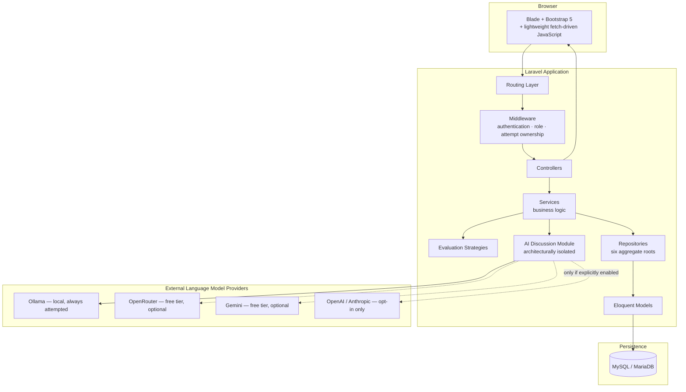
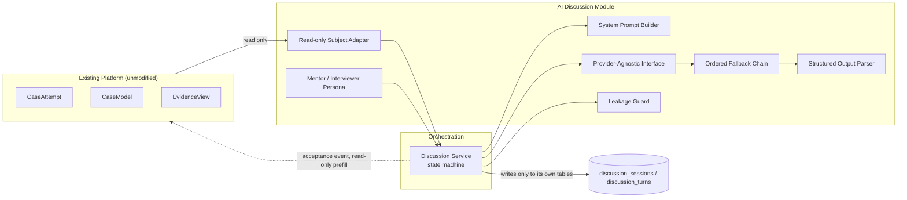

# Cover Page

**Project Title:** AI CaseLab — A Simulation-Based Platform for Teaching Software Engineering Incident Diagnosis, Augmented by an AI-Assisted Engineering Discussion Module

**Student:** [Student Name]

**Institution / Programme:** [Institution Name / Degree Programme]

**Supervisor:** [Supervisor Name]

**Project:** AI CaseLab

**Version:** 2.0 (Version 1 — Core Platform, Phases 1–12; Version 2 — AI Discussion Engine, Phases 13–22)

**Date:** August 3, 2026

---

# Executive Summary

AI CaseLab is a web-based training platform that teaches software engineering incident diagnosis through simulated, realistic workplace scenarios. Rather than testing whether a student can write correct code from a specification — the model nearly every existing programming-education tool follows — AI CaseLab tests whether a student can *investigate* a system they did not write, under incomplete information, the way a junior engineer does during their first on-call rotation. A student opens a simulated incident (a "Case"), reads a support ticket, examines evidence (logs, database snapshots, API responses, code, screenshots), forms a hypothesis, and submits a structured diagnosis that is scored against a rubric.

The project was delivered in two major versions. Version 1 (Phases 1–12) built the complete platform: authentication and role-based access, a case-authoring content-management system for instructors, the Investigation Workspace, an automated rubric-based Evaluation Engine, and an analytics dashboard. Version 2 (Phases 13–21, with Phase 22 covering documentation and release) added the **Engineering Discussion** — a Socratic AI reviewer that challenges a student's stated diagnosis before it is formally submitted, built on a provider-agnostic, cost-safe language-model integration layer that defaults to free and local inference and never silently incurs a financial cost.

Across both versions, the project was delivered through 22 formally tracked phases and more than 60 individually reviewed milestones, producing a final automated test suite of 498 passing tests, a fully documented database schema, and a validated AI safety architecture. This report documents the project's background, requirements, architecture, engineering decisions, chronological development, the real challenges encountered and how they were resolved, the testing and validation methodology applied, the results achieved, and the lessons this project produced — both technical and process-level — for future development.

---

# Abstract

Software engineering curricula reliably teach students to construct programs from specifications but rarely teach the complementary, and arguably more common, professional skill of diagnosing defects in systems they did not build, under ambiguity and incomplete information. This report presents AI CaseLab, a web application that addresses this gap by simulating realistic production incidents as self-contained, evidence-bearing "Cases" that students investigate and diagnose, with automated, rubric-based, and criterion-transparent evaluation of the investigation itself rather than only the final answer. The platform is implemented as a Laravel 11 monolithic web application with a layered Service/Repository architecture, a fifteen-table relational schema supporting polymorphic evidence typing for schema-stable extensibility, and a pluggable Strategy-pattern evaluation engine. Building on this foundation, the project extends the platform with an AI-assisted "Engineering Discussion" feature: a turn-based Socratic dialogue in which a large-language-model-driven reviewer, configured with one of two personas, probes a student's stated reasoning before it is submitted for formal grading. This subsystem is architected around a provider-agnostic abstraction and an ordered, cost-safe fallback chain across local and free-tier hosted language-model providers, with a structural — not merely procedural — guarantee that no paid provider is ever reached without explicit operator configuration, and a deterministic, non-language-model safety layer that prevents the disclosure of the case's model solution regardless of prompt-level instructions or attempted prompt injection. The system was validated through 498 automated tests, a dedicated performance and security audit, and a real behavioral-conformance validation exercise against three independent language-model providers. This report documents the system's requirements, architecture, the reasoning behind its major engineering decisions, its full chronological development history across 22 phases, the substantive technical challenges encountered during implementation and their resolutions, the testing methodology applied, the resulting capabilities of the delivered system, and the lessons this project generated for future software-engineering education tooling.

---

# Project Background

Computer science education has historically organized its practical component around the construction of programs: given a specification, produce working code that satisfies it. This model is well served by decades of tooling — automated judges, unit-testing frameworks, and algorithmic-correctness platforms — and it teaches genuinely important skills. It does not, however, teach a skill that occupies a substantial fraction of practicing software engineers' actual working time: reading and reasoning about a system someone else wrote, under time pressure, with incomplete information, in order to determine why it is behaving incorrectly. This is the daily discipline of incident response, on-call engineering, and code review — and it is largely absent from how software engineering is taught.

AI CaseLab was conceived to address this gap directly. Rather than asking a student to write code against a specification, the platform presents a simulated production incident — a support ticket describing symptoms, and a bounded, curated set of evidence artifacts a real engineer would consult (application logs, a database snapshot, an API response trace, a relevant code excerpt, sometimes a screenshot) — and asks the student to investigate it the way they would a real incident: read the evidence, form a hypothesis, and defend a diagnosis. The platform's pedagogical framing reinforces this directly: the product is presented to students as a "Virtual Engineering Office," not a course, with the student cast as a junior engineer and every screen named accordingly (an "Inbox" rather than a dashboard, "Assigned Incidents" rather than a course catalog, a "Performance Review" rather than a graded assignment result).

The project subsequently extended this foundation with a second major capability: an AI-driven "Engineering Discussion," in which a language-model-backed reviewer, playing one of two configurable personas, engages the student in a bounded, turn-based Socratic dialogue about their stated diagnosis before it is formally submitted — modeled deliberately on the real-world practice of a code review or incident postmortem occurring before a fix is merged, not as commentary on an already-finalized decision.

---

# Problem Statement

Three related deficiencies motivate this project:

1. **Curricula teach isolated technical concepts but rarely teach the investigative workflow** engineers actually use to resolve real incidents — reading a ticket, correlating evidence across systems, forming and testing a hypothesis, and communicating a defensible diagnosis.
2. **Existing automated-judge-style platforms measure algorithmic correctness of student-authored code**, not diagnostic reasoning, root-cause analysis, or the ability to communicate findings clearly and support them with evidence — a fundamentally different skill from the one such platforms were designed to assess.
3. **Instructors lack a scalable mechanism to simulate "a defect occurred in production, investigate it" for a cohort of any meaningful size**, together with a consistent, explainable rubric capable of grading the investigation process itself rather than only whether a final answer happened to be correct.

A fourth, narrower problem motivated the project's second phase of work: even where a student's investigation and stated diagnosis are individually sound, students rarely receive practice defending that reasoning under scrutiny before it is treated as final — a skill directly transferable to code review, technical interviews, and incident postmortems, and one a rubric-based automated grader cannot, by itself, provide.

---

# Motivation

The motivation for this project is both pedagogical and practical. Pedagogically, diagnostic reasoning under incomplete information is a skill that improves with deliberate, repeated, feedback-rich practice — the same argument that justifies automated judges for algorithmic skill applies equally to diagnostic skill, yet no comparable tooling exists for it at scale. Practically, the project targets a genuine gap between what graduating computer science students are assessed on and what early-career software engineering roles actually demand on a day-to-day basis, particularly in incident response, on-call rotations, and code review — contexts in which the ability to read, question, and diagnose unfamiliar systems is exercised far more frequently than the ability to write a novel algorithm from a blank page.

The addition of the Engineering Discussion module was motivated by a further observation: a student can complete a rubric-graded investigation successfully while never having their reasoning challenged in real time — the single most valuable and most difficult-to-scale part of a real code review. Recent advances in accessible, low-cost, and locally-hostable language models made it practical, for the first time within this project's resource constraints, to provide that adversarial-but-supportive review experience without dependency on an expensive, centrally-hosted service — provided the integration was engineered with explicit safeguards against uncontrolled cost and against the model inadvertently disclosing the answer it was meant to be evaluating the student's approach to, rather than simply assumed to behave correctly.

---

# Objectives

1. Design and implement a complete, role-based web platform supporting case-based incident investigation, from content authoring through automated, rubric-based evaluation.
2. Ensure the platform's architecture supports growth of its content library — new incident types and new evidence formats — without requiring schema or codebase rewrites.
3. Provide instructors with authoring tools, a manual-review workflow for judgment-based rubric criteria, and cohort-level analytics.
4. Design and implement an AI-assisted Socratic discussion feature that challenges a student's diagnosis before formal submission, without compromising the platform's grading determinism or introducing uncontrolled operating cost.
5. Guarantee, by architectural construction rather than by policy alone, that the AI subsystem never incurs a paid-provider cost unless a system operator has explicitly and deliberately enabled it.
6. Guarantee that the AI reviewer cannot disclose the case's model solution to a student, including under adversarial prompting, independent of whether the underlying language model itself reliably follows its instructions.
7. Validate the delivered system through automated testing, a dedicated security and performance audit, and — specific to the AI subsystem — real behavioral validation against multiple independent language-model providers, not API-contract testing alone.
8. Produce complete, professional-grade engineering and academic documentation of the system, suitable for handover to a future engineering team and for academic evaluation.

---

# Scope

**In scope, delivered:** student and instructor/administrator roles with full authentication; case, category, hint, and rubric-criterion content authoring with a publish workflow; a three-pane Investigation Workspace with type-specific evidence viewers, an autosaving notebook, and a hint system with scoring consequences; structured diagnosis submission; a pluggable, Strategy-pattern automated Evaluation Engine (keyword matching, evidence-citation matching, and instructor manual review); a Performance Review results screen; an administrative analytics dashboard; and the full AI Discussion Engine — schema, a provider-agnostic language-model client layer, a persona system, prompt construction, a structured-output contract, a four-state conversation state machine, an HTTP and user-interface layer, cost-safety and observability hardening, and a real provider behavioral-conformance validation exercise.

**Explicitly out of scope:** free-text, language-model-graded diagnosis scoring (rubric-based scoring remains the sole scoring authority; the AI's role is adversarial rehearsal, never a grader); live, collaborative multi-user case-solving; payment or subscription billing; a native mobile application; a public, user-submitted case marketplace; real-time human mentor chat; and multi-tenancy (a single-institution deployment is assumed).

**Deferred, documented gaps** (not oversights — see the Challenges and Future Work sections): an administrative user interface for authoring evidence items directly (evidence is currently populated via database seeding); enforcement of e-mail verification; and asynchronous/streaming delivery of AI discussion replies (the current implementation is fully synchronous by deliberate design, given the feature's actual latency profile).

---

# Project Deliverables

1. A production-ready Laravel 11 web application implementing the full scope above.
2. A fifteen-table (Version 1) plus two-table (Version 2) relational database schema with a documented entity-relationship design.
3. An automated test suite of 498 passing tests spanning feature, end-to-end, unit, and domain-graph-wiring coverage.
4. A provider-agnostic AI integration layer supporting Ollama (local), OpenRouter, Google Gemini, and an optional, explicitly-gated paid tier (OpenAI or Anthropic).
5. A real, executed provider behavioral-conformance validation report covering three independent language-model providers.
6. A complete, approved visual Design System specification, with an incremental, verified implementation rollout.
7. A 40-document engineering documentation library (`docs/00`–`docs/39`) plus this report, covering architecture, the AI subsystem, database design, security, testing, chronological development history, problems and solutions, lessons learned, formal architecture decision records, developer and maintenance guides, and operational runbooks.
8. A deployment guide, verified against a real production-representative environment including a full migration/seed run and a scripted end-to-end smoke test.

---

# Functional Overview

## Authentication

Standard credential-based authentication (registration, login, logout, password reset) via Laravel Breeze, extended with a three-role authorization model — student, instructor, and administrator — enforced through both route-level middleware and resource-level authorization policies. Every newly registered account is assigned the student role by construction; elevated roles are assigned administratively.

## Student Workspace

The student-facing shell (the "Engineering Office") presents an "Inbox" landing page summarizing current progress and recommending a next incident, an "Assigned Incidents" catalog with category and difficulty filtering, and a "Work History" view of past attempts. A guest visitor may preview one sample incident before registering.

## Investigation Workspace

The core screen of the product: a three-pane workbench comprising an Evidence Explorer (a navigable list of available evidence, organized by type, with a running "viewed" indicator), a tabbed Evidence Viewer rendering each artifact in a type-appropriate presentation (a terminal-styled log viewer with severity-colored entries, a syntax-styled code viewer, a database-snapshot table viewer, a JSON-formatted API-response viewer, and an image viewer for screenshots), and an autosaving "Engineering Notebook" for free-form investigation notes. A live, server-timestamp-derived elapsed-time indicator and an evidence-viewed counter are always visible. The workspace is deliberately styled with a dark, monospace visual language for evidence content, reinforcing that the material under investigation is authentic engineering artifact, not instructional content.

## Evidence Explorer

Evidence items are typed via a database-level type reference combined with a flexible payload structure, allowing new evidence categories to be introduced without a schema migration. Every evidence item a student opens is recorded, both to support the workspace's own progress indicators and to allow a later diagnosis to be checked against what the student actually examined.

## Notebook

A single, continuously-autosaved free-text field per investigation attempt, debounced client-side and persisted server-side without requiring an explicit "save" action from the student — mirroring the low-friction note-taking behavior of a real engineer working through an incident.

## Engineering Discussion

Prior to submitting a formal diagnosis, a student on a case configured for it may open the "Engineering Discussion" — a bounded, turn-based dialogue with an AI reviewer operating under one of two configurable personas (a supportive "Mentor," which offers a hint after a period of stalled reasoning, or a stricter "Interviewer," which never does). Each round consists of one student message and one AI reply; the AI's reply always carries a machine-readable verdict — continue, accept, or end unresolved — driving a four-state conversation lifecycle. A discussion that the AI accepts automatically, and non-destructively, pre-fills the subsequent diagnosis form with the student's accepted position; a discussion the student ends early, or one that reaches its configured round limit, never blocks submission of a diagnosis through the normal path. Full architectural detail is provided in the accompanying engineering documentation (`docs/08`–`docs/14`) and summarized in the System Architecture and Design Decisions sections of this report.

## Diagnosis Submission

A structured final report — root cause, proposed fix, a self-reported confidence level, and citations to the evidence items relied upon — submitted through an idempotent service that guarantees a single diagnosis per attempt regardless of network retries or duplicate submissions.

## Performance Review

The scored result screen: a total-versus-maximum score with an optional comparison against the case's average among other evaluated attempts, a per-criterion breakdown explaining how each rubric criterion was scored, the case's model-solution summary, and — where a discussion occurred — the full Engineering Discussion transcript, presented collapsed by default.

## Admin Dashboard and Case Management

A content-management interface for administrators and instructors covering case, category, hint, and rubric-criterion authoring, with an enforced publish invariant (a case cannot be published without at least one scored rubric criterion) and a dashboard surfacing draft cases that are not yet publishable, together with recent administrative activity.

## Analytics

A read-only, backend-computed analytics dashboard reporting completion rates, score distribution, hint-usage statistics, average completion time, and re-attempt rates, at platform-wide, single-case, and per-category granularity from one shared aggregation implementation.

## AI Integration

Detailed in the System Architecture and Design Decisions sections below; summarized here as a provider-agnostic, cost-safe language-model integration layer underlying the Engineering Discussion feature exclusively — the platform's automated grading remains entirely rule-based and does not depend on a language model at any point.

---

# System Architecture

## High-Level Architecture

AI CaseLab is implemented as a monolithic, server-rendered Laravel 11 application — Blade templates styled with Bootstrap 5, with small, page-scoped JavaScript handling client-side interactivity (evidence tabs, autosave, the discussion panel) rather than a separate single-page-application framework. This choice reflects a deliberate preference, discussed further under Design Decisions, for the simplest architecture capable of meeting the product's actual interactivity requirements.



## Component Overview

The application follows a layered architecture placing a Service layer and, for the six domain entities with genuine query complexity, a Repository layer between HTTP controllers and the persistence layer. Controllers are restricted to HTTP-only concerns; business logic — including the evaluation-scoring algorithm selection, hint-unlock penalty application, and the AI discussion state machine — resides exclusively in Services. Authorization is enforced through a combination of route-level middleware (for ownership checks with no meaningful nuance) and resource-level Policy classes (wherever a decision requires distinguishing more than one possible outcome, such as an instructor being permitted to view but not participate in a student's discussion transcript).

## Backend

The backend exposes eight student-facing and seven administrator-facing controllers, eleven Services, six Repository interfaces with their Eloquent implementations, and a Strategy-pattern Evaluation Engine comprising three interchangeable scoring algorithms selected per rubric criterion. Full detail is provided in the accompanying engineering documentation (`docs/05`, `docs/34`).

## Frontend

The frontend is organized around four reusable Blade layout components (student shell, administrator shell, guest/authentication shell, and a distraction-free Investigation Workspace shell), styled through a formal, token-based Design System introduced during the project's later phases (see Design Decisions, below, and `docs/16`). The Investigation Workspace and the Engineering Discussion panel deliberately share a dark, monospace visual language distinct from the rest of the application's lighter interface, reinforcing the product's core pedagogical claim that the evidence under investigation is authentic engineering material.

## Database

The Version 1 schema comprises fifteen tables supporting the full case-authoring, investigation, and evaluation lifecycle, extended in Version 2 by two additional tables (`discussion_sessions` and `discussion_turns`) and one additive column set on the existing `cases` table. A deliberate design decision — evidence modeled as a single, polymorphically-typed table rather than one table per evidence category — allows new evidence formats to be introduced without a schema migration, directly serving the project's scalability requirement. The full entity-relationship diagram and per-table rationale are provided in `docs/07-database-design.md`.

## AI Subsystem



The AI subsystem is architecturally isolated from the rest of the platform: it depends on the core domain through exactly one read-only adapter and is never depended upon by the core domain in return. Every model-facing operation is mediated through a single, narrow interface (accepting a system prompt, a conversation history, and the newest message, and returning a structured result), behind which a composite client implements an ordered, cost-safe fallback across independently-optional provider tiers. This design is discussed at length under Design Decisions and in the accompanying engineering documentation (`docs/08`–`docs/14`).

---

# Design Decisions

This section explains *why* the project's major engineering choices were made, not merely what was built. Full formal treatment, including alternatives explicitly considered and rejected, is provided as Architecture Decision Records in `docs/31-architecture-decision-records.md`; this section summarizes the reasoning for an academic audience.

## Laravel and a Server-Rendered Architecture

A separate single-page-application frontend was considered and rejected. The product's actual interactivity requirements — evidence-tab switching, autosave, a chat-style discussion panel — are each small and page-scoped; a full client-side framework would introduce a build pipeline, a state-management layer, and an API-versioning concern disproportionate to the interactivity actually required, in direct tension with the project's standing engineering principle of avoiding complexity not justified by an actual requirement.

## A Layered Service/Repository Architecture, Applied Selectively

The Repository Pattern was applied to six domain entities identified as having genuine query complexity and business rules, and deliberately withheld from trivial, near-static lookup tables. This is presented as a defensible engineering judgment rather than a uniform rule: patterns exist to manage complexity, and applying one where no complexity exists produces ceremony without benefit.

## Rubric-Based, Not Language-Model-Based, Grading

A foundational and deliberately preserved scope decision, made prior to any AI integration work and never revisited by the subsequent AI-focused phase of the project: the platform's scoring remains entirely deterministic and rule-based (keyword matching, evidence-citation matching, and instructor manual review), never delegated to a language model. This was a considered choice in favor of explainability and reproducibility of a student's grade, over the potentially richer but non-deterministic and harder-to-defend alternative of language-model-based essay grading. The subsequently added Engineering Discussion feature was designed from its inception to respect this boundary — its role is adversarial rehearsal of a student's reasoning, never an input to the score itself.

## Ollama, OpenRouter, and Gemini as the Default Provider Set, With Cost Safety as a Structural Property

The AI subsystem's single most consequential design decision was to guarantee, structurally, that no paid language-model provider is ever reached without an operator's explicit, deliberate configuration. This is implemented not as a runtime conditional that could contain a bug, but as an architectural fact: the code path that would construct a paid-provider client has exactly one call site in the entire codebase, and that call site is lexically nested inside the one configuration guard controlling it — meaning the guarantee is verifiable by inspection of a few lines of source code, not merely by exhaustive testing of every possible execution path. This decision directly reflects the project's constrained resources (no committed operating budget for language-model inference) and a broader principle that a "must never happen" requirement is best enforced by making the undesired outcome structurally unreachable, rather than by trusting a check to be bug-free indefinitely.

## Provider Abstraction Over Direct Integration

Rather than integrating any single language-model vendor's software development kit directly, the platform defines one narrow interface behind which independent provider-specific client implementations sit, composed into an ordered fallback chain. This decision was motivated by two considerations: first, resilience — a single provider's outage, rate limit, or configuration change should degrade the feature gracefully rather than fail the platform; second, extensibility — the design spec's stated long-term ambition of a general-purpose "AI engineering coach" applicable beyond this specific product requires provider flexibility as a foundational property, not a later refactor.

## Structured Output Over Free-Text Parsing

Every model turn is required to return a small, well-defined structured payload — most critically, a machine-readable verdict — rather than free-form prose interpreted through pattern matching. This decision trades a modest amount of prompt-engineering complexity for materially higher reliability in the conversation state machine's correctness, avoiding a class of subtle bugs where a model's phrasing of acceptance or continuation fails to match an anticipated pattern.

## A Deterministic Safety Layer Independent of Prompt Instructions

The system prompt instructs the AI reviewer never to disclose the case's model solution. This instruction alone was judged insufficient, given the well-documented susceptibility of instruction-following language models to prompt injection. A second, entirely deterministic and non-language-model mechanism — checking every generated reply for verbatim and near-verbatim overlap with the sensitive answer text before it is ever transmitted to the student — was implemented as a defense-in-depth measure independent of whether the underlying model actually follows its instructions. This decision was directly validated during the project's provider conformance testing, described in the Testing and Challenges sections below.

## Synchronous Request Handling for the AI Discussion Feature

The entire application, including the AI Discussion feature, is implemented as fully synchronous request/response — no background job queue, no streaming reply delivery — a deliberate decision given the feature's bounded per-turn latency (a strict cap on reply length keeps a single turn to a few seconds) and the absence, at this project's scale, of evidence that synchronous handling presents an actual user-experience problem. Asynchronous, streaming delivery is explicitly identified as the natural first scalability upgrade should usage grow, rather than infrastructure introduced speculatively ahead of demonstrated need.

## A Formal, Token-Based Visual Design System

Following approximately a dozen development phases of disciplined but ad hoc component-level styling, a formal design system — a documented palette, typography scale, spacing and elevation system, and component specification — was authored, approved, and is being incrementally rolled into the codebase as a shared token layer, replacing repeated literal values with named references. This decision was made once the specific, observable cost of the prior approach (colors and spacing values re-typed as literals across multiple files, with no single source of truth) began to outweigh the simplicity of not having a formal system, illustrating a general engineering principle applied throughout the project: formalize a process or system once its absence has a demonstrated cost, not preemptively and not indefinitely deferred.

---

# Development Process

The project was executed across 22 formally tracked phases, organized into two major versions, following a standing process discipline applied without exception: work proceeds in small, individually reviewable milestones; every milestone concludes with the full automated test suite passing before the next milestone begins; and, for any user-interface-facing change, an additional manual verification against a real, running instance of the application is performed. This discipline is the direct reason the project's git commit history and change log are detailed and accurate enough to serve as the primary source for this report and the accompanying engineering documentation, rather than requiring reconstruction from memory.

## Version 1 — Core Platform (Phases 1–12)

| Phase | Objective | Work Completed | Outcome |
|---|---|---|---|
| 1 | Technical foundation | Laravel 11, authentication scaffolding, Bootstrap 5 frontend, student and administrator shell layouts | Foundation established |
| 2 | Authentication and roles | Three-role model, role-gating middleware, registration service | Role-based access control operational |
| 3 | Database schema and models | Fifteen-table domain schema, five enumerated types, six repository-backed aggregates | Full domain graph provably wired |
| 4 | Administrative content management | Case, category, hint, and rubric CRUD; publish workflow; administrator dashboard | 110 tests passing |
| 5 | Student investigation journey | Seven milestones — shell, dashboard, catalog, Investigation Workspace, hint unlocking, timer/progress, diagnosis submission, Performance Review — followed by a dedicated architectural review pass | 222 tests passing, unchanged before and after the review pass |
| 6 | Evaluation engine, manual review, and analytics | Strategy-pattern automated scoring; instructor manual-review workflow with score-override semantics that never overwrite the auditable automated score; a reusable, scope-parameterized analytics aggregation layer and its administrative dashboard | Automated and instructor-reviewable grading fully operational |
| 7–11 | *(absorbed into Phases 5–6's actual delivered milestones — see below)* | Evidence handling, investigation notes, diagnosis submission, the evaluation engine, and analytics were delivered as milestones within Phases 5 and 6 rather than as separately numbered phases; this divergence from the original twelve-phase plan is documented explicitly rather than presented as if the plan and delivery matched exactly | — |
| 12 | Testing and deployment readiness | A five-milestone closing phase: a full authorization audit, a validation and error-state audit, an end-to-end testing pass, a dedicated performance and query-count audit, and verified deployment preparation including a full smoke test | **291 tests passing — Version 1 complete** |

## Version 2 — AI Discussion Engine (Phases 13–22)

Version 2's architecture and behavioral contract were fully specified and formally frozen before any implementation began, and sequenced into nine further phases following the identical process discipline established in Version 1.

| Phase | Objective | Work Completed | Outcome |
|---|---|---|---|
| 13 | Foundations | Discussion schema, domain models, and empty behavioral contracts, proven wired via a dedicated domain-graph test | 292 tests passing |
| 14 | Provider-agnostic language-model client layer | A network-free testing double; three concrete provider clients; the ordered fallback-chain composite; the factory embodying the cost-safety guarantee; a structured-output parsing layer (delivered as a corrective addition after a genuine phase-tracking gap, discussed under Challenges) | 362 tests passing |
| 15 | Personas and prompt construction | Two personas as configuration-driven strategy classes; a read-only adapter over the existing investigation data; system-prompt composition; a deterministic leakage-detection safety layer (also delivered as a corrective addition, see Challenges) | 374 tests passing |
| 16 | Conversation state machine | The core turn-orchestration service; an acceptance event and its non-destructive diagnosis-prefill listener; authorization policy; comprehensive end-to-end scenario tests | 405 tests passing |
| 17 | HTTP integration layer | Routes, controller, request validation, a full authenticated HTTP journey test, closure of a coverage gap mirroring one previously found in Version 1, and per-user rate limiting on the one cost-incurring endpoint | 427 tests passing |
| 18 | User interface | The workspace entry point, the discussion panel itself, the acceptance and end-of-discussion flows, and the "unavailable" degraded state | Feature-complete user-facing discussion |
| 19 | Result-screen integration and administrative configuration | A discussion transcript section on the Performance Review screen; administrative case-editor controls for enabling and configuring discussion | Fully administrator-configurable per case |
| 20 | Cost-safety and observability hardening | End-to-end persistence of fallback behavior; structured operational logging; the single regression test protecting the project's central cost-safety guarantee for its entire subsequent life | Guarantee proven under realistic failure conditions |
| 21 | Provider behavioral conformance validation | A real, executed validation exercise against three independent providers using a fixed set of scripted adversarial conversations, discovering and fixing one real infrastructure defect and correctly disqualifying one provider's tested model from recommended default status | **482 tests passing — Version 2 feature-complete** |
| 22 | Documentation and release | Deployment-guide updates, change-log and release-note finalization, and this documentation package | 498 tests passing at time of writing |

## Challenges by Phase

Substantive individual challenges are documented in full in the following section; in aggregate, they cluster around three moments in the schedule: a pre-implementation database design review (Phase 3) that revised the schema before any migration was written, a mid-project architectural review (end of Phase 5) that extracted duplicated logic without altering behavior, and two "phase-tracking" gaps during Version 2 (Phases 14 and 15) in which a phase was prematurely declared complete before a scheduled milestone had actually been delivered — each discovered through deliberate self-audit and corrected transparently before proceeding.

## Testing at Each Phase

Every phase and milestone table above concludes with a stated automated-test count, verified — not merely asserted — at the close of that unit of work; the complete phase-by-phase and milestone-by-milestone breakdown, including files touched and the specific tests added at each step, is provided in `docs/18-development-phases.md` and `docs/19-milestones.md`.

---

# Challenges Encountered

This section summarizes the project's most significant engineering challenges. A complete account, in a structured Problem/Root Cause/Investigation/Alternatives/Solution/Prevention format, is provided in `docs/21-problems-and-solutions.md`.

## Provider Validation and a Real Infrastructure Defect

The project's automated test suite validates every language-model provider client exclusively against simulated HTTP responses, deliberately never making a real network call, to keep the suite fast, free, and deterministic. This is a correct and necessary design choice, but it has a specific, structural blind spot: it cannot detect a defect in the *shape* of a real request against a real endpoint. This blind spot manifested concretely during the project's dedicated provider-conformance validation exercise, which discovered that the local Ollama provider's default configured endpoint was missing a required path suffix, causing every real request to fail — a defect invisible to every one of the simulated-response unit tests, and detectable only by a tool willing to make a genuine network call against genuine infrastructure. The defect was corrected immediately upon discovery; more importantly, its discovery is the concrete justification, documented explicitly in the project's engineering records, for retaining a real, manually invoked conformance-validation tool as a permanent part of the project's testing discipline rather than treating simulated-response unit testing as sufficient on its own for any system with an external, real-world integration point.

## The qwen2.5-coder vs. qwen2.5 Comparison and the Empty-Reply Investigation

Manual testing of the Engineering Discussion feature, subsequent to the AI subsystem's initial completion, surfaced a defect in which the AI reviewer's reply rendered as visibly empty to the student. Rather than assuming a frontend rendering fault, the investigation deliberately verified three independent sources of truth — the underlying database record, the exact code path responsible for producing the reply, and a captured raw network exchange with the model provider — before concluding that the server itself was persisting a genuinely empty value. The root cause proved to be a specific interaction between the project's structured-output failure-fallback logic and the internal behavior of a particular class of language model: a "reasoning" model configuration that consumes its entire allotted reply-length budget on internal deliberation tokens before producing any user-visible content, leaving the visible portion of its response empty. The immediate fix substituted a clear, honest placeholder message for a genuinely empty reply, with regression tests added to prove the fix handles both a truly empty reply and a whitespace-only reply correctly, without altering behavior for any non-empty (even malformed) response. A necessary follow-up question remained open after this fix: was the underlying defect specific to this one model's architecture, or a general characteristic of the local inference integration? This was resolved not by assumption but by a second, controlled experiment — installing and testing a non-reasoning variant of a comparable model (`qwen2.5:7b`, compared directly against the originally affected `qwen2.5-coder` configuration) against the *unmodified* pre-fix implementation, which confirmed the empty-reply behavior was specific to reasoning-model architecture rather than a defect in the Ollama integration generally. This finding directly informed a subsequent, separate operational decision to configure the local development default toward a non-reasoning model.

## Placeholder Behavior and Graceful Degradation

Beyond the specific empty-reply case above, the project's general design principle — that any failure within the AI subsystem must degrade gracefully rather than either crash or silently misbehave — was exercised and validated repeatedly: a fully exhausted provider fallback chain surfaces as an explicit, honest "temporarily unavailable" state to the student rather than an error page or a silent hang, and, critically, was verified to leave the platform's core, non-AI diagnosis-submission path completely unaffected in every such case, confirmed by dedicated automated tests asserting the underlying investigation attempt record remains entirely untouched when the AI subsystem fails in any way.

## UI Improvements: Navigation and Layout

Two representative user-interface defects, found during manual testing rather than automated testing (illustrating the continued necessity of manual verification for visually-observable properties no automated test can assert), were an administrative sidebar whose background failed to extend to the full height of pages taller than a single screen, traced to a CSS sizing property resolving against the wrong reference height, and a missing navigation link into the administrative console from the primary student-facing navigation, both corrected with narrowly scoped fixes and accompanying regression tests proving the corrected visibility/layout behavior.

## Sidebar Fixes and the Broader Navigation Reciprocity Principle

The corrected administrative navigation link was deliberately implemented with an explicit, redundant role check even though the underlying route is already access-controlled at the middleware level, because the navigation partial in question is shared across every user role; a later, reciprocal addition (a link back to the student workspace from within the administrative sidebar) was deliberately implemented *without* a redundant check, because that navigation partial only ever renders inside an already role-gated section of the application — illustrating a general principle applied consistently throughout the project that the correct security posture depends on where a given piece of code can actually be reached from, not on applying identical defensive checks everywhere regardless of context.

## Discussion Redesign and the Visual Identity Effort

Following the completion of the AI Discussion Engine's functional scope, a distinct visual-identity effort was undertaken to ensure the platform's interface reads as a considered, purpose-built engineering tool rather than a generic, template-derived interface. This included a formal design specification and an incremental implementation rollout, verified at each step through a real before-and-after visual comparison (rather than code-review confidence alone) to confirm that a substitution of literal styling values for a shared token system introduced no unintended visual change to already-shipped, previously-approved interface elements — including the Engineering Discussion panel itself, whose existing dark, instrument-panel visual language was deliberately preserved rather than redesigned.

## Branding Improvements

A modest but representative set of branding refinements — a custom application favicon and consistent application of it across every distinct page template in the application, each verified by an automated test asserting its presence — were completed as part of the project's broader attention to presenting a cohesive, professional product identity, consistent with the project's explicit design principle that the interface should read as a genuine engineering tool rather than a generic course platform.

---

# Testing & Validation

## Automated Testing

The delivered system is validated by 498 automated tests, executed against an isolated, in-memory database independent of any locally running database service, ensuring the suite's results depend only on the application code under test. Testing is organized into feature tests (verifying real HTTP request-to-response behavior against the full middleware, controller, and authorization stack), end-to-end workflow tests (verifying complete, multi-step user journeys — an administrator authoring and publishing a case, a student completing one start-to-finish, and confirmation that two students' data never leaks into one another's views), domain-graph-wiring tests (confirming the full object graph of the schema and its Eloquent models resolves correctly in every direction before any business logic is layered atop it), and unit tests of pure logic components. Every new or modified test file is executed in isolation before being executed as part of the complete suite, specifically to detect inter-test state leakage before it can manifest as an intermittent failure.

## Manual Testing

Every user-interface-affecting change in the project was additionally verified manually against a real, running instance of the application — a standing project requirement reflecting the recognition that passing automated tests demonstrates correct *behavior*, not correct *appearance*, and that the two are genuinely different properties requiring different verification methods.

## Regression Testing

The project's regression-protection discipline centers on encoding the specific scenario that produced a given defect as a permanent, named test, rather than relying solely on the general suite to happen to catch a re-occurrence. The single most consequential example is the automated end-to-end test that specifically exercises the AI subsystem's central cost-safety guarantee under realistic multi-provider-failure conditions — the test explicitly described in the project's own engineering records as protecting that guarantee "for the life of the project."

## AI Validation

The AI subsystem is subject to a validation methodology distinct from, and complementary to, its automated unit and integration tests. Because unit tests exercise provider clients exclusively against simulated responses, they cannot, by construction, validate whether a real, configured language model actually *behaves* as its assigned persona requires, or reliably declines to disclose sensitive content under adversarial prompting. This behavioral question is addressed by a separate, deliberately manually-invoked validation tool that executes a fixed set of scripted, adversarial conversation transcripts against a real, configured provider multiple times, applying a strict, zero-tolerance pass criterion for any safety-relevant violation — a violation is never averaged against an otherwise acceptable pass rate.

## Provider Conformance

This validation methodology was executed for real against three independent language-model configurations: a locally hosted Ollama model, a free-tier OpenRouter model, and a free-tier Google Gemini model. The exercise both discovered and corrected the infrastructure defect described under Challenges, and correctly identified that one tested provider's model exhibited a genuine safety failure — disclosing sensitive content under a scripted prompt-injection attempt — resulting in that specific model being explicitly withheld from recommendation as a validated default configuration, despite the platform's independent, deterministic safety layer having also correctly intercepted the same disclosure attempt in the moment it occurred. This outcome is presented in this report as a demonstration that the project's layered safety design — a prompt-level instruction, an independent deterministic check, and a separate real-world behavioral validation exercise — functioned as intended, each layer catching what the others might individually have missed.

## Performance Considerations

A dedicated performance audit, conducted by measuring real database query counts against seeded data at multiple scales rather than optimizing speculatively, identified and corrected the project's one genuine instance of unbounded query growth (an administrative dashboard component whose query count scaled linearly with the number of unpublished cases), while explicitly and knowingly declining to alter a separate, measured inefficiency in the analytics aggregation layer whose cost was judged acceptable at the platform's actual operating scale — a deliberate trade-off between query efficiency and implementation simplicity, documented rather than silently accepted or silently "fixed" at disproportionate engineering cost.

---

# Results

The delivered system implements the complete scope described in this report: a fully functional case-based incident-investigation platform with role-based access, content authoring, an automated and instructor-augmentable evaluation engine, and cohort analytics, extended by a fully functional, provider-agnostic AI Discussion feature with a structurally enforced cost-safety guarantee and an independently validated content-safety layer. The system passes 498 automated tests spanning unit, feature, end-to-end, and domain-integrity coverage; has undergone a dedicated authorization audit finding no policy gap (though two related test-coverage gaps, in two independently developed subsystems, were found and closed); has undergone a dedicated performance audit correcting the one genuine unbounded-query defect found; and has undergone real, executed behavioral validation of its AI subsystem against three independent providers, resulting in one corrected infrastructure defect and one provider correctly withheld from production recommendation on safety grounds. The system has been deployed and smoke-tested end-to-end against a production-representative environment, with a documented, verified deployment procedure and a complete set of production-readiness and release checklists. The project additionally produced a 40-document engineering documentation library and this report, together constituting a complete technical and academic handover package.

---

# Future Work

The system's architecture was deliberately designed to support a number of specific, realistic near-term extensions without requiring a redesign: an administrative interface for direct evidence-item authoring (currently populated only via database seeding); asynchronous, streaming delivery of AI discussion replies, should usage volume ever demonstrate a real need beyond the current synchronous design's adequacy; migration of the AI persona configuration from a static configuration file to database-backed, administrator-authorable content, mirroring the evolution already undertaken for rubric criteria; support for additional language-model provider tiers, most of which require no new integration code given the existing provider-agnostic abstraction; and expansion of the analytics layer to surface AI-subsystem cost and usage metrics, for which the necessary underlying data is already persisted per conversation turn.

At a larger scope, the project's own design documentation explicitly frames its long-term ambition as a general-purpose "AI engineering coach" — a reviewer capable of challenging a person's technical reasoning across contexts substantially broader than a single simulated incident investigation, including code review, system design discussion, and technical interview preparation. The current architecture's separation of "who is reviewing" (persona) from "what is being discussed" (subject) was purpose-built to make each such extension additive — new configuration and, at most, a small new class — rather than requiring a redesign of the underlying conversation engine. This is presented honestly as a well-supported architectural hypothesis rather than a proven one: it will not be fully validated until a genuinely second "subject" type, beyond the current incident-investigation context, is actually implemented. A related, explicitly acknowledged limitation not addressed by the current design is the complete absence of memory across separate discussion sessions — each conversation is scoped to a single investigation attempt with no recollection of a given student's prior sessions — which a genuine long-term coaching capability would eventually need to address as its own, separately considered design problem.

---

# Lessons Learned

This project generated lessons at both the technical and process level, documented in full in `docs/30-lessons-learned.md`; the most consequential are summarized here. Architecturally, the project reinforced that patterns are tools for managing genuine complexity and should be applied where that complexity actually exists, not uniformly by default — and that a "must never happen" requirement is best enforced by making the undesired code path structurally unreachable, rather than by trusting a runtime check to remain correct indefinitely. In AI integration specifically, the project demonstrated concretely that API-contract correctness and behavioral correctness are different properties requiring different validation methods, and that a safety mechanism dependent solely on prompt-level instruction is insufficient without an independent, deterministic verification layer. In testing, the project's discipline of investigating every anomaly — including an unrelated test flake that ultimately proved unrelated to the change under review — before either dismissing or chasing it proved more valuable than either extreme. In documentation, the project's practice of recording architectural reasoning directly in commit messages at the moment a decision was made, rather than relying on later reconstruction, is the direct reason this report and its accompanying documentation could be produced with high factual fidelity months after the relevant work was completed. In project planning, two separate instances of a development phase being prematurely declared complete before a scheduled unit of work had genuinely been delivered were both caught through deliberate self-audit rather than external discovery, reinforcing the value of periodically re-checking a project's actual state against its own plan rather than assuming the two remain synchronized by default.

---

# Conclusion

AI CaseLab successfully delivers a complete, production-quality platform for teaching software engineering diagnostic reasoning through realistic, evidence-based simulated incidents, addressing a genuine and under-served gap in how computer science curricula prepare students for the investigative dimension of professional software engineering practice. The project's extension into an AI-assisted Engineering Discussion feature demonstrates that a language-model-driven capability can be integrated into an educational platform responsibly — with cost exposure controlled by architectural construction rather than policy alone, and with content safety enforced by a mechanism independent of the underlying model's own reliability — while preserving the platform's foundational commitment to deterministic, explainable grading. Across 22 development phases and 498 automated tests, the project was executed with a consistent engineering discipline whose value is visible not only in the delivered system's correctness but in the depth and accuracy of the documentation this report and its accompanying engineering library were able to produce from the project's own contemporaneous records. The system is deployed, documented, and validated, and its architecture is positioned to support a clearly articulated set of future extensions without requiring foundational redesign.

---

# References

1. Laravel Framework Documentation, Laravel LLC. https://laravel.com/docs
2. Bootstrap Documentation, The Bootstrap Authors. https://getbootstrap.com/docs
3. Ollama Documentation. https://ollama.com
4. OpenRouter API Documentation. https://openrouter.ai/docs
5. Google Gemini API Documentation. https://ai.google.dev/docs
6. OpenAI API Documentation. https://platform.openai.com/docs
7. Anthropic API Documentation. https://docs.anthropic.com
8. Keep a Changelog specification, v1.1.0. https://keepachangelog.com
9. Fowler, M. *Patterns of Enterprise Application Architecture.* Addison-Wesley, 2002. (Repository and Service Layer patterns)
10. Gamma, E., Helm, R., Johnson, R., Vlissides, J. *Design Patterns: Elements of Reusable Object-Oriented Software.* Addison-Wesley, 1994. (Strategy pattern)
11. Project internal documentation: `docs/00`–`docs/39`, `docs/01`–`docs/15` (original design and results documents), and `CHANGELOG.md`, AI CaseLab repository, 2026.

---

# Appendix A: Folder Structure

A condensed view; the complete, annotated structure is provided in `docs/33-folder-structure.md`.

```
AICaseLab/
├── app/
│   ├── Discussion/        AI Discussion Engine module (Contracts, Infrastructure, Personas, Subjects, Support, Testing, Conformance)
│   ├── Enums/              13 backed enumerations
│   ├── Evaluation/          Strategy-pattern evaluation engine
│   ├── Events/ Listeners/   Cross-cutting side effects
│   ├── Http/                Controllers, Middleware, Form Requests
│   ├── Models/               18 Eloquent models
│   ├── Policies/             Authorization policies
│   ├── Providers/            Service container bindings
│   ├── Repositories/          6 aggregate roots (Contracts + Eloquent)
│   ├── Services/             11 business-logic services
│   └── Support/, View/Components/
├── config/                  llm.php, discussion_personas.php
├── database/                Migrations, seeders, factories
├── resources/                Blade views, Sass, JavaScript
├── routes/                  web.php, auth.php
├── tests/                   Feature/ and Unit/
└── docs/                    This documentation package
```

# Appendix B: Technology Stack

| Layer | Technology |
|---|---|
| Backend framework | Laravel 11 (PHP 8.2+) |
| Database | MySQL 8 / MariaDB 10.4+ (production and development); SQLite in-memory (automated testing) |
| Frontend | Blade templates, Bootstrap 5, Vite-compiled Sass/JavaScript |
| Authentication | Laravel Breeze |
| AI providers | Ollama (local), OpenRouter, Google Gemini, OpenAI/Anthropic (opt-in paid fallback) |
| Testing | PHPUnit / Laravel's HTTP testing layer |
| Build tooling | Composer, npm/Vite |

# Appendix C: Design System Summary

A four-trait brand personality (precise, calm, authentic, unshowy), a single accent color paired with a purpose-built cool-neutral scale and a dedicated dark "instrument panel" palette for evidence and discussion surfaces, a two-typeface system (one humanist sans-serif for interface text, system monospace reserved for data), a four-point spacing/radius/shadow token scale, and explicit accessibility (keyboard focus, contrast, screen-reader) and responsive-behavior specifications. Full specification in `docs/16-design-system.md`.

# Appendix D: AI Architecture Summary

A single narrow provider interface behind which an ordered, cost-safe fallback chain composes independently optional provider tiers (local Ollama, always attempted; OpenRouter and Gemini free tiers, independently optional; a paid tier, reachable only via explicit operator configuration). A persona/subject separation allows the reviewer's identity and the material under discussion to vary independently. Every model turn must produce structured, machine-readable output; a deterministic, non-language-model safety layer independently verifies every reply before it reaches a student. A four-state conversation lifecycle (active, accepted, ended by student, maximum rounds reached) governs the discussion, with acceptance non-destructively pre-filling the subsequent diagnosis form. Full specification in `docs/08`–`docs/14`.

# Appendix E: Screens Recommended to Capture for the Final Report Presentation

1. The student Inbox (dashboard) landing page.
2. The Assigned Incidents catalog with category/difficulty filtering visible.
3. The Investigation Workspace, showing the Evidence Explorer, an open log-viewer evidence tab, and the Engineering Notebook.
4. The Engineering Discussion panel mid-conversation, showing at least one student turn and one AI turn.
5. The Diagnosis Submission form, ideally pre-filled from an accepted discussion.
6. The Performance Review screen, showing the score header, per-criterion breakdown, and (expanded) the discussion transcript section.
7. The Admin Dashboard, showing the "needs attention" panel and recent activity.
8. The admin Case Editor's Engineering Discussion configuration card.
9. The Admin Analytics Dashboard.
10. A side-by-side or before/after comparison illustrating the Design System's visual identity work.
